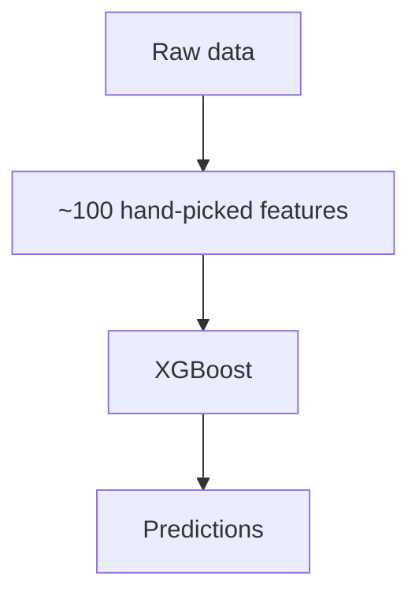
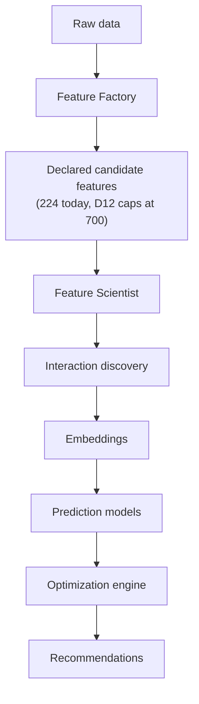

<!-- claims
commands: xg demo, xg ingest, xg build-features, xg train, xg recommend, xg build-squad, xg plan, xg advise, xg discover, xg discover-demo, xg build-discovery-frame, xg backtest, xg score, xg importance, xg models list, xg evaluate check
routes: GET /health, GET /recommend/{entry_id}, POST /squad/plan
symbols: xg_alonso.contracts.objective:ManagerObjective, xg_alonso.contracts.objective:ManagerConstraints, xg_alonso.contracts.objective:UserBelief, xg_alonso.contracts.context:DecisionContext, xg_alonso.prediction.beliefs, xg_alonso.interpreter.requests, xg_alonso.features.catalogue:catalogue_specs, xg_alonso.storage.parquet_store:ParquetTableStore
-->

# XG Alonso

> A continually learning sports intelligence platform that transforms raw football data into actionable Fantasy Premier League decisions through automated feature engineering, representation learning, machine learning, and optimization.

Documentation index: [`docs/README.md`](docs/README.md)

---

## Quickstart

**Prerequisites**

| Requirement | Why |
|---|---|
| Python 3.12 | Pinned in `.python-version`; `mypy --strict` and the type surface assume it |
| [uv](https://docs.astral.sh/uv/) | **`pip` does not work here.** The fourteen `xg-alonso-*` distributions are uv workspace members, resolvable only through `[tool.uv.sources]` in `pyproject.toml`. There is no index they can be fetched from |
| Node 20+ and npm | Only for the web front end. The CLI and API need neither |

```bash
git clone <repository-url> XGalonso
cd XGalonso
make install
```

`make install` syncs the workspace (`uv sync --all-packages`) and installs the pre-commit hooks.

**Why `make install` rather than `uv sync` directly — Apple Silicon.** On an arm64 Mac, a uv
installed from Intel Homebrew is itself x86_64, and it will select an x86_64 Python and build the
virtualenv under Rosetta. Polars' default wheel requires AVX2 and refuses to load there, so every
command fails at import with an error that says nothing about architecture. `make install` detects
`uname -m == arm64`, installs a native arm64 CPython 3.12 if one is missing, builds the venv on it,
and then asserts the result is genuinely arm64 rather than trusting that it worked. If you skip the
Makefile and the venv comes out x86_64, delete `.venv` and run `make install` again.

**A first run, with no network and no API key.** `data/fixtures` is committed, so the whole pipeline
— features, training, the discovery loop with its controls, and a recommendation — runs on a clone
with nothing fetched. It writes to a scratch root under the system temp, never to your own store.

```bash
make demo
```

The fixtures are real public FPL data, sampled rather than complete, so the demo proves the pipeline
runs end to end; it is not evidence about football. `tools/build_demo_fixture.py` records what was
sampled and how in `data/fixtures/PROVENANCE.json`.

**The real thing.** Every command below reads from local snapshots except `xg ingest` and
`xg ingest-history`, which are the only steps that touch the network.

```bash
make ingest                    # official FPL API -> immutable bronze snapshots
uv run xg ingest-history       # per-player history, also bronze
make features                  # point-in-time feature build
uv run xg train                # fit the component models
make recommend ENTRY=1234567   # the product: one transfer, or advice to hold
```

`make check` runs what CI runs: `ruff`, `mypy --strict`, `import-linter`, the banned-string grep,
and the test suite.

**The two local interfaces**, in separate terminals — the web app proxies `/api/*` to port 8000, so
the API must be up first:

```bash
make api          # 127.0.0.1:8000
make web-install  # once
make web          # 127.0.0.1:3000
```

---

## Overview

XG Alonso is an ML-first decision engine for Fantasy Premier League (FPL).

Unlike traditional FPL tools that rank players using a fixed set of statistics or manually engineered models, XG Alonso continuously learns from football data by automatically generating features, discovering predictive interactions, learning player representations, and optimizing complete squad decisions.

The system predicts:

- Expected FPL points
- Price movements — deferred, see [Current status](#current-status)
- Expected minutes
- Player value
- Squad value
- Transfer opportunities

These predictions are then combined inside an optimization engine which recommends:

- Transfers
- Multi-player transfer packages
- Captain choices
- Bench order
- Starting XI
- Wildcard timing — deferred, see [Current status](#current-status)
- Long-term squad planning

The objective is **not** to predict football.

The objective is to maximize Fantasy Premier League performance.

---

## Philosophy

Football prediction is only one component of Fantasy Premier League.

Winning FPL requires balancing:

- Player quality
- Fixtures
- Rotation
- Injuries
- Market behavior
- Budget
- Future flexibility
- Price appreciation
- Squad structure

This project treats FPL as a constrained optimization problem rather than a ranking problem.

---

## Core Idea

Instead of asking

> "Who scores the most points?"

we ask

> "Given my current squad, budget, future fixtures, transfer availability, market dynamics, and uncertainty, what sequence of decisions maximizes my expected long-term score?"

---

## Technical Pillars

XG Alonso consists of six primary systems.

1. **Data Platform** — continuously ingests football, fixture, player, market, and FPL data.
2. **Feature Factory** — declares candidate features rather than hand-writing them.
3. **Feature Scientist** — discovers useful features, interactions, and representations.
4. **Prediction Layer** — predicts football outcomes and Fantasy outcomes.
5. **Optimization Engine** — finds optimal squad decisions.
6. **Continual Learning** — retrains and improves after every gameweek.

The candidate-feature target is deliberately bounded — D12 caps it at **300-700 quality
candidates, not thousands**. That is a ceiling, and the build is currently well under it: the
declarative catalogue holds **180 specs**, and with the career, opponent, recency and slice-1
families the model-ready frame carries **224 distinct feature columns**. Quality and point-in-time
correctness matter more than raw count, so the gap is not a defect to be closed by generating
filler; see [Feature Factory](docs/ml/02_feature_factory.md).

```bash
uv run python -c "from xg_alonso.features.catalogue import catalogue_specs; print(len(catalogue_specs()))"
```

---

## Technical Differentiators

Most FPL models:



XG Alonso:



The project is centered around **automatic representation learning**, not simply prediction.

---

## Repository Structure

This is the tree as it exists on disk. A uv workspace of fourteen distributions sharing the PEP 420
namespace package `xg_alonso`; package ownership and the enforced dependency direction live in
[Repository Structure](docs/architecture/01_repository_structure.md), and the machine-readable
version of the rules is `.importlinter`.

```text
xg-alonso/
├── README.md, CLAUDE.md, LICENSE, Makefile, pyproject.toml, uv.lock
├── .importlinter                # 7 enforced dependency contracts
│
├── apps/
│   ├── cli/                     # `xg` — the first surface, Typer
│   ├── api/                     # FastAPI, unprefixed routes over the same functions
│   └── web/                     # Next.js; renders, never computes
│
├── packages/
│   ├── data_contracts/          # xg_alonso.contracts — shared vocabulary, bottom layer
│   ├── domain/                  # pure FPL and football rules, no I/O
│   ├── storage/                 # the only package permitted a database driver
│   ├── interpreter/             # reads free text: requests, team news
│   ├── feature_factory/         # xg_alonso.features — declarative, point-in-time safe
│   ├── prediction/              # component models, calibration, beliefs
│   ├── optimization/            # transfers, squad build, planning
│   ├── explanations/            # structured evidence to reason-coded text
│   ├── evaluation/              # walk-forward backtests and experiment reports
│   └── discovery/               # objective-conditioned feature search (research surface)
│
├── pipelines/
│   ├── ingestion/               # the only package permitted httpx
│   └── normalization/
│
├── data/                        # samples, schemas, fixtures only — never raw datasets
├── tests/                       # mirrors the package tree, plus e2e and docs checks
├── docs/                        # engineering documentation suite
└── .github/
```

Two directories are gitignored rather than absent: `.data/` holds the bronze/silver/gold snapshots
and model artifacts, and `.venv/` the workspace environment.

Things the documentation set has historically named that **do not exist**: `packages/feature_scientist`,
`packages/embeddings`, `packages/observability`, `configs/`, `models/`, `infra/`, `scripts/`,
`notebooks/`, `docker-compose.yml`. The Feature Scientist capability shipped inside
`packages/discovery` rather than as its own package; the embeddings capability shipped as
`discovery/embeddings.py` and `discovery/clusters.py`.

---

## Current status

The vertical slice is built and runs end to end. FPL ingestion into immutable bronze snapshots,
normalization, a point-in-time Feature Factory with a mechanical leakage harness, component models
with an expected-minutes stage, squad import by public entry ID, a transfer optimizer measured
against an explicit HOLD baseline, reason-coded explanations, and a walk-forward backtest — all
driven from `xg`, with a FastAPI surface and a Next.js front end over the same functions.

Target: useful by **GW1 of the 2026/27 season, 2026-08-21**, then refined in-season.

**Objective-conditioned feature discovery has since landed** — the Feature Scientist,
player embeddings and dynamic clustering, all conditioned on what the manager is actually trying to
achieve. See [Objective-Conditioned Feature Discovery](docs/objective_conditioned_feature_discovery.md).
Interaction *search* is the exception: the beam search exists in `discovery/search.py` but is not
yet reached from the discovery loop, so that part is in progress rather than done.

Still deliberately out:

- Price model — no current-season price data exists at GW1 (D11)
- Chip logic — chip state is modelled, chip decisions are not built (D5)
- Wildcard planner — the wildcard is unavailable in GW1 (windows are GW2-19 and GW20-38)
- Docker, cloud, and hosting — everything runs locally (D1)

**A correction on storage.** D2 names "DuckDB + Parquet", and both implementations exist behind the
`TableStore` protocol — but nothing in the running system constructs the DuckDB one. `apps/cli` and
`apps/api` are both forbidden from importing `duckdb` by the `duckdb-isolation` contract, so the
composition root uses `ParquetTableStore` and `FileSystemBronzeStore`, and there is no `.duckdb`
file on disk. `DuckDBTableStore` is kept, tested, and unreached: the point of the boundary was to
keep D2 reversible, and it has been reversed in practice without a code change downstream.

---

## Commands

Twenty-eight commands, all under the single `xg` entry point. `--help` on any of them is
authoritative; this table exists so the surface is discoverable without running the binary.

| Command | Does |
|---|---|
| `xg demo` | Run the whole pipeline offline on committed fixtures — no network, no `.data` |
| `xg ingest` | Fetch official FPL data into immutable bronze snapshots |
| `xg ingest-history` | Fetch each player's per-gameweek history into bronze |
| `xg backfill` | Backfill per-gameweek history from the community archive |
| `xg refresh` | Re-read the official payload and report what changed |
| `xg team-news` | Search for team news FPL has not published, and file it as form signals |
| `xg refresh-plan` | Show which clubs are worth looking up for form, and which are not |
| `xg build-features` | Build the point-in-time feature set for the next gameweek |
| `xg train` | Fit component models on historical seasons |
| `xg importance` | Measure which features actually earn their place |
| `xg squad` | Show a squad with projected points per player |
| `xg recommend` | Recommend the best legal single transfer, or advise holding |
| `xg build-squad` | Build a squad from scratch — the gameweek-1 answer |
| `xg plan` | Build a squad around requirements typed in plain English |
| `xg advise` | Recommend a transfer under your objective, constraints and beliefs |
| `xg backtest` | Walk a past season, measuring recommendations against holding |
| `xg score` | Score assembled expected points against what actually happened |
| `xg build-discovery-frame` | Build the point-in-time training frame the discovery loop runs on |
| `xg discover` | Compile a request, discover features that serve it, report the verdicts |
| `xg discover-demo` | Two managers, same frame and seed, different constraints — different verdicts |
| `xg models list` | Every artifact and whether it can be used with the active build |
| `xg models verify` | Explain in full whether one artifact can be used, and why not |
| `xg models backfill-manifest` | Write a manifest for an artifact saved before manifests existed |
| `xg models audit` | Classify every artifact, and optionally give each one a manifest |
| `xg evaluate check` | Run the freeze assertions and stop |
| `xg evaluate plan` | Show what an experiment would run, without running any of it |
| `xg evaluate status` | How far along an experiment is, from its run files alone |
| `xg evaluate report` | Re-render every artifact from the run files |

The HTTP surface is documented in [Public API](docs/api/01_public_api.md). It is unprefixed and
read-only apart from three planning endpoints, and it calls the same functions the CLI calls.

---

## Post language → code language

A LinkedIn post about this project describes it as **constraint-conditioned machine learning**. That
is a reasonable phrase for a general audience and the wrong one for this codebase, because the
separation the post collapses is the one the code is most careful about. This table maps the post's
vocabulary onto what to open.

| Post phrasing | Precise term here | Where |
|---|---|---|
| "constraint-conditioned" | **context-conditioned** — conditioned on the whole decision context, of which hard constraints are one part | `contracts/context.py` |
| "what the user wants" (soft) | `ManagerObjective` — maximized, trades off against itself | `contracts/objective.py` |
| "what the user wants" (hard) | `ManagerConstraints` — never traded off, never priced | `contracts/objective.py` |
| "what the user thinks" | `UserBelief` — uncertain evidence, never fact, never a constraint | `contracts/objective.py`, applied in `prediction/beliefs.py` |
| "the AI figures out which features matter" | objective-conditioned feature discovery — a declared search space, scored under the objective, gated by fixed acceptance criteria | `packages/discovery` |
| "it understands your prompt" | deterministic regex compilation, no language model on the default path | `interpreter/requests.py` |

**Why the distinction is load-bearing rather than pedantic.** The module docstring at
`packages/data_contracts/src/xg_alonso/contracts/objective.py` puts it directly: confusing an
objective with a constraint "is how an optimizer comes to sell a player the user said to keep,
having decided the points were worth it". A constraint is the user choosing which question gets
answered. An optimizer that prices one has answered a different question and reported the number
from the wrong one. Beliefs are a third thing again, and the reason `prediction/beliefs.py` returns
the raw and the adjusted projection side by side is so a hunch cannot quietly overwrite the evidence
it was supposed to be weighed against.

The umbrella type is `DecisionContext` in `contracts/context.py`: the objective bundle, the squad
requirements, the squad itself and the gameweek, travelling together as one argument. It is what
makes "context-conditioned" the right word rather than a nicer-sounding synonym for
"constraint-conditioned" — intent is only half of a decision context, and the other half is the
situation the intent applies to.

The umbrella does not blur the three. Objective, constraints and belief remain separately typed and
separately reachable inside it; that separation is enforced by the types, not asserted by a
docstring.

---

## Objective-conditioned feature discovery

Traditional automated feature engineering asks which features maximise predictive accuracy. That
question has one answer. This system asks a different one:

> Given this manager's objective, constraints, beliefs and required features — which representation
> of the player pool produces the best *decisions*?

A manager forty points behind in a mini-league and a manager protecting a rank are not looking for
the same player, and a feature that sharpens the mean while flattening the tail helps the second
and harms the first.

```bash
# Build the point-in-time training frame (the expensive step, run once).
uv run xg build-discovery-frame --seasons 2023-24,2024-25

# See how a request parses, without running anything.
uv run xg discover "I am 40 points behind in my mini-league. Keep Haaland and my current
  defense. I want an aggressive three-gameweek strategy. Recent xG must remain in the model.
  Find signals that complement xG." --dry-run

# Run the loop. 2025-26 is held out of every fold.
uv run xg discover "<same request>"
```

The request compiles — deterministically, with no language model — into an objective
(`expected_rank_gain`, aggressive, three gameweeks, differential), constraints (Haaland locked,
defence frozen, no hits) and a discovery request anchored on xG. Anything the parser did not
understand is printed rather than dropped.

What the loop then does: measures where the required-feature model is weakest, proposes hypotheses
with falsification conditions, compiles each to a **safe expression tree** (never Python source,
never `eval`), proves it point-in-time safe with the shipped leakage harness, backtests
walk-forward against noise and shuffled controls, scores utility under the objective, accepts or
rejects against criteria fixed in advance, and writes a reproducible manifest.

Further reading:

- [Objective-Conditioned Feature Discovery](docs/objective_conditioned_feature_discovery.md) — the loop, and what is and is not automated
- [The Feature DSL](docs/feature_dsl.md) — the grammar, and what it deliberately cannot express
- [Player Embeddings and Clusters](docs/player_embeddings_and_clusters.md)
- [Backtesting and Leakage](docs/backtesting_and_leakage.md)
- [Experiment Reproducibility](docs/experiment_reproducibility.md)

---

## Related documents

- [Documentation index](docs/README.md)
- [Vision](docs/vision/00_vision.md)
- [Product Requirements](docs/product/01_product_requirements.md)
- [Repository Structure](docs/architecture/01_repository_structure.md)
- [Public API](docs/api/01_public_api.md) — the CLI and HTTP surfaces as built
- [Build Plan](docs/implementation/01_build_plan.md) — superseded, retained as a record
- [Feature Factory](docs/ml/02_feature_factory.md)
- [`apps/web/README.md`](apps/web/README.md) — the front end and its honesty constraints
