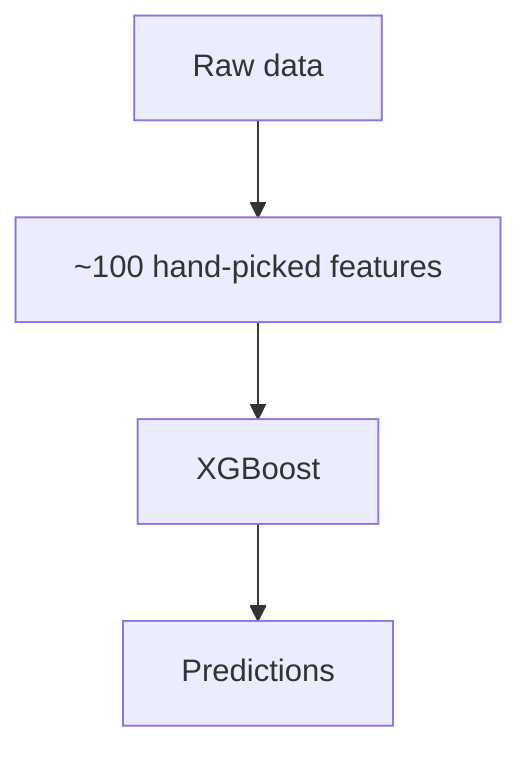
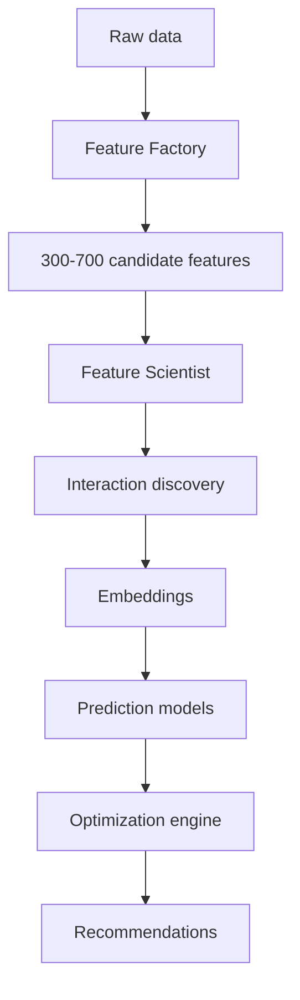

# XG Alonso

> A continually learning sports intelligence platform that transforms raw football data into actionable Fantasy Premier League decisions through automated feature engineering, representation learning, machine learning, and optimization.

Documentation index: [`docs/README.md`](docs/README.md)

---

## Overview

XG Alonso is an ML-first decision engine for Fantasy Premier League (FPL).

Unlike traditional FPL tools that rank players using a fixed set of statistics or manually engineered models, XG Alonso continuously learns from football data by automatically generating features, discovering predictive interactions, learning player representations, and optimizing complete squad decisions.

The system predicts:

- Expected FPL points
- Price movements — deferred, see [Current status](#current-status)
- Expected minutes
- Player value
- Squad value
- Transfer opportunities

These predictions are then combined inside an optimization engine which recommends:

- Transfers
- Multi-player transfer packages
- Captain choices
- Bench order
- Starting XI
- Wildcard timing — deferred, see [Current status](#current-status)
- Long-term squad planning

The objective is **not** to predict football.

The objective is to maximize Fantasy Premier League performance.

---

## Philosophy

Football prediction is only one component of Fantasy Premier League.

Winning FPL requires balancing:

- Player quality
- Fixtures
- Rotation
- Injuries
- Market behavior
- Budget
- Future flexibility
- Price appreciation
- Squad structure

This project treats FPL as a constrained optimization problem rather than a ranking problem.

---

## Core Idea

Instead of asking

> "Who scores the most points?"

we ask

> "Given my current squad, budget, future fixtures, transfer availability, market dynamics, and uncertainty, what sequence of decisions maximizes my expected long-term score?"

---

## Technical Pillars

XG Alonso consists of six primary systems.

1. **Data Platform** — continuously ingests football, fixture, player, market, and FPL data.
2. **Feature Factory** — automatically engineers 300-700 quality candidate features.
3. **Feature Scientist** — discovers useful features, interactions, and representations.
4. **Prediction Layer** — predicts football outcomes and Fantasy outcomes.
5. **Optimization Engine** — finds optimal squad decisions.
6. **Continual Learning** — retrains and improves after every gameweek.

The candidate-feature target is deliberately bounded. Quality and point-in-time correctness matter
more than raw count; see [Feature Factory](docs/ml/02_feature_factory.md).

---

## Technical Differentiators

Most FPL models:



XG Alonso:



The project is centered around **automatic representation learning**, not simply prediction.

---

## Repository Structure

This is the target modular monorepo layout, not the current on-disk state. Only what the current
slice needs is scaffolded; folders are created when a slice requires them, never speculatively.
The full tree, package ownership, and dependency rules live in
[Repository Structure](docs/architecture/01_repository_structure.md).

```text
xg-alonso/
├── README.md
├── CLAUDE.md
├── pyproject.toml
│
├── apps/
│   ├── web/                     # Next.js user-facing app
│   └── api/                     # FastAPI application
│
├── packages/
│   ├── data_contracts/          # Shared schemas
│   ├── domain/                  # Pure FPL and football rules
│   ├── feature_factory/         # Deterministic candidate-feature generation
│   ├── feature_scientist/       # Automated feature evaluation and promotion
│   ├── embeddings/              # Representation learning
│   ├── prediction/              # Model training and inference
│   ├── optimization/            # Decision layer
│   ├── explanations/            # Structured evidence to user-facing reasoning
│   ├── evaluation/              # Walk-forward validation and backtests
│   └── observability/           # Run IDs, structured logs, freshness checks
│
├── pipelines/
│   ├── ingestion/
│   ├── normalization/
│   ├── identity_resolution/
│   ├── feature_materialization/
│   ├── training/
│   ├── backtesting/
│   └── recommendations/
│
├── configs/                     # Typed YAML/TOML for sources, features, models, experiments
├── data/                        # Samples, schemas, fixtures only — never raw datasets
├── models/                      # Model registry and per-target artifacts
├── infra/                       # Docker, database, migrations, CI, monitoring
├── scripts/                     # Operational entry points
├── notebooks/                   # Exploration only, never the sole implementation
├── tests/                       # Integration, end-to-end, golden, performance
├── docs/                        # Engineering documentation suite
└── .github/
```

Scaffolded for the current slice:

```text
xg-alonso/
├── README.md
├── CLAUDE.md
├── docs/
└── LICENSE
```

The web app is added only after a complete recommendation can be produced from the CLI.
Embeddings and the automated Feature Scientist are added only after the data and feature pipeline
is reliable.

---

## Current status

Planning is complete. The engineering documentation suite defines every subsystem, and the
binding project decisions are settled and recorded in [`docs/README.md`](docs/README.md).

The first vertical slice is in progress: FPL ingestion, canonical tables, a point-in-time Feature
Factory, an expected-minutes baseline, a component-based points baseline, squad import by public
team ID, and a single/double transfer optimizer compared against a hold baseline — all driven from
a CLI.

Target: useful by **GW1 of the 2026/27 season, 2026-08-21**, then refined in-season.

Deliberately out of the first release:

- Price model — no current-season price data exists at GW1
- Chip logic — chip state is modelled, chip decisions are not built
- Wildcard planner — the wildcard is unavailable in GW1 (windows are GW2-19 and GW20-38)
- Automated Feature Scientist, embeddings, and clustering
- Web frontend — CLI first, then API, then Next.js
- Docker, cloud, and hosting — the first slice runs locally against DuckDB and Parquet

---

## Related documents

- [Documentation index](docs/README.md)
- [Vision](docs/vision/00_vision.md)
- [Product Requirements](docs/product/01_product_requirements.md)
- [Repository Structure](docs/architecture/01_repository_structure.md)
- [Build Plan](docs/implementation/01_build_plan.md)
- [Feature Factory](docs/ml/02_feature_factory.md)
