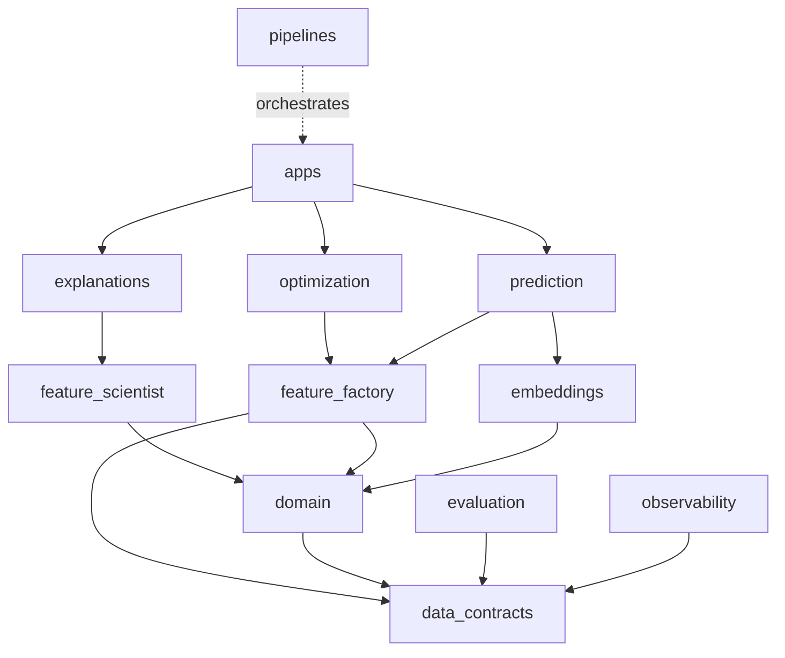
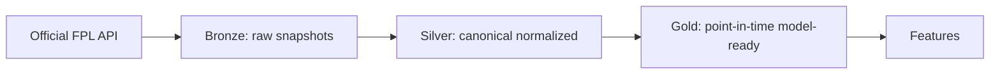

# XG Alonso Documentation

Navigation index for the XG Alonso engineering documentation suite.

| Field | Value |
|---|---|
| Project | XG Alonso |
| Document | Documentation Index |
| Version | 1.0 |
| Status | Active |
| Owner | Platform |
| Dependencies | None |
| Last updated | 2026-07-27 |

---

## How to read this suite

Documents carry a `Status` field from a closed vocabulary. **Read it before treating a document
as a commitment.**

| Status | Meaning |
|---|---|
| `Active` | Describes what is being built now |
| `Build Specification` | Approved design, implementation in progress or imminent |
| `Draft` | Written but not yet reconciled against binding decisions |
| `Deferred (Post-MVP)` | Design retained deliberately; **not** in the MVP. Nothing here ships yet |

A `Deferred (Post-MVP)` document is not dead — it holds real design substance and its contracts
constrain what the MVP must not make impossible. It is simply not a promise about this release.

---

## Start here

1. [Vision](vision/00_vision.md) — why this exists and what it optimizes for
2. [Product Requirements](product/01_product_requirements.md) — the workflows the system must support
3. [Repository Structure](architecture/01_repository_structure.md) — package boundaries and dependency rules
4. [Build Plan](implementation/01_build_plan.md) — phases and sequencing
5. `../CLAUDE.md` — engineering standards that override default behaviour

---

## Binding decisions

These were settled with the project owner and are **not** open for relitigation during
implementation. Individual documents may predate them; where a document conflicts, the decision
wins and the document is scheduled for correction.

| # | Decision |
|---|---|
| D1 | Local-only first — no Docker, cloud, or hosting in the first slice |
| D2 | DuckDB + Parquet only; no PostgreSQL. Storage behind a repository interface |
| D3 | Public FPL team ID only; no authentication. Prices reconstructed from public transfer history |
| D4 | CLI first, then FastAPI, then Next.js. No frontend in the MVP |
| D5 | No chips in the MVP. Chip *state* is modelled; chip *logic* is not built |
| D6 | Official FPL API only, zero budget. No scraping, no paid providers |
| D7 | Historical backfill from 2022/23 — the earliest season with xG in the API |
| D8 | Component-based points modelling, converted through versioned scoring rules |
| D9 | Useful by GW1 of 2026/27, refined in-season |
| D10 | Product first; research platform deepened afterwards |
| D11 | Price model deferred — no current-season price data exists at GW1 |
| D12 | 300–700 quality candidate features, **not** thousands |

---

## Architecture

| Document | Status | Purpose |
|---|---|---|
| [01_repository_structure.md](architecture/01_repository_structure.md) | Build Specification | Monorepo layout, package ownership, dependency direction |
| `02_system_architecture.md` | Planned | End-to-end data and control flow |
| `03_service_boundaries.md` | Planned | What may call what, and why |

**Dependency direction.** Arrows point toward dependencies; nothing may point back.

`pipelines` may orchestrate every package. `domain` holds pure football and FPL rules with no
database or API dependency.

---

## Data

| Document | Status | Purpose |
|---|---|---|
| [01_data_sources.md](data/01_data_sources.md) | Draft | Source register, endpoints, cadence, timestamps |
| `02_data_contracts.md` | Planned | Shared schemas and the four-timestamp rule |
| `03_identity_resolution.md` | Planned | Cross-season player identity, transfers, promoted clubs |
| [04_database_schema.md](data/04_database_schema.md) | Draft | Canonical table definitions |
| `05_data_quality.md` | Planned | Validation gates, quarantine policy, leakage register |

**Medallion layers.** Bronze is immutable and append-only; nothing overwrites a raw snapshot.

---

## Machine learning

| Document | Status | Purpose |
|---|---|---|
| `01_ml_architecture.md` | Planned | How the ML subsystems compose |
| [02_feature_factory.md](ml/02_feature_factory.md) | Build Specification | Deterministic candidate-feature generation. **The deepest spec in the repo** |
| [03_feature_scientist.md](ml/03_feature_scientist.md) | Deferred (Post-MVP) | Automated feature evaluation and promotion |
| [04_interaction_discovery.md](ml/04_interaction_discovery.md) | Deferred (Post-MVP) | Controlled interaction search and gating |
| [05_player_clustering.md](ml/05_player_clustering.md) | Deferred (Post-MVP) | Archetype clustering for priors and similarity |
| [06_embeddings.md](ml/06_embeddings.md) | Deferred (Post-MVP) | Representation learning |
| [07_prediction_models.md](ml/07_prediction_models.md) | Draft | Minutes, components, points, price, fair value |
| `08_continual_learning.md` | Planned | Per-gameweek retraining and champion/challenger |
| `09_evaluation.md` | Planned | Walk-forward protocol and metrics |

---

## Optimization

The optimizer is the product; predictions are inputs to it.

| Document | Status | Purpose |
|---|---|---|
| `01_squad_optimizer.md` | Planned | Constraints, starting XI, formation, bench |
| [02_transfer_planner.md](optimization/02_transfer_planner.md) | Draft | Single, double and package transfers |
| [03_wildcard_planner.md](optimization/03_wildcard_planner.md) | Deferred (Post-MVP) | Wildcard squad and timing |
| [04_chip_planner.md](optimization/04_chip_planner.md) | Deferred (Post-MVP) | Free Hit, Bench Boost, Triple Captain |
| `05_captain_and_bench.md` | Planned | Captaincy and bench ordering |

---

## Interfaces

| Document | Status | Purpose |
|---|---|---|
| [01_public_api.md](api/01_public_api.md) | Draft | CLI surface first, HTTP API second |
| `02_internal_contracts.md` | Planned | Package-to-package contracts |
| `01_information_architecture.md` | Planned | Web app screens and navigation |
| [02_dashboard.md](frontend/02_dashboard.md) | Deferred (Post-MVP) | Dashboard views |
| `03_design_system.md` | Planned | Visual language |

---

## Implementation

| Document | Status | Purpose |
|---|---|---|
| [01_build_plan.md](implementation/01_build_plan.md) | Draft | Phase sequencing |
| `02_mvp_milestones.md` | Planned | Milestone acceptance criteria |
| `03_testing_strategy.md` | Planned | Unit, property, golden, integration, leakage, e2e |
| `04_release_checklist.md` | Planned | Release gates and definition of done |

---

## Research

| Document | Status | Purpose |
|---|---|---|
| [01_knowledge_lab.md](research/01_knowledge_lab.md) | Deferred (Post-MVP) | Accumulated hypotheses, experiments, outcomes |

### The research surface, and what it may not touch

`packages/discovery` (objective-conditioned feature search) and
`packages/interpreter` (reading a manager's request, sweeping team news) are
**offline research tools, not part of the recommendation path**. The
`research-surface-is-quarantined` contract in `.importlinter` enforces it: no
package from `contracts` through `evaluation`, nor `pipelines`, may import
either. `cli` and `api` may, because wiring a research tool up as a command or
an endpoint is what an app layer is for.

The claim being enforced is that a recommendation stays reproducible from
stored snapshots alone. The layers contract alone would not give that — it
places `interpreter` *below* `features`, so without the explicit gate
`prediction` could import the LLM client and nothing would object.

**LLM use is optional and never on the critical path.** The `anthropic` client
is an extra (`uv sync --extra llm`), reached from exactly three places:
discovery hypothesis proposal, request interpretation, and the team-news sweep.
Each is opt-in per invocation, and a missing SDK or key raises a typed
unavailability error that the deterministic path handles. A default install
gains no new dependency and needs no credential. Where a model is used it emits
*data* — a JSON expression tree parsed by the DSL, or a list of names resolved
locally — never code, and a proposal that fails to parse is dropped rather than
repaired.

**Form signals are a bounded human channel.** `.data/signals/form_signals.json`
scales a projection by at most ±15%, requires a source URL, expires, and is
evaluated against the *deadline* rather than the wall clock so a backtest sees
only what was live then. It is the weakest evidence in the stack and is applied
last, after price calibration and FPL's own published chance of playing — see
`prediction/adjustments.py`, which is the one place any of those three is
applied.

---

## Conventions

- **Scoring and constraint constants are never transcribed.** They load from a pinned snapshot of
  the FPL payload with a recorded fetch timestamp, verified by a drift check on every ingest.
  A goalkeeper goal is worth 10 points, not the widely assumed 6 — transcription is how that kind
  of error enters a codebase silently.
- **Point-in-time correctness is non-negotiable.** Every feature reflects only information whose
  `available_time` precedes the prediction timestamp.
- **Walk-forward validation only.** Random splits on temporal data are forbidden.
- **Raw data is immutable.** Transformations are versioned; snapshots are timestamped.
- **Notebooks are never the only implementation** of a source adapter, feature, model, backtest,
  or optimizer.
