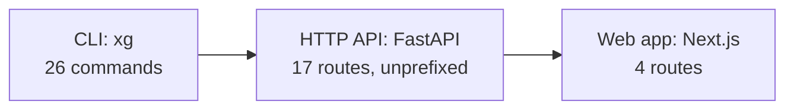

<!-- claims
commands: xg ingest, xg ingest-history, xg backfill, xg refresh, xg team-news, xg refresh-plan, xg build-features, xg train, xg importance, xg squad, xg recommend, xg build-squad, xg plan, xg advise, xg backtest, xg score, xg build-discovery-frame, xg discover, xg models list, xg models verify, xg models backfill-manifest, xg models audit, xg evaluate check, xg evaluate plan, xg evaluate status, xg evaluate report
routes: GET /health, GET /players, GET /squad/{entry_id}, GET /recommend/{entry_id}, GET /build-squad, GET /build-squad/explained, GET /features/importance, POST /objectives/compile, POST /requirements/parse, POST /squad/plan, GET /objectives, GET /features/discovered, GET /hypotheses, GET /clusters, GET /players/{player_code}/cluster-history, GET /experiments, GET /experiments/{experiment_id}
-->

# Public API

| Field | Value |
|---|---|
| Project | XG Alonso |
| Document | Public API |
| Version | 2.0 |
| Status | Active |
| Owner | Product |
| Dependencies | [Transfer Planner](../optimization/02_transfer_planner.md), [Database Schema](../data/04_database_schema.md), [Prediction Models](../ml/07_prediction_models.md) |
| Last updated | 2026-08-04 |

**Version 2.0 documents the surface that exists.** Version 1.0 was written before either surface was
built and never reconciled afterwards. It specified nine HTTP routes under a `/v1` prefix — none of
which were ever served — four CLI commands that were never written (`xg predict`, `xg config pin`,
`xg config show`, `xg doctor`), an `xg evaluate` flag form that is actually a sub-app, and six error
codes that appear nowhere in the codebase. All of it is gone. The design intent that survived
contact with the implementation is kept and marked as such.

The claims block at the top of this file is checked by `tests/docs/test_docs_match_code.py`, which
introspects the Typer app and the FastAPI app. A route or command named there that stops existing
now fails a test rather than quietly misleading a reader.

---

## 1. Surface order

Three surfaces, all over the same functions. The CLI was built first, the HTTP API second, the web
app third — the order D4 sets — though the web app arrived earlier in absolute terms than D4's
"no frontend in the MVP" anticipated. See the D4 supersession note in `CLAUDE.md`.

The HTTP API is a transport over the functions the CLI invokes. It never reimplements planning,
scoring or constraint logic: `apps/api/src/xg_alonso/api/main.py` holds request and response models
and route handlers, and every handler delegates to `service.py`, which is the composition root.

### 1.1 Vocabulary

In FPL "team" means both a manager's fantasy side and a Premier League club. That ambiguity is
banned here.

| Term | Means | Identifier | Example |
|---|---|---|---|
| **entry** | An FPL manager's fantasy squad | `entry_id` — the public FPL entry ID | `1234567` |
| **team** | A Premier League club | `team_id` (season-scoped), `team_code` (stable) | Arsenal |
| **player** | A footballer | `player_id` (season-scoped), `player_code` (stable) | Saka |

**`{team_id}` must never appear in a route path.** A route addressing a manager uses `{entry_id}`;
a route addressing a player uses `{player_code}`, because a cluster history spans seasons and
`player_id` is re-issued each one.

---

## 2. CLI

Installed as a single entry point `xg`. Twenty-six commands: eighteen at the top level and two
sub-apps, `models` and `evaluate`. `xg --help` and `xg <command> --help` are authoritative; this
section groups the surface so it can be read without running anything.

### 2.1 Options

There is no global option callback. Options are declared per command, which means the same flag can
be absent from a command that has no use for it. The recurring ones:

| Option | Effect |
|---|---|
| `--data-root <path>` | Where bronze, silver, gold and artifacts live. Defaults to `.data` |
| `--season <s>` | Season in `YYYY-YY` form. Defaults to `2026-27` |
| `--squad-file <path>` | Read a squad from a local file instead of the API. See §2.4 |
| `--horizon <n>` | Gameweeks to judge a decision over |

A single `--run-id` that replays an arbitrary command byte-for-byte does **not** exist. Experiments
carry a manifest and can be re-rendered with `xg evaluate report`; ad-hoc commands cannot.

### 2.2 Data

| Command | Purpose |
|---|---|
| `xg ingest` | Fetch official FPL data into immutable bronze snapshots. The only command that reads the network on the main path |
| `xg ingest-history` | Fetch each player's per-gameweek history into bronze |
| `xg backfill` | Backfill per-gameweek history from the community archive |
| `xg refresh` | Re-read the official payload and report what changed |
| `xg team-news` | Search for team news FPL has not published and file it as bounded form signals |
| `xg refresh-plan` | Show which clubs are worth looking up for form, and which are not |

`xg team-news` reads outside the official FPL API and therefore sits in tension with D6. That
tension is recorded, unresolved, in [the documentation index](../README.md#the-research-surface-and-what-it-may-not-touch);
the feature is off by default and needs an explicit extra and a key.

### 2.3 Features and models

| Command | Purpose |
|---|---|
| `xg build-features` | Build the point-in-time feature set for the next gameweek |
| `xg train` | Fit component models on historical seasons |
| `xg importance` | Measure which features actually earn their place, out of sample |
| `xg models list` | Every artifact and whether it can be used with the active build |
| `xg models verify` | Explain in full whether one artifact can be used, and why not |
| `xg models backfill-manifest` | Write a manifest for an artifact saved before manifests existed |
| `xg models audit` | Classify every artifact, and optionally give each one a manifest |

See [Model Artifacts](../ml/model_artifacts.md) for what a manifest carries and how compatibility is
decided.

### 2.4 Decisions

| Command | Purpose |
|---|---|
| `xg squad` | Show a squad with projected points per player |
| `xg recommend` | The best legal single transfer, or an explicit hold |
| `xg build-squad` | Build a squad from scratch — the gameweek-1 answer |
| `xg plan` | Build a squad around requirements typed in plain English |
| `xg advise` | Recommend a transfer under an objective, constraints and beliefs |

**`--squad-file` is not a convenience flag; it is a launch requirement.**
`entry/{entry_id}/event/{gw}/picks/` returns **404 before the deadline**, so at the start of a season
there is no way to read a squad from the API at all. Before GW1, `xg build-squad` is the right
command anyway: transfers are unlimited before the first deadline, so recommending one swap answers
a question nobody is asking.

`purchase_price` is required in a squad file because selling price depends on it via the sell-on
fee. When the API path is used instead, purchase prices are reconstructed from
`entry/{entry_id}/transfers/` (D3), and where they must be assumed the output says so and states
that the budget shown is a lower bound.

The loader validates a squad against the pinned constraint constants — 15 players, quotas
GKP 2 / DEF 5 / MID 5 / FWD 3, at most 3 per club, cost plus bank within budget — and refuses an
illegal squad rather than planning from it.

### 2.5 Evaluation and research

| Command | Purpose |
|---|---|
| `xg backtest` | Walk a past season, measuring recommendations against holding |
| `xg score` | Score assembled expected points against what actually happened |
| `xg evaluate check` | Run the freeze assertions and stop |
| `xg evaluate plan` | Show what an experiment would run, without running any of it |
| `xg evaluate status` | How far along an experiment is, from its run files alone |
| `xg evaluate report` | Re-render every artifact from the run files |
| `xg build-discovery-frame` | Build the point-in-time training frame the discovery loop runs on |
| `xg discover` | Compile a request, discover features that serve it, report the verdicts |

`evaluate` is a sub-app, not a flag form. Version 1.0 documented
`xg evaluate --from-gw <a> --to-gw <b>`; that never existed.

**There is no `xg evaluate run`.** `run_one` is injected but never wired, so the reproduction gate
against the recorded legacy headline is unrun rather than passing. This is a known gap, tracked in
[Model Artifacts §8](../ml/model_artifacts.md).

### 2.6 Exit codes

The CLI uses `0` for success and `1` for a handled failure, raised as `typer.Exit(1)` at the point
the failure is explained. The graded scheme version 1.0 specified — separate codes for drift, stale
data, illegal squads and leakage — was **not implemented**. It is a reasonable design and is
recorded here as unbuilt rather than deleted: a caller today must read stderr, which makes the CLI
awkward to script against.

---

## 3. HTTP API

Seventeen routes, **unprefixed**. There is no `/v1`. No authentication — an entry id is public
information (D3). Read-only apart from three planning endpoints, all of which are stateless: they
compute from the payload and store nothing.

All timestamps are ISO-8601 UTC. All money is in tenths of a million, as integers. FastAPI serves
`/docs`, `/redoc` and `/openapi.json`, and the OpenAPI schema is the authoritative contract.

### 3.1 Provenance

**Every response that carries a decision carries provenance.** A recommendation without provenance
is unreproducible, and an unreproducible recommendation is not a product. The `Provenance` model
lives in `api/main.py` and is attached to the recommendation, squad-build and plan responses; the
web app prints it in the footer, so a figure whose lineage cannot be shown does not reach the page.

Reference and research reads — the cluster, hypothesis and experiment routes — carry their own
version and computed-at fields instead, because there is no model version to attach.

### 3.2 Decision routes

| Method | Path | Returns |
|---|---|---|
| `GET` | `/health` | Whether the system can answer, and whether its data is current. `stale` surfaces in the web masthead rather than being swallowed |
| `GET` | `/players` | Ranked players for the next gameweek. Query: `limit`, `position`, `max_price` |
| `GET` | `/squad/{entry_id}` | A manager's squad with projected points and the XI that would be fielded. Query: `squad_file` |
| `GET` | `/recommend/{entry_id}` | The best legal single transfer, or an explicit hold. Query: `squad_file`, `horizon` |
| `GET` | `/build-squad` | A squad built from scratch |
| `GET` | `/build-squad/explained` | The optimal fifteen from scratch, with a justification for every pick |
| `GET` | `/features/importance` | Which features earn their place, measured out of sample. Query: `label`, `family`, `position`, `limit` |

`horizon` on `/recommend/{entry_id}` defaults to `1` and is capped at `10`. Its docstring states the
reason it exists at all: a transfer is permanent and paid for once, so scoring it on the next
gameweek alone undervalues buying a better player.

`/features/importance` returns a `stale` flag that is true when the table was computed against a
different model than the one currently loaded. Serving old numbers silently is worse than serving
none.

### 3.3 Planning routes

| Method | Path | Returns |
|---|---|---|
| `POST` | `/objectives/compile` | Parse a request into an objective, constraints and beliefs |
| `POST` | `/requirements/parse` | Read squad requirements out of a request, without building anything |
| `POST` | `/squad/plan` | Build the best legal squad that honours what was asked for |

All three are stateless and compile deterministically, by regex, with no language model on the
default path. `/objectives/compile` is the endpoint to reach for when the question is "what did the
system think I asked for" — anything the parser did not understand is returned rather than dropped.

### 3.4 Research routes

| Method | Path | Returns |
|---|---|---|
| `GET` | `/objectives` | The shipped objective presets |
| `GET` | `/features/discovered` | Every discovered feature's latest verdict, accepted and rejected alike |
| `GET` | `/hypotheses` | Every hypothesis tested, with the condition that would have refuted it |
| `GET` | `/clusters` | Player clusters, with the statistical basis behind each label |
| `GET` | `/players/{player_code}/cluster-history` | One player's cluster over time |
| `GET` | `/experiments` | Every recorded experiment, newest first |
| `GET` | `/experiments/{experiment_id}` | One experiment's manifest |

Rejected features are returned alongside accepted ones deliberately. A discovery surface that shows
only its successes is a marketing page.

**Running an experiment is deliberately not exposed over HTTP.** A discovery run fits hundreds of
models and takes minutes, and there is no job queue (D1 keeps everything local). A request that
blocks for that long is not an API, it is a timeout.

### 3.5 Errors

Errors are FastAPI's default shape — `{"detail": "..."}` — with the status chosen by the handler:

| Status | Raised when |
|---|---|
| `400` | An invalid query parameter, such as an unrecognised position |
| `404` | No such entry, or picks that cannot be resolved |
| `422` | A squad that violates a pinned constraint, or a request that cannot be satisfied |

The typed error-code vocabulary version 1.0 specified — `PICKS_NOT_AVAILABLE`, `ENTRY_NOT_FOUND`,
`INVALID_SQUAD`, `STALE_DATA`, `CONFIG_DRIFT`, `UPSTREAM_UNAVAILABLE` — **exists nowhere in the
codebase.** It is a better design than what was built: a caller currently cannot distinguish a
missing entry from unpublished picks without parsing English. Recorded as an unbuilt improvement.

---

## 4. Acceptance criteria

Met today:

- `xg recommend` runs end to end from a local checkout with no network access, from stored bronze
  snapshots.
- No route path contains `{team_id}`.
- The HTTP layer contains no planning, scoring or constraint logic — it validates, calls
  `service.py`, and serialises.
- No wildcard or chip route exists.
- Every decision response carries provenance, and the web front end renders it.

Not met, and stated rather than quietly dropped:

- **Byte-identical replay of an arbitrary command is not supported.** There is no `--run-id`.
  Experiments are reproducible from their manifests; ad-hoc CLI invocations are not.
- **Machine-readable errors are not implemented** on either surface. See §2.6 and §3.5.

---

## Related documents

- [Transfer Planner](../optimization/02_transfer_planner.md) — what `xg recommend` calls
- [Wildcard Planner](../optimization/03_wildcard_planner.md) — deferred; routes deliberately absent
- [Database Schema](../data/04_database_schema.md) — what is persisted, and what is not
- [Data Sources](../data/01_data_sources.md) — what `xg ingest` fetches
- [Prediction Models](../ml/07_prediction_models.md) — the models behind every projection
- [Model Artifacts](../ml/model_artifacts.md) — what `xg models` inspects
- [Dashboard](../frontend/02_dashboard.md) — the third surface, and which of its views exist
- [`apps/web/README.md`](../../apps/web/README.md) — the front end as built
- [Documentation Index](../README.md)
