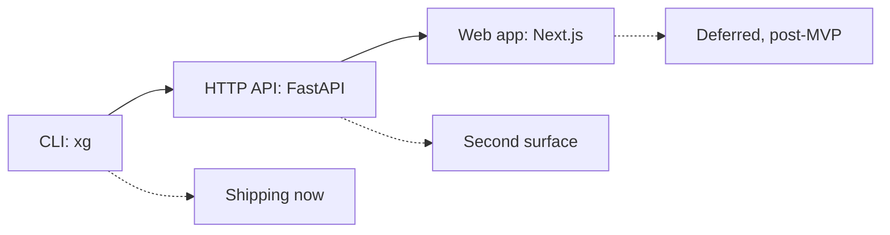

# Public API

| Field | Value |
|---|---|
| Project | XG Alonso |
| Document | Public API |
| Version | 1.0 |
| Status | Draft |
| Owner | Product |
| Dependencies | [Transfer Planner](../optimization/02_transfer_planner.md), [Database Schema](../data/04_database_schema.md), [Prediction Models](../ml/07_prediction_models.md) |
| Last updated | 2026-07-27 |

---

## 1. Surface order

**The CLI is the first and only shipping surface.** FastAPI follows once the CLI produces
recommendations users trust; Next.js follows after that. There is no frontend in the MVP (D4).



Both surfaces call the same domain packages. The HTTP API is a transport over the identical
functions the CLI invokes — it never reimplements planning, scoring or constraint logic.

### 1.1 Vocabulary

The previous draft used `{team_id}`, which is ambiguous: in FPL "team" means both a manager's fantasy
side and a Premier League club. That ambiguity is banned from this API.

| Term | Means | Identifier | Example |
|---|---|---|---|
| **entry** | An FPL manager's fantasy squad | `entry_id` — the public FPL entry ID | `1234567` |
| **team** | A Premier League club | `team_id` (season-scoped), `team_code` (stable) | Arsenal |
| **player** | A footballer | `player_id` (season-scoped), `player_code` (stable) | Saka |

**`{team_id}` must never appear in a route path.** A route addressing a manager uses `{entry_id}`.

### 1.2 Corrections to the previous draft

| Was | Now | Reason |
|---|---|---|
| `GET /playersG` + `ET /recommendations/{team_id}` | `GET /players` and `GET /entries/{entry_id}/recommendations` | A line-break typo split one route into two invalid ones |
| `GET /wildcard/{team_id}` | Removed | No chips in the MVP (D5) |
| `POST /optimize/wildcard` | Removed | No chips in the MVP (D5) |
| `POST /optimize/transfers` | `POST /recommendations/transfers` | Same capability; renamed to match the resource vocabulary |

Wildcard design is retained in [Wildcard Planner](../optimization/03_wildcard_planner.md) with status
`Deferred (Post-MVP)`. Removing the routes removes the promise, not the design.

---

## 2. CLI

Installed as a single entry point `xg`. Every command is deterministic: the same inputs and the same
pinned config produce byte-identical output.

### 2.1 Global options

| Option | Effect |
|---|---|
| `--season <s>` | Season key, e.g. `2026-27`. Defaults to the current season from `bootstrap-static` |
| `--as-of <ts>` | Point-in-time cutoff. Nothing with `available_time > as-of` is used. Defaults to now |
| `--config <id>` | Pinned `game_config` snapshot id. Defaults to the pinned row for the season |
| `--json` | Emit machine-readable JSON instead of the human table |
| `--run-id <id>` | Reuse a run id, for reproducing an earlier run exactly |
| `-v, --verbose` | Per-stage timings and row counts |

### 2.2 `xg ingest`

Fetches from the official FPL API into bronze, then normalises to silver.

```bash
xg ingest                                   # incremental: everything stale
xg ingest --source bootstrap-static         # one source only
xg ingest --source element-summary --resume # resume a checkpointed per-player crawl
xg ingest --backfill --from-season 2022-23  # historical backfill floor per D7
xg ingest --check-config                    # run the game_config drift check only
```

| Option | Effect |
|---|---|
| `--source <name>` | Restrict to one endpoint family. Repeatable |
| `--backfill` | Historical load including the community archive for completed seasons |
| `--from-season <s>` | Backfill floor. Cannot precede `2022-23` (D7) |
| `--resume` | Continue a checkpointed crawl rather than restarting |
| `--check-config` | Compare live `game_config` against the pinned snapshot and exit non-zero on drift |

Exits non-zero on `game_config` drift, on a checksum mismatch against an existing bronze snapshot,
or on a component-to-`total_points` reconciliation failure.

### 2.3 `xg build-features`

Materializes point-in-time feature rows from gold.

```bash
xg build-features --up-to-gw 2
xg build-features --feature-set fs_core_v1.2 --up-to-gw 2
xg build-features --leakage-check
```

| Option | Effect |
|---|---|
| `--up-to-gw <n>` | Build rows for prediction timestamps up to and including gameweek `n`'s deadline |
| `--feature-set <id>` | Named, versioned feature set. Defaults to the current approved set |
| `--leakage-check` | Run the leakage harness: assert no feature reads data with `available_time` after the row's prediction timestamp |

`--leakage-check` is advisory here and mandatory in CI.

### 2.4 `xg predict`

Runs the component and points models over materialized features.

```bash
xg predict --gw 3 --horizon 3
xg predict --gw 3 --model points_component_v0.3.1
```

| Option | Effect |
|---|---|
| `--gw <n>` | Target gameweek |
| `--horizon <n>` | Number of gameweeks to project, `1`, `3` or `6` |
| `--model <version>` | Explicit model version. Defaults to the current champion |

Writes predictions with model version, feature-set version and data cutoff attached to every row.

### 2.5 `xg squad`

Resolves and displays an entry's current squad, including reconstructed purchase and selling prices.

```bash
xg squad 1234567
xg squad 1234567 --gw 2
xg squad 1234567 --squad-file ./my_gw1_squad.yaml
```

| Option | Effect |
|---|---|
| `--gw <n>` | Gameweek whose picks to resolve. Defaults to the last finished gameweek |
| `--squad-file <path>` | Read the squad from a local file instead of the API |

**`--squad-file` is not a convenience flag; it is required for GW1.**
`entry/{entry_id}/event/{gw}/picks/` returns **404 before the deadline**, so at the start of a season
there is no way to read a squad from the API. The file format:

```yaml
entry_id: 1234567
season: "2026-27"
gameweek: 1
bank: 5            # tenths of a million
free_transfers: 1
picks:
  - player_id: 351   # element id from bootstrap-static
    purchase_price: 55
    is_captain: true
  - player_id: 427
    purchase_price: 72
    is_vice_captain: true
  # ... 15 entries total
```

`purchase_price` is required because selling price depends on it via the sell-on fee. When the API
path is used instead, purchase prices are reconstructed from `entry/{entry_id}/transfers/` (D3).

The loader validates the squad against the pinned constraint constants — 15 players, positional
quotas GKP 2 / DEF 5 / MID 5 / FWD 3, at most 3 per club, total cost plus bank within budget — and
refuses an illegal squad rather than planning from it.

### 2.6 `xg recommend`

The product. Produces ranked transfer recommendations against the HOLD baseline.

```bash
xg recommend 1234567
xg recommend 1234567 --gw 3 --horizon 3
xg recommend 1234567 --gw 1 --squad-file ./my_gw1_squad.yaml
xg recommend 1234567 --max-transfers 2 --json
```

| Option | Effect |
|---|---|
| `--gw <n>` | Target gameweek. Defaults to the next gameweek by deadline |
| `--horizon <n>` | Planning horizon in gameweeks: `1`, `3` or `6`. Default `3` |
| `--max-transfers <n>` | Cap on transfers considered. Slice 1 supports `0` and `1` |
| `--squad-file <path>` | As for `xg squad`; required before the GW1 deadline |
| `--top <n>` | Number of ranked recommendations to display. Default `5` |
| `--explain` | Include per-recommendation feature contributions |

Illustrative output (mocked values, real format):

```text
$ xg recommend 1234567 --gw 3 --horizon 3

XG Alonso  ·  entry 1234567  ·  GW3  ·  horizon GW3-GW5
Squad source   entry/1234567/event/2/picks/   observed 2026-08-29T09:12:04Z
Bank 1.6m      Squad value 100.4m             Free transfers 1

BASELINE   HOLD                                            168.2 pts  (GW3-GW5)
           0 transfers · XI, formation, captain and bench re-optimised
           Formation 3-4-3 · C Haaland (MCI) · VC Saka (ARS)

  #  ACTION                                   NET Δ vs HOLD   HIT   CONF
  1  TRANSFER  Wissa (BRE) → Watkins (AVL)          +6.1      0     0.71
        sell 7.4m  (bought 7.2m, now 7.6m, sell-on fee 0.2m)
        buy  8.9m  ·  bank 1.6m → 0.1m
        why: 3 of next 3 at home vs FDR<=2 · xGI/90 0.68 vs 0.41
             expected minutes 84 vs 71 · ownership 12.4% vs 9.1%
        captain unchanged (Haaland)

  2  HOLD (roll transfer to GW4)                     +0.0      0     ---
        why: 2 free transfers at GW4 covers the Gabriel → Saliba
             swap that GW5's fixture swing favours

  3  TRANSFER  Mbeumo (BRE) → Rogers (AVL)           +2.3      0     0.54

  4  TRANSFER  Wissa (BRE) → Isak (NEW)              -1.8     -4     0.63
        raw gain +2.2 does not cover the 4-point hit

RECOMMENDED  #1  ·  +6.1 pts over HOLD across GW3-GW5
Confidence 0.71 · above the 0.60 action threshold

model=points_component_v0.3.1  features=fs_core_v1.2
data cutoff=2026-08-29T09:12:04Z  predicted=2026-08-29T09:14:31Z
scoring config=gc_2026-27_pin3  run=01JQ8ZC4M2WK7B3XN5T9RVGH0D
```

Every number above traces to a stored artefact: the run id reproduces the whole output, and the
scoring config id pins the constants used to convert components to points.

### 2.7 Ancillary commands

| Command | Purpose |
|---|---|
| `xg config pin` | Pin the current `game_config` payload as the season's authoritative snapshot |
| `xg config show` | Print pinned scoring and constraint constants with their fetch timestamp |
| `xg evaluate --from-gw <a> --to-gw <b>` | Walk-forward evaluation of recommendation quality against HOLD |
| `xg doctor` | Freshness, drift, schema and pinned-config health checks |

### 2.8 Exit codes

| Code | Meaning |
|---|---|
| `0` | Success |
| `1` | Unexpected error |
| `2` | Invalid arguments or an illegal squad |
| `3` | Upstream FPL API failure after retries |
| `4` | `game_config` drift against the pinned snapshot |
| `5` | Stale data: required inputs older than the freshness threshold |
| `6` | Leakage check failed |

---

## 3. HTTP API

The second surface. Read-only apart from the stateless planning endpoint. No authentication —
an entry id is public information (D3).

Base path `/v1`. All timestamps are ISO-8601 UTC. All money is in tenths of a million.

### 3.1 Provenance envelope

**Every response carries provenance. There are no exceptions and no "lightweight" responses that
omit it.** A recommendation without provenance is unreproducible, and an unreproducible
recommendation is not a product.

```json
{
  "data": { "...": "endpoint-specific payload" },
  "provenance": {
    "model_version": "points_component_v0.3.1",
    "feature_set_version": "fs_core_v1.2",
    "scoring_config_id": "gc_2026-27_pin3",
    "data_cutoff": "2026-08-29T09:12:04Z",
    "prediction_timestamp": "2026-08-29T09:14:31Z",
    "run_id": "01JQ8ZC4M2WK7B3XN5T9RVGH0D",
    "season": "2026-27",
    "source": "live_api"
  }
}
```

| Field | Meaning |
|---|---|
| `model_version` | Exact trained artefact that produced the predictions |
| `feature_set_version` | Versioned feature set the model consumed |
| `scoring_config_id` | Pinned `game_config` snapshot used for points conversion and constraints |
| `data_cutoff` | Latest `available_time` of any input row — the point-in-time boundary |
| `prediction_timestamp` | When inference ran |
| `run_id` | Replays the entire computation |
| `source` | `live_api` or `community_archive` for the underlying rows |

For purely static reference data, `model_version` and `feature_set_version` are `null` while
`data_cutoff` and `run_id` remain populated.

### 3.2 Endpoints

| Method | Path | Returns |
|---|---|---|
| `GET` | `/v1/players` | Player list with predictions. Filters: `position`, `team_id`, `max_cost`, `min_minutes`, `available_only`, `sort`, `limit`, `offset` |
| `GET` | `/v1/players/{player_id}` | One player: attributes, per-gameweek history, predictions, feature contributions |
| `GET` | `/v1/teams` | Premier League clubs with strength fields and the `strength_scale` flag |
| `GET` | `/v1/fixtures` | Fixtures with difficulty. Filters: `event_id`, `team_id`, `from_event`, `to_event` |
| `GET` | `/v1/gameweeks` | Gameweeks with deadlines, `finished` and `data_checked` |
| `GET` | `/v1/entries/{entry_id}` | Entry summary: name, overall points and rank, bank, squad value, free transfers |
| `GET` | `/v1/entries/{entry_id}/squad` | Resolved 15-player squad with purchase and selling prices |
| `GET` | `/v1/entries/{entry_id}/recommendations` | Ranked recommendations against HOLD for the entry's stored squad |
| `POST` | `/v1/recommendations/transfers` | Stateless planning from a caller-supplied squad — the HTTP equivalent of `--squad-file` |
| `GET` | `/v1/predictions` | Raw predictions. Filters: `event_id`, `horizon`, `player_id`, `model_version` |
| `GET` | `/v1/meta/versions` | Current champion model, feature set, pinned scoring config, data freshness |
| `GET` | `/v1/health` | Liveness plus per-source freshness |

`GET /v1/entries/{entry_id}/recommendations` returns `409 Conflict` before the GW1 deadline, because
picks are not readable yet. The error body directs the caller to `POST /v1/recommendations/transfers`.

### 3.3 `POST /v1/recommendations/transfers`

Request:

```json
{
  "entry_id": 1234567,
  "season": "2026-27",
  "gameweek": 3,
  "horizon": 3,
  "max_transfers": 1,
  "bank": 16,
  "free_transfers": 1,
  "squad": [
    { "player_id": 351, "purchase_price": 55, "is_captain": true },
    { "player_id": 427, "purchase_price": 72, "is_vice_captain": true }
  ]
}
```

`squad` must contain 15 entries and satisfy the pinned constraints. `bank` and `purchase_price` are
in tenths of a million.

Response:

```json
{
  "data": {
    "baseline": {
      "kind": "HOLD",
      "expected_points": 168.2,
      "horizon": ["GW3", "GW4", "GW5"],
      "formation": "3-4-3",
      "captain_player_id": 355,
      "vice_captain_player_id": 17
    },
    "recommendations": [
      {
        "rank": 1,
        "kind": "SINGLE_TRANSFER",
        "players_out": [
          { "player_id": 102, "web_name": "Wissa", "selling_price": 74, "purchase_price": 72 }
        ],
        "players_in": [
          { "player_id": 60, "web_name": "Watkins", "cost": 89 }
        ],
        "cost": 15,
        "bank_after": 1,
        "transfers_used": 1,
        "hit_points": 0,
        "expected_point_gain": 6.1,
        "expected_value_gain": 0.3,
        "risk": 0.28,
        "confidence": 0.71,
        "explanation": {
          "reason_codes": ["FIXTURE_RUN_FAVOURABLE", "XGI_PER_90_HIGHER", "MINUTES_SECURE"],
          "text": "Watkins has three home fixtures against FDR<=2 defences ..."
        }
      }
    ]
  },
  "provenance": { "...": "as in 3.1" }
}
```

`expected_point_gain` is always **net of hit cost and always relative to HOLD**. See
[Transfer Planner §4](../optimization/02_transfer_planner.md) for the baseline definition.

### 3.4 Errors

```json
{
  "error": {
    "code": "PICKS_NOT_AVAILABLE",
    "message": "Entry picks are not published before the gameweek deadline.",
    "detail": { "entry_id": 1234567, "gameweek": 1, "deadline": "2026-08-21T17:30:00Z" },
    "remediation": "Supply the squad explicitly via POST /v1/recommendations/transfers."
  },
  "provenance": { "...": "as in 3.1" }
}
```

| Code | HTTP | Meaning |
|---|---|---|
| `ENTRY_NOT_FOUND` | 404 | No such public entry id |
| `PICKS_NOT_AVAILABLE` | 409 | Before the deadline; upstream returns 404 |
| `INVALID_SQUAD` | 422 | Supplied squad violates a pinned constraint |
| `STALE_DATA` | 503 | Required inputs older than the freshness threshold |
| `CONFIG_DRIFT` | 503 | Live `game_config` differs from the pinned snapshot |
| `UPSTREAM_UNAVAILABLE` | 502 | FPL API failed after retries |

`INVALID_SQUAD` names the violated constraint and the pinned constant it was checked against, so a
caller can tell a genuine mistake from a stale pin.

---

## 4. Acceptance criteria

- `xg recommend` runs end to end from a cold local checkout with no network access, using pinned
  bronze snapshots.
- `xg recommend --gw 1 --squad-file ...` works before the GW1 deadline of `2026-08-21T17:30Z`.
- No route path contains `{team_id}`.
- Every response and every `--json` output carries the full provenance block.
- Identical inputs and the same `--run-id` produce byte-identical output.
- The HTTP layer contains no planning, scoring or constraint logic — it only validates, calls domain
  packages, and serialises.
- No wildcard or chip route exists in the MVP surface.

---

## Related documents

- [Transfer Planner](../optimization/02_transfer_planner.md) — what `xg recommend` calls
- [Wildcard Planner](../optimization/03_wildcard_planner.md) — deferred; routes deliberately absent
- [Database Schema](../data/04_database_schema.md) — repository interface behind every read
- [Data Sources](../data/01_data_sources.md) — what `xg ingest` fetches
- [Prediction Models](../ml/07_prediction_models.md) — what `xg predict` runs
- [Dashboard](../frontend/02_dashboard.md) — deferred third surface
- [Build Plan](../implementation/01_build_plan.md) — phase 8 delivers the CLI
- [Documentation Index](../README.md)
