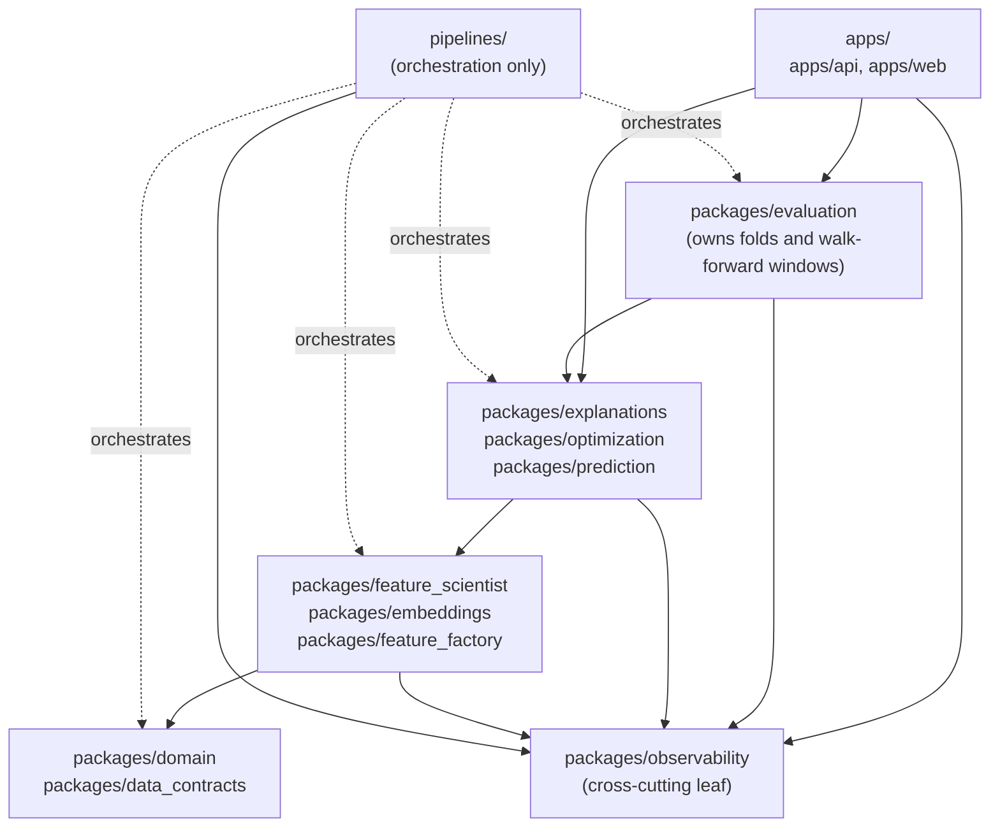

# Repository Structure and Ownership

| Field | Value |
|---|---|
| Project | XG Alonso |
| Document | Repository Structure and Ownership |
| Version | 1.0 |
| Status | Build Specification |
| Owner | Platform |
| Dependencies | None |
| Last updated | 2026-07-27 |

---

## 1. Recommended Repository Layout

Naming is fixed across contexts and must not drift:

| Context | Name |
|---|---|
| Repository directory on disk | `XGalonso` |
| Docs, prose, and package/project slug | `xg-alonso` |
| Python namespace | `xg_alonso` |
| CLI binary | `xg` |

The tree below is the long-term target. Entries marked `# deferred: Dn` are intentionally not built
in the first slice; see section 10 and the binding decision referenced by each marker.

```text
xg-alonso/
├── README.md
├── CLAUDE.md
├── pyproject.toml
├── package.json
├── pnpm-workspace.yaml
├── docker-compose.yml                      # deferred: D1
├── Makefile
├── .env.example
├── .gitignore
├── .pre-commit-config.yaml
│
├── apps/
│   ├── web/                                # deferred: D4
│   │   ├── app/
│   │   ├── components/
│   │   ├── features/
│   │   ├── lib/
│   │   ├── public/
│   │   ├── tests/
│   │   └── package.json
│   │
│   └── api/
│       ├── src/
│       │   ├── api/
│       │   ├── auth/
│       │   ├── dependencies/
│       │   ├── middleware/
│       │   ├── services/
│       │   └── main.py
│       ├── tests/
│       └── Dockerfile                      # deferred: D1
│
├── packages/
│   ├── data_contracts/
│   ├── domain/
│   ├── feature_factory/
│   ├── feature_scientist/
│   ├── embeddings/
│   ├── prediction/
│   ├── optimization/
│   ├── explanations/
│   ├── evaluation/
│   └── observability/
│
├── pipelines/
│   ├── ingestion/
│   │   ├── fpl/
│   │   ├── price_predictor/                # deferred: D11
│   │   ├── historical/
│   │   ├── underlying_stats/               # deferred: D6
│   │   ├── availability/
│   │   └── odds/                           # deferred: D6
│   ├── normalization/
│   ├── identity_resolution/
│   ├── feature_materialization/
│   ├── training/
│   ├── backtesting/
│   └── recommendations/
│
├── configs/
│   ├── environments/
│   ├── sources/
│   ├── features/
│   ├── feature_sets/
│   ├── models/
│   ├── optimization/
│   └── experiments/
│
├── data/
│   ├── README.md
│   ├── samples/
│   ├── schemas/
│   └── fixtures/
│
├── models/
│   ├── registry/
│   ├── minutes/
│   ├── points/
│   ├── price/                              # deferred: D11
│   ├── valuation/
│   └── embeddings/
│
├── infra/
│   ├── docker/                             # deferred: D1
│   ├── database/
│   ├── migrations/                         # deferred: D2
│   ├── github_actions/
│   ├── monitoring/
│   └── deployment/
│
├── scripts/
│   ├── bootstrap_dev.sh
│   ├── ingest_current_data.py
│   ├── backfill_season.py
│   ├── build_features.py
│   ├── train_models.py
│   ├── run_backtest.py
│   └── generate_recommendations.py
│
├── notebooks/
│   ├── exploration/
│   ├── feature_research/
│   ├── model_research/
│   └── archived/
│
├── tests/
│   ├── integration/
│   ├── end_to_end/
│   ├── golden/
│   └── performance/
│
├── docs/
│   ├── README.md
│   ├── vision/
│   │   └── 00_vision.md
│   ├── product/
│   │   └── 01_product_requirements.md
│   ├── architecture/
│   │   └── 01_repository_structure.md
│   ├── data/
│   │   ├── 01_data_sources.md
│   │   └── 04_database_schema.md
│   ├── ml/
│   │   ├── 02_feature_factory.md
│   │   ├── 03_feature_scientist.md
│   │   ├── 04_interaction_discovery.md
│   │   ├── 05_player_clustering.md
│   │   ├── 06_embeddings.md
│   │   └── 07_prediction_models.md
│   ├── optimization/
│   │   ├── 02_transfer_planner.md
│   │   ├── 03_wildcard_planner.md
│   │   └── 04_chip_planner.md
│   ├── api/
│   │   └── 01_public_api.md
│   ├── frontend/
│   │   └── 02_dashboard.md
│   ├── implementation/
│   │   └── 01_build_plan.md
│   └── research/
│       └── 01_knowledge_lab.md
│
└── .github/
    ├── workflows/
    ├── ISSUE_TEMPLATE/
    ├── pull_request_template.md
    └── CODEOWNERS
```

The `docs/` subtree above is the actual current documentation set. Numbering gaps (for example
`docs/ml/` starting at `02_`) are intentional: the slots are reserved for documents that have not
been written yet.

---

## 2. Architectural Rule

Use a modular monorepo, not microservices.

The system is complex in domain logic but does not initially require independently deployed
services. Keep the API, data pipelines, feature platform, models, and optimizer in one repository
with strict package boundaries.

Split deployment units only when there is an operational reason, such as:

- intraday ingestion requires an independent schedule;
- model inference needs separate scaling;
- the web frontend has a separate hosting platform;
- long-running training jobs need a worker environment.

---

## 3. Top-Level Ownership

### `apps/web`

The user-facing Next.js application. Deferred per D4: no frontend in the MVP.

Owns:

- squad dashboard;
- player explorer;
- recommendation cards;
- wildcard planner UI;
- feature-importance views;
- player similarity views;
- model and data freshness indicators.

Must not contain model logic or optimization logic.

### `apps/api`

FastAPI application that exposes product workflows.

Owns:

- request validation;
- authentication (deferred: D3 — the MVP takes a public FPL team ID only and has no auth);
- orchestration;
- API response models;
- caching;
- user-specific access.

Must call domain packages rather than duplicate their logic.

### `packages/data_contracts`

Shared schemas for:

- players;
- teams;
- fixtures;
- gameweeks;
- snapshots;
- feature rows;
- predictions;
- recommendations;
- model metadata.

This package should have minimal dependencies.

### `packages/domain`

Pure FPL and football domain rules.

Owns:

- squad constraints;
- price and selling-price rules;
- position rules;
- club limits;
- transfer accounting;
- chip states (D5: chip state is modelled, chip logic is not built in the MVP);
- gameweek horizons.

No database or API dependencies.

**Constants rule.** Every scoring value and squad constraint in this package loads from a pinned
snapshot of the FPL `bootstrap-static` payload — `game_config.scoring` and `game_config.rules` —
with a recorded fetch timestamp and a drift check against the live payload. They are never Python
literals. This covers squad size 15, XI 11, max 3 per club, budget 1000 tenths of a million,
`transfers_sell_on_fee` 0.5, `max_extra_free_transfers` 4 (so free transfers cap at 5),
`transfers_cap` 20, and the positional quotas GKP 2 (play 1-1), DEF 5 (play 3-5), MID 5 (play 2-5),
FWD 3 (play 1-3).

### `packages/feature_factory`

Deterministic candidate-feature generation.

Owns:

- generators;
- definitions;
- registry;
- lineage;
- point-in-time joins;
- materialization;
- feature-quality validation.

### `packages/feature_scientist`

Automated feature evaluation and promotion.

Owns:

- univariate screening;
- redundancy analysis;
- stability scoring;
- interaction evaluation;
- feature-set selection;
- feature retirement;
- Feature Scientist reports.

### `packages/embeddings`

Representation learning.

Owns:

- player embeddings;
- team embeddings;
- manager embeddings;
- fixture embeddings;
- clustering;
- similarity search;
- embedding versioning.

### `packages/prediction`

Model training and inference.

Owns:

- expected minutes;
- expected points;
- price movement (deferred: D11 — no current-season price data exists at GW1);
- fair value;
- model calibration;
- prediction contracts.

Must not own fold or walk-forward logic; that lives in `packages/evaluation` (see section 7).

### `packages/optimization`

Decision layer.

Owns:

- starting XI optimization;
- transfer packages;
- multi-gameweek planning;
- wildcard timing (note: wildcard windows are GW2-19 and GW20-38, so the chip is unavailable in
  GW1);
- chip timing (deferred: D5);
- captain and bench decisions.

### `packages/explanations`

Converts structured evidence into user-facing reasoning.

Owns:

- deterministic reason codes;
- feature-contribution summaries;
- recommendation comparisons;
- natural-language rendering.

LLMs may rewrite explanations, but they must not invent underlying reasons.

### `packages/evaluation`

Research and production evaluation.

Owns:

- walk-forward validation;
- model metrics;
- calibration;
- recommendation backtests;
- policy regret;
- baseline comparisons;
- experiment reports.

This package is the single definition of fold construction and walk-forward windows.

### `packages/observability`

Shared logging and monitoring utilities.

Owns:

- run IDs;
- structured logs;
- metrics;
- lineage IDs;
- tracing;
- freshness checks.

---

## 4. Data Directory Rule

Do not commit full raw datasets.

The `data/` directory should contain only:

- tiny samples;
- schemas;
- test fixtures;
- documentation;
- local development placeholders.

Use object storage or an ignored local directory for actual data.

Recommended ignored paths:

```text
.data/bronze/
.data/silver/
.data/gold/
.artifacts/models/
.artifacts/features/
```

`.data/bronze/` holds immutable, timestamped raw snapshots; `.data/silver/` holds normalized
tables; `.data/gold/` holds modelling-ready and serving tables. The naming matches the
bronze/silver/gold medallion layering used elsewhere in the documentation set.

---

## 5. Configuration Rule

Behavior that changes between feature sets, models, experiments, or environments should live in
configuration.

Use typed YAML or TOML for:

- source settings;
- feature definitions;
- feature sets;
- model hyperparameters;
- optimization weights;
- backtest windows;
- environment endpoints.

Do not hide important product behavior in magic constants. FPL scoring values and squad
constraints are a stricter case than configuration: they load from a pinned snapshot of the FPL
payload with a recorded fetch timestamp and a drift check, never from Python literals and never
from hand-edited config.

---

## 6. Notebook Rule

Notebooks are for exploration, not production.

Any logic that survives experimentation must move into a package with tests.

A notebook may:

- inspect data;
- visualize features;
- test hypotheses;
- compare prototypes.

A notebook may not be the only implementation of:

- a source adapter;
- a feature;
- a model;
- a backtest;
- an optimizer.

---

## 7. Dependency Direction

Allowed dependency direction:



Tier notes:

- `packages/evaluation` sits above the decision tier. It imports `prediction` and `optimization` to
  train, score, and replay them fold by fold. Nothing in the decision tier imports `evaluation`.
- `packages/observability` is a cross-cutting leaf. Any tier may import it; it imports nothing from
  this diagram, so it never creates a cycle. `domain` and `data_contracts` stay free of it to keep
  their dependency surface minimal.
- Pipelines may orchestrate all packages.

Forbidden:

- `domain` importing API or database code;
- `feature_factory` importing frontend code;
- `prediction` containing FPL transfer rules;
- `prediction` defining its own folds or walk-forward windows, or importing `evaluation` — fold
  logic exists once, in `evaluation`;
- `optimization` rebuilding model features;
- `observability` importing any other package in this repository;
- frontend computing recommendation logic.

---

## 8. Suggested Python Namespaces

Use one installable Python workspace, published under the project slug `xg-alonso` with the import
namespace `xg_alonso` and the console entry point `xg`.

```text
xg_alonso.contracts
xg_alonso.domain
xg_alonso.features
xg_alonso.feature_scientist
xg_alonso.embeddings
xg_alonso.prediction
xg_alonso.optimization
xg_alonso.explanations
xg_alonso.evaluation
xg_alonso.observability
```

The physical monorepo can still preserve package-level ownership.

---

## 9. Suggested Frontend Feature Structure

Deferred per D4; recorded here as the target shape once the web app is built.

```text
apps/web/features/
├── squad/
├── players/
├── transfers/
├── wildcard/
├── captain/
├── market/
├── feature_lab/
├── similarity/
└── settings/
```

Each feature folder should contain:

- components;
- hooks;
- types;
- API bindings;
- tests.

---

## 10. Recommended Initial Build Order

Do not create every folder on day one.

Start with:

```text
xg-alonso/
├── README.md
├── CLAUDE.md
├── pyproject.toml
├── apps/
│   └── api/
├── packages/
│   ├── data_contracts/
│   ├── domain/
│   ├── feature_factory/
│   ├── prediction/
│   ├── optimization/
│   └── evaluation/
├── pipelines/
│   ├── ingestion/
│   ├── normalization/
│   └── feature_materialization/
├── configs/
├── tests/
└── docs/
```

Per D4, the first surface is the `xg` CLI; `apps/api` follows, and the web app follows that.

Add the web app after the first end-to-end recommendation can be generated from a CLI or API.

Add embeddings and the automated Feature Scientist after the base data and feature pipeline is
reliable.

---

## 11. MVP Milestone Mapping

### Milestone 1: Data Foundation

Create:

- contracts;
- source adapters;
- raw snapshots;
- normalized tables;
- identity resolution.

### Milestone 2: Feature Platform

Create:

- generator registry;
- point-in-time joins;
- rolling features;
- Feature Cards;
- offline feature store.

### Milestone 3: Baseline Models

Create:

- minutes model;
- points model;
- price model (deferred: D11);
- walk-forward evaluation.

### Milestone 4: Decision Engine

Create:

- squad import;
- one-transfer optimizer;
- multi-transfer packages;
- no-action baseline.

### Milestone 5: Wildcard Planner

Create:

- best wildcard squad;
- wildcard-now versus wildcard-later comparison;
- chip opportunity-cost logic (deferred: D5).

### Milestone 6: Product UI

Deferred per D4; no frontend ships in the MVP.

Create:

- squad dashboard;
- recommendations;
- player comparison;
- market scanner;
- explanations.

### Milestone 7: Feature Scientist

Create:

- candidate evaluation;
- redundancy removal;
- stable feature-set selection;
- interaction discovery;
- feature reports.

### Milestone 8: Embeddings and Clustering

Create:

- player vectors;
- player clusters;
- similarity search;
- cold-start priors.

---

## 12. Branching and Pull Requests

Recommended branch naming:

```text
feat/feature-factory-registry
feat/fpl-bootstrap-adapter
fix/point-in-time-leakage
docs/feature-scientist
experiment/player-clustering-v1
```

Pull requests should include:

- problem;
- design;
- affected contracts;
- tests;
- data or model impact;
- migration notes;
- screenshots where relevant.

Any change affecting features or models must mention reproducibility impact.

---

## 13. Definition of Done

A subsystem is not complete until it has:

- typed interfaces;
- unit tests;
- integration coverage;
- documentation;
- observability;
- configuration;
- failure behavior;
- sample usage;
- ownership.

For ML components, also require:

- evaluation baseline;
- feature or model version;
- data cutoff;
- saved metrics;
- reproducible command.

---

## 14. Claude Code Operating Rule

Claude should treat documentation as the source of truth.

Before implementing a task:

1. read `CLAUDE.md`;
2. read the relevant design document;
3. inspect existing contracts;
4. identify affected tests;
5. propose a narrow implementation plan;
6. implement the smallest complete vertical slice;
7. run formatting, type checks, and tests;
8. update documentation when contracts change.

Claude should not scaffold unused services or speculative abstractions merely because they appear
in the long-term repository tree.

---

## Related documents

- [Documentation index](../README.md)
- [Vision](../vision/00_vision.md)
- [Product Requirements](../product/01_product_requirements.md)
- [Data Sources](../data/01_data_sources.md)
- [Database Schema](../data/04_database_schema.md)
- [Feature Factory](../ml/02_feature_factory.md)
- [Feature Scientist](../ml/03_feature_scientist.md)
- [Prediction Models](../ml/07_prediction_models.md)
- [Transfer Planner](../optimization/02_transfer_planner.md)
- [Public API](../api/01_public_api.md)
- [Build Plan](../implementation/01_build_plan.md)
