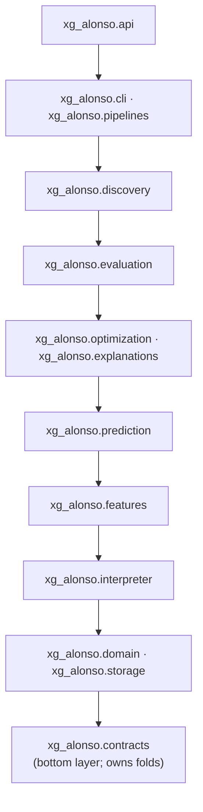

<!-- claims
symbols: xg_alonso.contracts.folds:walk_forward_folds, xg_alonso.discovery.registry:DiscoveryRegistry, xg_alonso.storage.parquet_store:ParquetTableStore, xg_alonso.storage.duckdb_store:DuckDBTableStore, xg_alonso.interpreter.requests, xg_alonso.discovery.embeddings, xg_alonso.discovery.clusters
-->

# Repository Structure and Ownership

| Field | Value |
|---|---|
| Project | XG Alonso |
| Document | Repository Structure and Ownership |
| Version | 2.0 |
| Status | Active |
| Owner | Platform |
| Dependencies | `.importlinter` (the machine-readable form of section 7) |
| Last updated | 2026-08-04 |

**Version 2.0 describes the tree as built.** Version 1.0 described a speculative target and drifted
badly from it: it named three packages that were never created, placed fold construction in a
package that does not own it, and listed seven top-level directories that have never existed on
disk. Where this document and `.importlinter` disagree, `.importlinter` wins — it is executable and
this is not.

---

## 1. Repository Layout

Naming is fixed across contexts and must not drift:

| Context | Name |
|---|---|
| Repository directory on disk | `XGalonso` |
| Docs, prose, and package/project slug | `xg-alonso` |
| Python namespace | `xg_alonso` |
| CLI binary | `xg` |

The tree below is what exists. Every distribution is a member of the uv workspace declared in the
root `pyproject.toml`, and all of them contribute to the single PEP 420 namespace package
`xg_alonso` — so the directory name (`feature_factory`) and the import name (`xg_alonso.features`)
routinely differ, and only the import name matters to code.

```text
xg-alonso/
├── README.md
├── CLAUDE.md
├── LICENSE
├── Makefile
├── pyproject.toml                          # uv workspace root; 14 members
├── uv.lock
├── .importlinter                           # 7 enforced contracts — see section 7
├── .python-version                         # 3.12
├── .pre-commit-config.yaml
├── .env                                    # local only, gitignored
│
├── apps/
│   ├── cli/src/xg_alonso/cli/
│   │   └── main.py                         # Typer; 18 top-level + 2 sub-apps
│   ├── api/src/xg_alonso/api/
│   │   ├── main.py                         # FastAPI app and route handlers
│   │   └── service.py                      # the composition root the routes call
│   └── web/
│       ├── app/                            # Next.js app router: /, /plan, /features, /discovery
│       ├── components/                     # 9 presentational components
│       ├── lib/                            # api.ts, glossary.ts
│       └── package.json
│
├── packages/
│   ├── data_contracts/src/xg_alonso/contracts/
│   ├── domain/src/xg_alonso/domain/
│   ├── storage/src/xg_alonso/storage/
│   ├── interpreter/src/xg_alonso/interpreter/
│   ├── feature_factory/src/xg_alonso/features/
│   ├── prediction/src/xg_alonso/prediction/
│   ├── optimization/src/xg_alonso/optimization/
│   ├── explanations/src/xg_alonso/explanations/
│   ├── evaluation/src/xg_alonso/evaluation/
│   └── discovery/src/xg_alonso/discovery/
│
├── pipelines/
│   ├── ingestion/src/xg_alonso/pipelines/
│   └── normalization/src/xg_alonso/pipelines/
│
├── data/                                   # samples, schemas, fixtures only
├── tests/                                  # mirrors the package tree; plus e2e and docs
├── docs/
└── .github/workflows/
```

Two trees are gitignored rather than absent:

```text
.data/
├── bronze/                                 # immutable, timestamped raw snapshots
├── silver/                                 # normalized parquet
├── gold/                                   # model-ready parquet, feature importance
├── pinned/                                 # the pinned game_config snapshot per season
├── models/                                 # fitted artifacts and their manifests
├── signals/                                # bounded human form signals
└── reports/                                # experiment run files
.venv/
```

### 1.1 Named in version 1.0 and never built

Recorded rather than deleted, because a reader of an older commit or of the build plan will look
for them.

| Named | Reality |
|---|---|
| `packages/feature_scientist` | The capability shipped inside `packages/discovery`; there is no such package |
| `packages/embeddings` | Shipped as `discovery/embeddings.py` and `discovery/clusters.py` |
| `packages/observability` | Never built. Provenance is carried in contracts (`contracts/provenance.py`) rather than by a shared logging package |
| `configs/`, `models/`, `infra/`, `scripts/`, `notebooks/` | None exist. Configuration is either the pinned snapshot, a CLI flag, or a module constant; artifacts live under `.data/` |
| `docker-compose.yml`, `package.json`, `pnpm-workspace.yaml` at the root | None exist. `apps/web` carries its own `package.json` and is installed with npm |
| `pipelines/identity_resolution`, `feature_materialization`, `training`, `backtesting`, `recommendations` | Only `ingestion` and `normalization` exist. The rest are commands on the CLI, not pipeline packages |
| `apps/api/src/{auth,dependencies,middleware,services}/` | The API is two modules: `main.py` and `service.py`. There is no auth layer, by D3 |

The `docs/` numbering gaps (for example `docs/ml/` starting at `02_`) remain intentional: the slots
are reserved for documents that have not been written.

---

## 2. Architectural Rule

Use a modular monorepo, not microservices.

The system is complex in domain logic but does not initially require independently deployed
services. Keep the API, data pipelines, feature platform, models, and optimizer in one repository
with strict package boundaries.

Split deployment units only when there is an operational reason, such as:

- intraday ingestion requires an independent schedule;
- model inference needs separate scaling;
- the web frontend has a separate hosting platform;
- long-running training jobs need a worker environment.

---

## 3. Top-Level Ownership

### `apps/cli` — `xg_alonso.cli`

The first and primary surface, per D4. A Typer app with eighteen top-level commands and two
sub-apps (`models`, `evaluate`). It is also the composition root: the CLI is where a store, a
ruleset and a model are constructed and wired together, which is why it may import every package
below it.

Must not contain modelling, scoring or constraint logic — only argument handling, wiring, and
rendering.

### `apps/web` — Next.js

Built and running (see `apps/web/README.md`), which supersedes the original D4 sequencing note; the
CLI-first *ordering* was still followed. Four routes: the recommendation (`/`), squad planning
(`/plan`), feature importance (`/features`), and the discovery lab (`/discovery`).

Owns:

- the recommendation, rendered as a sentence rather than a metric tile;
- the starting eleven drawn in the formation the optimizer chose;
- the ranked player pool and per-player ledger;
- feature-importance views;
- provenance and freshness indicators, in the footer and masthead.

Must not contain model logic or optimization logic. Every number on the page is computed in
`packages/` and delivered through `apps/api`, so the browser cannot disagree with `xg recommend`.

Not built: the wildcard planner UI (D5) and player similarity views.

### `apps/api`

FastAPI application that exposes product workflows.

Owns:

- request validation;
- authentication (deferred: D3 — the MVP takes a public FPL team ID only and has no auth);
- orchestration;
- API response models;
- caching;
- user-specific access.

Must call domain packages rather than duplicate their logic.

### `packages/data_contracts`

Shared schemas for:

- players;
- teams;
- fixtures;
- gameweeks;
- snapshots;
- feature rows;
- predictions;
- recommendations;
- model metadata.

It also owns **fold construction**. `contracts/folds.py::walk_forward_folds` is the single
definition of a walk-forward split, and it lives here rather than in `evaluation` because
`evaluation`, `discovery` and `prediction` all need to agree on what a fold is, and `contracts` is
the only layer all three are permitted to import. Version 1.0 of this document placed folds in
`evaluation`; that was never true in the code, and had it been, `discovery` could not have used them
without violating the layering.

This package depends on no other internal package — the `contracts-independence` contract enforces
it. `polars` is permitted, because the storage protocols are typed in terms of frames and a
dataframe type is legitimate shared vocabulary for an analytics system. A database driver and an
HTTP client are not.

### `packages/domain`

Pure FPL and football domain rules.

Owns:

- squad constraints;
- price and selling-price rules;
- position rules;
- club limits;
- transfer accounting;
- chip states (D5: chip state is modelled, chip logic is not built in the MVP);
- gameweek horizons.

No database or API dependencies.

**Constants rule.** Every scoring value and squad constraint in this package loads from a pinned
snapshot of the FPL `bootstrap-static` payload — `game_config.scoring` and `game_config.rules` —
with a recorded fetch timestamp and a drift check against the live payload. They are never Python
literals. This covers squad size 15, XI 11, max 3 per club, budget 1000 tenths of a million,
`transfers_sell_on_fee` 0.5, `max_extra_free_transfers` 4 (so free transfers cap at 5),
`transfers_cap` 20, and the positional quotas GKP 2 (play 1-1), DEF 5 (play 3-5), MID 5 (play 2-5),
FWD 3 (play 1-3).

### `packages/storage` — `xg_alonso.storage`

Adapters implementing the protocols declared in `contracts/storage.py`. **The only package
permitted to import a database driver**, enforced by the `duckdb-isolation` contract. During
planning, four separate packages each reached for `duckdb` directly; the gate exists so D2 stays
reversible instead of becoming load-bearing.

Owns:

- `FileSystemBronzeStore` — immutable, timestamped raw snapshots;
- `ParquetTableStore` — the store the running system actually uses;
- `DuckDBTableStore` — implemented, tested, and constructed nowhere outside tests;
- training-manifest read and write.

`DuckDBTableStore` is deliberately not re-exported from `xg_alonso.storage`. Re-exporting it would
mean every consumer transitively imported `duckdb`, quietly defeating the contract.

### `packages/interpreter` — `xg_alonso.interpreter`

Reads free text into typed structures. `requests.py` compiles a manager's plain-English request into
an objective, constraints and beliefs — deterministically, by regex, with no language model on the
default path. `news.py` sweeps for team news FPL has not published.

Part of the quarantined research surface (see section 7). Sits *below* `features` in the layering,
which is precisely why it also needs the explicit `research-surface-is-quarantined` gate.

### `packages/feature_factory` — `xg_alonso.features`

Deterministic candidate-feature generation. Note the name mismatch: directory `feature_factory`,
import `xg_alonso.features`.

Owns:

- the declarative catalogue (`FeatureSpec`, `catalogue_specs`, `build_catalogue`);
- reusable as-of generators (`rolling_as_of`, `shrunk_rate_as_of`);
- point-in-time joins;
- the leakage harness, including its negative control;
- the career, opponent, recency and archetype families;
- assembly into the model-ready frame.

There is no `FeatureStore`, `FeatureDefinition`, `GenerationContext` or `FeatureCard` — those are
specification vocabulary from `docs/ml/02_feature_factory.md` that was never built. The real unit is
a frozen `FeatureSpec` dataclass.

### `packages/discovery` — `xg_alonso.discovery`

Objective-conditioned feature search: the capability version 1.0 called the Feature Scientist and
Embeddings, shipped as one package rather than two.

Owns:

- the feature DSL and its safe expression trees (`dsl.py`, `compile.py`);
- hypothesis generation from measured residual weakness (`hypotheses.py`);
- the walk-forward harness with noise and shuffled controls (`harness.py`);
- utility scoring under an objective (`utility.py`);
- acceptance against criteria fixed in advance (`acceptance.py`);
- player embeddings and dynamic clustering (`embeddings.py`, `clusters.py`);
- the nine `discovery_*` registry tables (`registry.py`);
- an optional language-model proposer that may emit data only (`llm.py`);
- greedy and beam feature-set search (`search.py`).

Two boundaries apply here and nowhere else. The `discovery-core-is-generic` contract keeps `dsl`,
`compile`, `utility`, `acceptance`, `search` and `registry` free of anything football-specific, so
the engine is reusable outside FPL rather than merely claimed to be; the FPL bindings live in
`experiment.py`. The `research-surface-is-quarantined` contract stops the deterministic core from
depending on any of it.

### `packages/prediction`

Model training and inference.

Owns:

- expected minutes;
- expected points;
- price movement (deferred: D11 — no current-season price data exists at GW1);
- fair value;
- model calibration;
- prediction contracts;
- belief application, which returns the raw and adjusted projection side by side and never
  overwrites one with the other (`beliefs.py`).

Must not own fold or walk-forward logic; that lives in `packages/data_contracts` (see section 7).

### `packages/optimization`

Decision layer.

Owns:

- starting XI optimization;
- transfer packages;
- multi-gameweek planning;
- wildcard timing (note: wildcard windows are GW2-19 and GW20-38, so the chip is unavailable in
  GW1);
- chip timing (deferred: D5);
- captain and bench decisions.

### `packages/explanations`

Converts structured evidence into user-facing reasoning.

Owns:

- deterministic reason codes;
- feature-contribution summaries;
- recommendation comparisons;
- natural-language rendering.

LLMs may rewrite explanations, but they must not invent underlying reasons.

### `packages/evaluation`

Research and production evaluation.

Owns:

- walk-forward validation;
- model metrics;
- calibration;
- recommendation backtests;
- policy regret;
- baseline comparisons;
- experiment reports.

It *consumes* `contracts.folds.walk_forward_folds`; it does not define folds. See
`packages/data_contracts` above for why.

### There is no `packages/observability`

Version 1.0 specified one and it was never built. Run IDs, lineage and provenance are carried as
typed values in `contracts/provenance.py` and threaded through the call, rather than being emitted
by a shared logging package. That is a real gap for tracing and metrics; it is recorded here rather
than papered over with a package that does not exist.

---

## 4. Data Directory Rule

Do not commit full raw datasets.

The `data/` directory should contain only:

- tiny samples;
- schemas;
- test fixtures;
- documentation;
- local development placeholders.

Use object storage or an ignored local directory for actual data.

Recommended ignored paths:

```text
.data/bronze/
.data/silver/
.data/gold/
.artifacts/models/
.artifacts/features/
```

`.data/bronze/` holds immutable, timestamped raw snapshots; `.data/silver/` holds normalized
tables; `.data/gold/` holds modelling-ready and serving tables. The naming matches the
bronze/silver/gold medallion layering used elsewhere in the documentation set.

---

## 5. Configuration Rule

Behavior that changes between feature sets, models, experiments, or environments should be
declared, versioned and recorded in run provenance rather than buried in a call site.

**There is no `configs/` directory.** Version 1.0 specified a typed YAML/TOML tree and it was never
built. What exists instead:

| What varies | Where it lives |
|---|---|
| FPL scoring and squad constants | The pinned `bootstrap-static` snapshot in `.data/pinned/`, with a fetch timestamp and a drift check. Never a literal, never hand-edited config |
| Feature definitions and feature sets | Declared in Python as frozen `FeatureSpec` values in `features/catalogue.py`, versioned by `CATALOGUE_VERSION` |
| Source settings, backtest windows, horizons | CLI flags with defaults, recorded in the run manifest |
| Optimization weights | Module constants — `_RISK_WEIGHT` and `_MIN_NET_GAIN` in `optimization/transfer.py` |
| Model hyperparameters | Constructor arguments, hashed into the model configuration hash on the artifact manifest |

The optimization weights are the weakest of these. They are module constants, so changing one is a
code change with no config-level record — reproducibility rests on the commit hash in the run
manifest rather than on a versioned weights file. That is adequate today and would not be if the
weights were tuned per objective.

Do not hide important product behavior in magic constants. FPL scoring values and squad constraints
are a stricter case still: they load from the pinned snapshot with a recorded fetch timestamp and a
drift check, never from Python literals and never from hand-edited config.

---

## 6. Notebook Rule

Notebooks are for exploration, not production.

Any logic that survives experimentation must move into a package with tests.

A notebook may:

- inspect data;
- visualize features;
- test hypotheses;
- compare prototypes.

A notebook may not be the only implementation of:

- a source adapter;
- a feature;
- a model;
- a backtest;
- an optimizer.

---

## 7. Dependency Direction

**This section is a description of `.importlinter`, not an independent specification.** Seven
contracts — one layer contract and six forbidden-import contracts — are checked by
`make boundaries` on every CI run. Where the two disagree, the file wins
and this section is the bug.

### 7.1 The layer contract

Top imports downward; nothing imports upward. Modules on the same line are siblings and may not
import each other.

```text
xg_alonso.api
xg_alonso.cli : xg_alonso.pipelines
xg_alonso.discovery
xg_alonso.evaluation
xg_alonso.optimization : xg_alonso.explanations
xg_alonso.prediction
xg_alonso.features
xg_alonso.interpreter
xg_alonso.domain : xg_alonso.storage
xg_alonso.contracts
```



`contracts` is the bottom layer and depends on nothing internal. That is why fold construction lives
there: `discovery`, `evaluation` and `prediction` must agree on what a fold is, and `contracts` is
the only place all three can reach.

### 7.2 The six forbidden-import contracts

| Contract | Claim it protects |
|---|---|
| `duckdb-isolation` | Only `xg_alonso.storage` may import `duckdb`, so D2 stays reversible |
| `domain-purity` | `domain` imports no `duckdb`, `polars`, `httpx`, `pyarrow` or `sqlite3` — pure rules, testable without a database, a network or a dataframe engine |
| `contracts-independence` | `contracts` imports no internal package, no `duckdb`, no `httpx`. `polars` **is** allowed, deliberately |
| `http-isolation` | Only ingestion may import `httpx`. This is what keeps a feature build reproducible from stored snapshots |
| `discovery-core-is-generic` | `discovery.{dsl,compile,utility,acceptance,search,registry}` may not import `domain`, `features`, `prediction`, `optimization` or `evaluation` — the search engine knows nothing about football |
| `research-surface-is-quarantined` | Nothing from `contracts` through `evaluation`, nor `pipelines`, may import `discovery` or `interpreter` |

The last one is the subtle one and deserves its reasoning stated. `discovery` proposes features and
`interpreter` reads free text, both optionally through a language model and over the network.
Neither may sit under a prediction, an optimization or an evaluation, because a recommendation has
to be reproducible from stored snapshots alone. The layer contract alone would not give that: it
places `interpreter` *below* `features`, so without the explicit gate `prediction` could import the
LLM client and nothing would object. `cli` and `api` are deliberately absent from the source list —
wiring a research tool up as a command or an endpoint is what an app layer is for. The claim being
enforced is that the core does not depend on research, not that research is unreachable.

Forbidden, restated in prose:

- `domain` importing API or database code;
- `features` importing frontend code;
- `prediction` containing FPL transfer rules;
- `prediction` defining its own folds or walk-forward windows — fold logic exists once, in
  `contracts.folds`;
- `optimization` rebuilding model features;
- the frontend computing recommendation logic.

---

## 8. Python Namespaces

One installable uv workspace, published under the project slug `xg-alonso` with the import namespace
`xg_alonso` and the console entry point `xg`. Fourteen distributions; the directory name and the
import name are not always the same.

| Distribution | Directory | Import namespace |
|---|---|---|
| `xg-alonso-contracts` | `packages/data_contracts` | `xg_alonso.contracts` |
| `xg-alonso-domain` | `packages/domain` | `xg_alonso.domain` |
| `xg-alonso-storage` | `packages/storage` | `xg_alonso.storage` |
| `xg-alonso-interpreter` | `packages/interpreter` | `xg_alonso.interpreter` |
| `xg-alonso-features` | `packages/feature_factory` | `xg_alonso.features` |
| `xg-alonso-prediction` | `packages/prediction` | `xg_alonso.prediction` |
| `xg-alonso-optimization` | `packages/optimization` | `xg_alonso.optimization` |
| `xg-alonso-explanations` | `packages/explanations` | `xg_alonso.explanations` |
| `xg-alonso-evaluation` | `packages/evaluation` | `xg_alonso.evaluation` |
| `xg-alonso-discovery` | `packages/discovery` | `xg_alonso.discovery` |
| `xg-alonso-ingestion` | `pipelines/ingestion` | `xg_alonso.pipelines` |
| `xg-alonso-normalization` | `pipelines/normalization` | `xg_alonso.pipelines` |
| `xg-alonso-cli` | `apps/cli` | `xg_alonso.cli` |
| `xg-alonso-api` | `apps/api` | `xg_alonso.api` |

The two pipelines share `xg_alonso.pipelines`, which is what PEP 420 namespace packages are for.

**These distributions resolve only through the uv workspace.** They are published nowhere, so `pip`
cannot find them and `pip install -e .` will not resolve the sibling dependencies.
`uv sync --all-packages`, via `make install`, is the only supported installation path.

There is no `xg_alonso.feature_scientist`, `xg_alonso.embeddings` or `xg_alonso.observability`.

---

## 9. Frontend Structure

As built. The web app uses the Next.js app router with flat, presentational components rather than
the per-feature folder structure version 1.0 proposed.

```text
apps/web/
├── app/
│   ├── page.tsx            # the recommendation
│   ├── plan/page.tsx       # squad planning from a typed request
│   ├── features/page.tsx   # feature importance
│   ├── discovery/page.tsx  # the discovery lab
│   ├── layout.tsx
│   └── globals.css         # the "floodlit night" token set
├── components/             # Pitch, TheCall, SquadBuild, Alternatives, Depth,
│                           # History, LineupDiff, PlayerLedger, Context
└── lib/
    ├── api.ts              # every call to apps/api, typed
    └── glossary.ts
```

The per-feature folder shape was not adopted: there are four routes and nine components, and the
indirection would cost more than it saves. Revisit it if the surface grows.

---

## 10. Build Order

Recorded as history rather than instruction. The order followed was: contracts and domain, then
ingestion and storage, then the Feature Factory with its leakage harness, then prediction, then
optimization and explanations, then evaluation, then the CLI, then the API, then the web app, then
discovery.

Per D4 the first surface was the `xg` CLI, `apps/api` followed, and the web app followed that. The
web app shipped earlier in absolute terms than the original sequencing implied — see the D4
supersession note in `CLAUDE.md` — but the ordering held.

---

## 11. Milestone Status

| Milestone | Status |
|---|---|
| 1 — Data foundation: contracts, source adapters, bronze snapshots, normalized tables | Built. Identity resolution is `player_code`-keyed throughout rather than a separate pipeline |
| 2 — Feature platform: point-in-time joins, rolling features, declarative catalogue, leakage harness | Built. No Feature Cards and no offline feature store; features materialize to parquet under `.data/gold/` |
| 3 — Baseline models: minutes, component points, walk-forward evaluation | Built. Price model deferred (D11) |
| 4 — Decision engine: squad import, transfer optimizer, HOLD baseline | Built, plus squad construction from scratch |
| 5 — Wildcard planner | Not built (D5) |
| 6 — Product UI | Built: four routes over `apps/api` |
| 7 — Feature Scientist: candidate evaluation, feature-set selection, feature reports | Built in `packages/discovery`, and not in the shape this milestone described. Interaction *search* exists (`search.py::beam_search`) but is not yet reached from the loop |
| 8 — Embeddings and clustering: player vectors, clusters, cold-start priors | Built in `discovery/embeddings.py` and `discovery/clusters.py`. Similarity is exposed as cluster membership rather than a nearest-neighbour index |

---

## 12. Branching and Pull Requests

Recommended branch naming:

```text
feat/feature-factory-registry
feat/fpl-bootstrap-adapter
fix/point-in-time-leakage
docs/feature-scientist
experiment/player-clustering-v1
```

Pull requests should include:

- problem;
- design;
- affected contracts;
- tests;
- data or model impact;
- migration notes;
- screenshots where relevant.

Any change affecting features or models must mention reproducibility impact.

---

## 13. Definition of Done

A subsystem is not complete until it has:

- typed interfaces;
- unit tests;
- integration coverage;
- documentation;
- observability;
- configuration;
- failure behavior;
- sample usage;
- ownership.

For ML components, also require:

- evaluation baseline;
- feature or model version;
- data cutoff;
- saved metrics;
- reproducible command.

---

## 14. Claude Code Operating Rule

Claude should treat documentation as the source of truth.

Before implementing a task:

1. read `CLAUDE.md`;
2. read the relevant design document;
3. inspect existing contracts;
4. identify affected tests;
5. propose a narrow implementation plan;
6. implement the smallest complete vertical slice;
7. run formatting, type checks, and tests;
8. update documentation when contracts change.

Claude should not scaffold unused services or speculative abstractions merely because they appear
in the long-term repository tree.

---

## Related documents

- [Documentation index](../README.md)
- [Vision](../vision/00_vision.md)
- [Product Requirements](../product/01_product_requirements.md)
- [Data Sources](../data/01_data_sources.md)
- [Database Schema](../data/04_database_schema.md)
- [Feature Factory](../ml/02_feature_factory.md)
- [Feature Scientist](../ml/03_feature_scientist.md)
- [Prediction Models](../ml/07_prediction_models.md)
- [Transfer Planner](../optimization/02_transfer_planner.md)
- [Public API](../api/01_public_api.md)
- [Build Plan](../implementation/01_build_plan.md)
