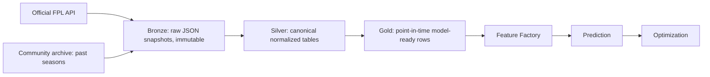
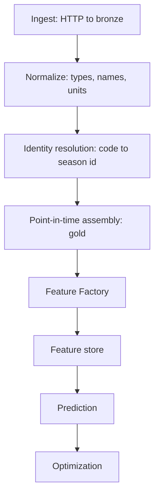

# Data Sources and Ingestion Register

| Field | Value |
|---|---|
| Project | XG Alonso |
| Document | Data Sources |
| Version | 1.0 |
| Status | Draft |
| Owner | Data Platform |
| Dependencies | [Database Schema](04_database_schema.md), [Feature Factory](../ml/02_feature_factory.md), [Repository Structure](../architecture/01_repository_structure.md) |
| Last updated | 2026-07-27 |

---

## 1. Scope and sourcing rule

XG Alonso ingests from the **official Fantasy Premier League API only**. This is binding decision
D6: zero budget, no paid providers, and **no scraping**. Understat, FBref, odds feeds and
availability aggregators are explicitly out of scope for the MVP and must not be added by a source
adapter without reversing D6.

The base URL for every endpoint in this document is:

```text
https://fantasy.premierleague.com/api/
```

No endpoint requires authentication. Manager-scoped endpoints are addressed by a **public FPL entry
ID** supplied by the user (D3). No credentials are stored and no login flow exists.

The original pipeline sketch for this document listed five source families — official FPL,
historical FPL, underlying stats, availability, and a price predictor. Three of those are
corrected here:

- **Underlying stats** do not require a third-party provider. The FPL API itself publishes
  `expected_goals`, `expected_assists`, `expected_goal_involvements` and `expected_goals_conceded`
  per player per gameweek from 2022/23 onward.
- **Availability** is not a separate source. It is carried on `elements[]` in `bootstrap-static`
  as `status`, `chance_of_playing_this_round` and `chance_of_playing_next_round`.
- **Price predictor** is not a source at all. FPL publishes no official price predictor. Any
  "official predictor progress" field is a signal XG Alonso would have to model itself, and the
  price model is deferred (D11).

### 1.1 Backfill floor

Historical backfill starts at **season 2022/23** (D7) — the earliest season for which the API
exposes expected-goals data. Earlier seasons are not ingested, because a feature that exists for
some seasons and not others silently poisons walk-forward evaluation.

Per-gameweek history for *completed* seasons is not retrievable from the live API, which only
serves the current season on `element-summary` and `event/{gw}/live`. For those seasons XG Alonso
reads the free, official-API-derived community archive (`vaastav/Fantasy-Premier-League`), which is
a recorded dump of the same official endpoints rather than a scrape of a third-party site. Every
archive row is ingested with full provenance: `source_name`, `source_url`, `source_commit`,
`archive_season`, `observed_time` and a checksum of the file it came from. Archive-derived rows are
tagged so any model or evaluation run can be re-executed against live-API rows only.

---

## 2. Source register

### 2.1 Endpoints, grain and cadence

| Endpoint | Contents | Grain | Primary key | Cadence |
|---|---|---|---|---|
| `bootstrap-static/` | `elements`, `teams`, `events`, `element_types`, `game_config`, `phases`, `total_players` | Full-state snapshot | `(snapshot_id)`; child grains `(snapshot_id, element_id)`, `(snapshot_id, team_id)`, `(snapshot_id, event_id)` | Every 6h in-season; hourly in the 24h before a deadline; mandatory read within 2h before every deadline; daily at ~02:00Z to capture overnight price changes |
| `fixtures/` | Whole-season fixture list; `stats` array populated after each match | One row per fixture | `(season, fixture_id)` | Daily; every 15 min on matchdays until all fixtures are `finished` |
| `fixtures/?event={gw}` | Fixtures for one gameweek | One row per fixture | `(season, fixture_id)` | On demand; used for targeted refresh |
| `element-summary/{element_id}/` | `history` (this season, per fixture), `history_past` (per prior season, aggregate), `fixtures` (upcoming) | Player × fixture | `(season, player_id, fixture_id)` | Once per player after each gameweek reaches `data_checked = true` |
| `event/{gw}/live/` | Per-player stats and `explain` breakdown for one gameweek | Player × gameweek | `(season, event_id, player_id)` | Every 2 min while fixtures in that gameweek are live; one final authoritative read after `data_checked = true` |
| `entry/{entry_id}/` | Manager summary: name, `summary_overall_points`, `summary_overall_rank`, `last_deadline_bank`, `last_deadline_value`, `current_event` | One row per entry | `(entry_id)` | On demand, and once after each gameweek finishes |
| `entry/{entry_id}/history/` | `current` (per gameweek), `past` (per season), `chips` (chips already played) | Entry × gameweek, entry × season, entry × chip | `(entry_id, event_id)` / `(entry_id, season_name)` / `(entry_id, chip_name, event_id)` | On demand, and once after each gameweek finishes |
| `entry/{entry_id}/event/{gw}/picks/` | 15 picks with `position`, `multiplier`, `is_captain`, `is_vice_captain`; plus `entry_history` and `active_chip` | Entry × gameweek × pick | `(entry_id, event_id, element_id)` | After the gameweek deadline only — **404 before it** |
| `entry/{entry_id}/transfers/` | All transfers made by the entry: `element_in`, `element_in_cost`, `element_out`, `element_out_cost`, `event`, `time` | One row per transfer | `(entry_id, event_id, element_in, element_out, time)` | On demand, and once after each gameweek deadline |

`element-summary/{element_id}/` is called once per player. At roughly 750 players this is 750
requests per gameweek, so the adapter must rate-limit, back off on 429, and checkpoint progress so
a partial run resumes rather than restarts.

### 2.2 Timestamp derivation

Every ingested row carries the four timestamps used throughout the platform. Feature joins filter
on `available_time <= prediction_timestamp`; see the [Feature Factory](../ml/02_feature_factory.md)
point-in-time rules.

| Endpoint | `event_time` | `observed_time` | `available_time` | `processed_time` |
|---|---|---|---|---|
| `bootstrap-static/` | State, not an event — set equal to `observed_time` | HTTP response time of the snapshot | `= observed_time` (public the moment it is readable) | Pipeline run timestamp |
| `fixtures/` | `kickoff_time` for match facts; scheduling fields have none | HTTP response time | Pre-match fields `= observed_time`; result and `stats` fields gated on `finished_provisional = true` | Pipeline run timestamp |
| `element-summary/{id}/` | `history[].kickoff_time` | HTTP response time | Match stats when that fixture is `finished_provisional`; `bonus` and `bps`-derived values only when the gameweek is `data_checked = true` | Pipeline run timestamp |
| `event/{gw}/live/` | Kickoff time of the player's fixture in that gameweek | HTTP response time | As above — provisional in-play, authoritative at `data_checked` | Pipeline run timestamp |
| `entry/{id}/` | State — set equal to `observed_time` | HTTP response time | `= observed_time` | Pipeline run timestamp |
| `entry/{id}/history/` | End of the gameweek the row describes | HTTP response time | Gameweek `finished = true` | Pipeline run timestamp |
| `entry/{id}/event/{gw}/picks/` | The gameweek `deadline_time` | HTTP response time | `deadline_time` of that gameweek | Pipeline run timestamp |
| `entry/{id}/transfers/` | The transfer's own `time` field | HTTP response time | `= event_time` (the transfer is already public when returned) | Pipeline run timestamp |

**Bonus points are the sharpest leakage trap in the API.** `bonus` is provisional while a gameweek
is live and is only final when the corresponding `events[]` row reports `data_checked = true`.
An `available_time` that ignores `data_checked` will leak final bonus into in-play feature rows.

### 2.3 Constants are loaded, never transcribed

`bootstrap-static` carries `game_config.scoring` and `game_config.rules`. Both are machine-readable,
so **scoring and constraint constants load from a pinned snapshot of the FPL payload with a recorded
fetch timestamp and a drift check on every ingest. They are never Python literals.**

This is not stylistic. A goalkeeper goal is worth **10** points, not the widely assumed 6 — a value
almost every hand-written FPL codebase gets wrong. Transcription is how that error enters silently.
The drift check compares the live `game_config` against the pinned snapshot and fails the ingest run
on any difference, forcing a deliberate re-pin rather than a silent behaviour change.

### 2.4 Identity keys

| Key | Source field | Stability |
|---|---|---|
| Player cross-season identity | `elements[].code` | Stable across seasons — **the** join key for history |
| Player season identity | `elements[].id` | Re-issued each season; valid only within one season |
| Team cross-season identity | `teams[].code` | Stable across seasons |
| Team season identity | `teams[].id` | 1–20, assigned alphabetically each season; changes on promotion and relegation |
| Fixture identity | `fixtures[].id` (season-scoped), `fixtures[].code` | Season-scoped id; code is stable |

Any table keyed on `elements[].id` or `teams[].id` without a season column is a bug. Promoted clubs
have no prior-season rows at all, which is a cold-start case rather than a data-quality failure.

---

## 3. Medallion layers



### 3.1 Bronze

Raw HTTP response bodies, stored byte-for-byte as received, partitioned by endpoint and
`observed_time`. Bronze records the request URL, response status, response headers of interest,
a payload checksum, and the `snapshot_id` that every downstream row inherits.

Bronze performs no parsing, no renaming, no type coercion and no filtering. If the API ships a
malformed payload, bronze stores the malformed payload.

### 3.2 Silver

Canonical, typed, deduplicated tables with resolved identity — `players`, `teams`, `fixtures`,
`gameweeks`, `player_gameweek_stats`. Silver is where season-scoped ids are joined to stable codes
and where the four timestamps are computed. Silver holds no feature logic.

### 3.3 Gold

Point-in-time correct rows at the modelling grain
(`player_id × prediction_timestamp × target_gameweek`), containing only information whose
`available_time` precedes the prediction timestamp. Gold is what the Feature Factory reads.

### 3.4 Immutability rule

**Raw data is immutable.** A bronze snapshot is append-only and is never overwritten, corrected,
backfilled in place, or deleted. Correcting a mistake means writing a *new* snapshot and re-deriving
silver and gold from it. Every silver and gold row is traceable to the `snapshot_id` it came from,
so any historical run can be reproduced exactly.

Corollary: reruns are cheap and safe, and "the pipeline fixed itself when I re-ran it" is a
detectable condition rather than a mystery.

### 3.5 Pipeline stages



---

## 4. Preseason hazards

XG Alonso must be useful by GW1 of 2026/27 (D9), which means it must run correctly during preseason
— when the API is at its least trustworthy. These are verified behaviours, not speculation, and each
one needs an explicit code path rather than a crash.

| Hazard | Observed behaviour | Required handling |
|---|---|---|
| Team attack strength | `strength_attack_home` and `strength_attack_away` are `0` for **all 20 teams** | Never divide by strength. Fall back to a prior-season strength estimate, flagged as imputed |
| Team defence strength | `strength_defence_home` and `strength_defence_away` are `0` for **all 20 teams** | Same fallback; imputation is recorded in feature lineage |
| `strength` | `null` | Treat as missing, not as zero |
| `strength_overall_home` / `strength_overall_away` | Preseason uses a **1–5** scale; in-season the same fields carry roughly **1000–1400** | Scale detection on ingest. A feature that mixes the two scales is silently catastrophic |
| Entry picks | `entry/{id}/event/{gw}/picks/` returns **404 before the deadline** | Not an error. The CLI accepts `--squad-file` so a squad can be supplied manually before the GW1 deadline. See [Public API](../api/01_public_api.md) |
| Entry transfers | `entry/{id}/transfers/` returns an **empty array** before an entry's first transfer | Empty is a valid response. Purchase-price reconstruction (D3) starts from the initial squad, not from a transfer |
| Player match history | `element-summary` `history` is empty for the new season | Cross-season features come from `history_past` and archive rows keyed on `elements[].code` |
| Live stats | `event/{gw}/live/` returns all-zero stats before any fixture kicks off | Distinguish "zero because it has not happened" from "zero because the player did nothing" |
| Promoted clubs | No prior-season rows exist under any key | Cold-start path, not a data-quality failure |
| Fixture scheduling | `kickoff_time` may be `null` and `event` unassigned for late-scheduled fixtures | Fixture-count features must handle unscheduled fixtures without dropping them |

Preseason hazard handling is covered by fixture-backed tests using pinned bronze snapshots taken
during preseason, so the behaviour cannot regress once the live API leaves this state.

---

## 5. Ingestion acceptance criteria

- Every adapter is independently testable against a pinned bronze snapshot with no network access.
- Every ingest run emits a `run_id`, a row count per table, and a freshness timestamp per source.
- Re-running an ingest over the same snapshot produces byte-identical silver and gold output.
- The `game_config` drift check runs on every ingest and fails the run on any change.
- No adapter writes to bronze twice for the same `(endpoint, observed_time)` pair.
- Archive-derived rows are distinguishable from live-API rows by a provenance column.
- Rate limiting and 429 back-off are implemented in the shared HTTP client, not per adapter.

---

## Related documents

- [Database Schema](04_database_schema.md) — the tables these sources land in
- [Feature Factory](../ml/02_feature_factory.md) — point-in-time joins and the four-timestamp rule
- [Prediction Models](../ml/07_prediction_models.md) — consumers of gold
- [Public API](../api/01_public_api.md) — `xg ingest` and the `--squad-file` escape hatch
- [Repository Structure](../architecture/01_repository_structure.md) — where adapters live
- [Build Plan](../implementation/01_build_plan.md) — phase 3 delivers this document
- [Documentation Index](../README.md)
