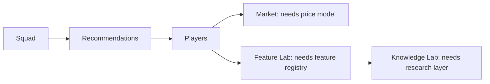

# Dashboard

| Field | Value |
|---|---|
| Project | XG Alonso |
| Document | Dashboard |
| Version | 1.0 |
| Status | Deferred (Post-MVP) |
| Owner | Product |
| Dependencies | [Public API](../api/01_public_api.md), [Transfer Planner](../optimization/02_transfer_planner.md), [Feature Factory](../ml/02_feature_factory.md) |
| Last updated | 2026-07-27 |

---

## 1. Deferral notice

**No frontend ships in the MVP.** Binding decision D4 sets the surface order: CLI first, then
FastAPI, then Next.js. The dashboard is the third surface and is not on the critical path to GW1 of
2026/27 (D9).

This document exists so the eventual UI is built against contracts the API already provides, rather
than the API being retrofitted to a UI designed in isolation. Each view below names the subsystem it
depends on and whether that subsystem exists yet.

The MVP equivalent of every view below is terminal output from `xg`. See
[Public API §2](../api/01_public_api.md).

---

## 2. View register

| View | Purpose | Depends on | Blocked by |
|---|---|---|---|
| Squad | The entry's current 15, XI, formation, captain, bench, bank, squad value, purchase and selling prices | `GET /v1/entries/{entry_id}/squad` | Nothing — buildable as soon as the HTTP API exists |
| Recommendations | Ranked transfer recommendations against HOLD, with hit accounting and explanations | `GET /v1/entries/{entry_id}/recommendations` | Nothing beyond the API |
| Players | Player explorer: filter, sort, compare, per-player projections and history | `GET /v1/players`, `GET /v1/players/{player_id}` | Nothing beyond the API |
| Market | Price rises and falls, ownership momentum, transfer flow, value opportunities | Price model | **Deferred price model (D11)** — no current-season price data exists at GW1, so this view has nothing truthful to display |
| Feature Lab | Feature catalogue, lineage, importance, stability, promotion and retirement history | Feature registry and Feature Scientist | **Post-MVP subsystems** — [Feature Scientist](../ml/03_feature_scientist.md) is `Deferred (Post-MVP)` and the `feature_registry` / `feature_values` tables are not built |
| Knowledge Lab | Accumulated hypotheses, experiments, outcomes and what has been learned across seasons | Research layer | **Post-MVP subsystem** — [Knowledge Lab](../research/01_knowledge_lab.md) is `Deferred (Post-MVP)`; product comes first (D10) |

Three of the six views are blocked on subsystems that do not exist. Building the shell for all six
would produce three views with placeholder content, which is worse than three honest views.

### 2.1 Build order when the frontend starts

Squad and Recommendations together constitute the product. Everything after that is depth.

---

## 3. Cross-cutting requirements

These apply to every view whenever the frontend is built.

| Requirement | Rule |
|---|---|
| Provenance is visible | Model version, feature-set version, data cutoff and prediction timestamp are surfaced in the UI, not buried. A user must be able to see how stale a recommendation is |
| Freshness is explicit | Every view shows when its underlying data was last ingested |
| No computation in the frontend | The web app renders. It never computes recommendations, scores squads, applies scoring rules, or checks constraints. See [Repository Structure §3](../architecture/01_repository_structure.md) |
| Explanations are read, not written | The frontend displays reason codes and rendered text from `packages/explanations`. It never generates reasoning |
| Deferred means absent | A view whose subsystem does not exist is not shipped as an empty shell. No placeholder charts, no lorem data |
| Uncertainty is shown | Confidence and risk are displayed alongside every point projection, never a bare number |

---

## Related documents

- [Public API](../api/01_public_api.md) — the contracts every view reads
- [Transfer Planner](../optimization/02_transfer_planner.md) — what the Recommendations view displays
- [Feature Factory](../ml/02_feature_factory.md) — what the Feature Lab would expose
- [Feature Scientist](../ml/03_feature_scientist.md) — deferred, blocks the Feature Lab
- [Knowledge Lab](../research/01_knowledge_lab.md) — deferred, blocks the Knowledge Lab view
- [Repository Structure](../architecture/01_repository_structure.md) — `apps/web` ownership boundary
- [Build Plan](../implementation/01_build_plan.md) — the frontend is after phase 9
- [Documentation Index](../README.md)
