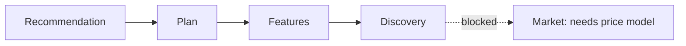

<!-- claims
routes: GET /squad/{entry_id}, GET /recommend/{entry_id}, GET /players, GET /features/importance, GET /features/discovered, GET /hypotheses, GET /clusters, GET /experiments
-->

# Dashboard

| Field | Value |
|---|---|
| Project | XG Alonso |
| Document | Dashboard |
| Version | 1.1 |
| Status | Partially shipped |
| Owner | Product |
| Dependencies | [Public API](../api/01_public_api.md), [Transfer Planner](../optimization/02_transfer_planner.md), [Feature Factory](../ml/02_feature_factory.md) |
| Last updated | 2026-08-04 |

---

## 1. Status

**The frontend shipped.** `apps/web` serves four routes — the recommendation (`/`), squad planning
(`/plan`), feature importance (`/features`) and the discovery lab (`/discovery`) — built from nine
components over `apps/api`. See [`apps/web/README.md`](../../apps/web/README.md) for the design and
the honesty constraints it holds itself to.

This document previously read *"No frontend ships in the MVP"*, citing D4. D4's ordering was in fact
followed — CLI, then API, then Next.js — but its "no frontend in the MVP" clause has been superseded;
see the dated note in `CLAUDE.md`. The document is kept because its view register and its
cross-cutting requirements are still the right frame, and because two of the six views really are
still blocked.

The CLI equivalent of every view remains available. See [Public API §2](../api/01_public_api.md).

---

## 2. View register

| View | Purpose | Reads | Status |
|---|---|---|---|
| Recommendation | The transfer written as a sentence, the resulting XI in the chosen formation, the arithmetic beneath it | `GET /recommend/{entry_id}`, `GET /squad/{entry_id}` | **Shipped** at `/` |
| Plan | Build a squad from requirements typed in plain English, with a justification per pick | `POST /squad/plan`, `POST /requirements/parse`, `GET /build-squad/explained` | **Shipped** at `/plan` |
| Players | Ranked player pool and per-player ledger | `GET /players` | **Shipped**, as the depth panel and ledger inside `/` rather than as a standalone explorer. Filter, sort and side-by-side compare are not built |
| Feature Lab | Feature importance out of sample; discovered features, accepted and rejected; hypotheses and their refutation conditions; clusters; experiment manifests | `GET /features/importance`, `GET /features/discovered`, `GET /hypotheses`, `GET /clusters`, `GET /experiments` | **Shipped** across `/features` and `/discovery`. Not as specified: there is no feature *registry* view, because there is no `feature_registry` table — lineage is carried on the artifact manifest and the catalogue version instead |
| Market | Price rises and falls, ownership momentum, transfer flow, value opportunities | Price model | **Blocked (D11)** — no current-season price data exists at GW1, so this view has nothing truthful to display |
| Knowledge Lab | What has been learned across seasons, as opposed to within one experiment | Research layer | **Partly subsumed.** `/discovery` shows hypotheses, verdicts and experiments, which is most of what this view was for. The cross-season lesson accumulation in [Knowledge Lab](../research/01_knowledge_lab.md) is still not built |

The rule that governed the build order held: no view shipped as an empty shell. Market is absent
rather than present-and-blank.

### 2.1 Build order followed

The Recommendation view alone constitutes the product. Everything after it is depth.

---

## 3. Cross-cutting requirements

These apply to every view. They are met today and are load-bearing rather than aspirational — see
the "Honesty constraints" section of [`apps/web/README.md`](../../apps/web/README.md).

| Requirement | Rule |
|---|---|
| Provenance is visible | Model version, feature-set version, data cutoff and prediction timestamp are surfaced in the UI, not buried. A user must be able to see how stale a recommendation is |
| Freshness is explicit | Every view shows when its underlying data was last ingested |
| No computation in the frontend | The web app renders. It never computes recommendations, scores squads, applies scoring rules, or checks constraints. See [Repository Structure §3](../architecture/01_repository_structure.md) |
| Explanations are read, not written | The frontend displays reason codes and rendered text from `packages/explanations`. It never generates reasoning |
| Deferred means absent | A view whose subsystem does not exist is not shipped as an empty shell. No placeholder charts, no lorem data |
| Uncertainty is shown | Confidence and risk are displayed alongside every point projection, never a bare number |

---

## Related documents

- [Public API](../api/01_public_api.md) — the contracts every view reads
- [Transfer Planner](../optimization/02_transfer_planner.md) — what the Recommendations view displays
- [Feature Factory](../ml/02_feature_factory.md) — what the Feature Lab would expose
- [Feature Scientist](../ml/03_feature_scientist.md) — superseded; the capability behind `/discovery`
- [Knowledge Lab](../research/01_knowledge_lab.md) — still deferred; the cross-season half of `/discovery`
- [Repository Structure](../architecture/01_repository_structure.md) — `apps/web` ownership boundary
- [`apps/web/README.md`](../../apps/web/README.md) — the front end as built
- [Documentation Index](../README.md)
