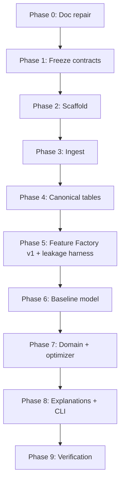

# Build Plan

| Field | Value |
|---|---|
| Project | XG Alonso |
| Document | Build Plan |
| Version | 1.0 |
| Status | **Superseded** — historical record of the 25-day sequencing from 2026-07-27 |
| Owner | Platform |
| Dependencies | [Repository Structure](../architecture/01_repository_structure.md), [Data Sources](../data/01_data_sources.md), [Feature Factory](../ml/02_feature_factory.md), [Transfer Planner](../optimization/02_transfer_planner.md), [Public API](../api/01_public_api.md) |
| Last updated | 2026-08-04 (status only) |

> **Superseded 2026-08-04.** This plan was written on 2026-07-27 and sequenced 25 days against the
> GW1 deadline. Its scope has been exceeded: the API, the web front end and the whole discovery
> package are built and appear nowhere in it. It carries no completion markers and none have been
> added, because retro-fitting ticks to a plan that was overtaken rather than followed would
> misrepresent how the work actually went.
>
> For what exists now, read [Repository Structure §11](../architecture/01_repository_structure.md)
> (milestone status) and the [Public API](../api/01_public_api.md). This document is kept for its
> reasoning about *ordering* — in particular §1, which is still the clearest statement of why the
> GW1 404 makes `--squad-file` a launch requirement rather than a convenience.

---

## 1. The deadline

**GW1 of the 2026/27 season locks at `2026-08-21T17:30Z`.**

That is the hard target (D9): `xg recommend` must produce a defensible, explainable recommendation
before that timestamp. From 2026-07-27 that is 25 days. Everything in this plan is sequenced against
that date, and every scope decision below is a consequence of it.

Two facts about GW1 shape the whole plan and are easy to discover too late:

- `entry/{entry_id}/event/1/picks/` returns **404 before the deadline**, so the GW1 squad cannot be
  read from the API. The CLI's `--squad-file` path is therefore a **launch requirement**, not a
  convenience.
- A **wildcard cannot be played in GW1** — the first window is GW2–GW19. Chips are excluded from the
  MVP anyway (D5), but this removes any argument for rushing them.

---

## 2. Phase sequence

Phases are strictly ordered. Each has one output and one acceptance criterion, and a phase is not
complete until its criterion is demonstrated, not asserted.

### 2.1 Summary

| Phase | Name | Output | Acceptance criterion |
|---|---|---|---|
| 0 | Documentation repair | A documentation suite consistent with the binding decisions | Every document has one H1, a metadata block, a status from the closed vocabulary, and contradicts no binding decision |
| 1 | Freeze shared contracts | Typed schemas in `packages/data_contracts` and the repository interface | Every downstream package imports contracts; no package defines its own player, squad or prediction type |
| 2 | Scaffold | Minimal runnable monorepo with tooling, CI, and a no-op `xg` CLI | `make check` runs format, lint, type-check and tests green on a cold clone |
| 3 | Ingest | Source adapters writing immutable bronze snapshots | A full ingest runs offline from pinned snapshots and reproduces byte-identical bronze; `game_config` drift check passes |
| 4 | Canonical tables | Silver and gold in DuckDB with the four timestamps | Component-to-`total_points` reconciliation passes for every row in `player_gameweek_stats` |
| 5 | Feature Factory v1 + leakage harness | 300–700 versioned candidate features with lineage | The leakage harness proves no feature reads data with `available_time` after its row's prediction timestamp |
| 6 | Baseline model | Expected minutes and component-based expected points | Walk-forward evaluation beats a naive persistence baseline, with metrics stored and reproducible |
| 7 | Domain + optimizer | `packages/domain` constraints and the single-transfer planner | Exhaustive search never proposes an illegal squad, verified by property-based tests; HOLD is scored by the same routine as every alternative |
| 8 | Explanations + CLI | Reason codes and the full `xg` command surface | `xg recommend <entry_id> --squad-file ...` produces a ranked, explained recommendation with full provenance |
| 9 | Verification | End-to-end reproducibility and freshness gates | A stored `run_id` replays an entire recommendation byte-identically on a clean machine |

---

## 3. Phase detail

### 3.1 Phase 0 — Documentation repair

**Output.** The documentation suite in `docs/` structurally correct and reconciled against the
binding decisions, with a navigable index.

**Acceptance criterion.** Exactly one H1 per document; a metadata table on every document; every
status drawn from `Active | Build Specification | Draft | Deferred (Post-MVP)`; no document asserts
something a binding decision forbids.

Documentation is phase 0 because `CLAUDE.md` makes documentation the source of truth for
implementation. Building from documents that contradict D2, D5 or D6 produces code that has to be
deleted.

### 3.2 Phase 1 — Freeze shared contracts

**Output.** `packages/data_contracts` containing typed schemas for players, teams, fixtures,
gameweeks, squads, picks, predictions, recommendations and provenance; plus the repository interface
from [Database Schema §1](../data/04_database_schema.md).

**Acceptance criterion.** Every other package imports its types from `data_contracts`. No package
defines a competing player, squad or prediction type. The dependency direction rule holds:
`data_contracts` imports nothing from the project.

Contracts are frozen before implementation because they are the interfaces everything else is
written against. Changing them in phase 7 is a refactor across every package.

### 3.3 Phase 2 — Scaffold

**Output.** A minimal runnable monorepo: `pyproject.toml`, the package skeletons actually needed
(`data_contracts`, `domain`, `feature_factory`, `prediction`, `optimization`, `evaluation`,
`observability`), the ingestion pipeline directory, `configs/`, `tests/`, and an `xg` entry point
whose subcommands exist and exit cleanly.

**Acceptance criterion.** `make check` runs formatting, linting, type checking and tests green on a
cold clone with no manual setup. `xg --help` lists every command in
[Public API §2](../api/01_public_api.md).

Scope discipline: **do not scaffold the full long-term repository tree.** No `apps/web`, no
`infra/docker`, no `pipelines/odds`. Local-only, no Docker, no cloud (D1). Empty directories for
speculative subsystems are a maintenance tax with no payoff.

### 3.4 Phase 3 — Ingest

**Output.** Source adapters for `bootstrap-static`, `fixtures`, `element-summary/{id}`,
`event/{gw}/live`, `entry/{id}`, `entry/{id}/history`, `entry/{id}/event/{gw}/picks` and
`entry/{id}/transfers`, all writing immutable bronze. Plus historical backfill from 2022/23 (D7),
including the official-API-derived community archive for completed seasons, recorded with full
provenance. Plus `xg config pin` and the drift check.

**Acceptance criterion.** A full ingest replays offline from pinned bronze snapshots and produces
byte-identical output. The `game_config` drift check runs and passes. Preseason hazard tests pass:
zero strength fields, the 1–5 versus 1000–1400 scale split, a 404 on pre-deadline picks, and an
empty transfers array are all handled as expected states rather than errors.

Official FPL API only (D6). No scraping, no paid providers.

### 3.5 Phase 4 — Canonical tables

**Output.** Silver and gold layers in DuckDB — `teams`, `players`, `gameweeks`, `fixtures`,
`player_gameweek_stats`, plus `raw_snapshots` and `game_config_snapshots` — with identity resolution
on `elements[].code` and `teams[].code`, and the four timestamps computed per
[Data Sources §2.2](../data/01_data_sources.md).

**Acceptance criterion.** Applying the pinned scoring rules to the component columns reproduces
`total_points` for **every** row in `player_gameweek_stats`. Any mismatch fails the build.

That reconciliation is the single most valuable test in the project. It proves simultaneously that
the component columns are interpreted correctly, that the pinned scoring snapshot is right, and that
component-based points modelling (D8) rests on a correct conversion.

### 3.6 Phase 5 — Feature Factory v1 and leakage harness

**Output.** Deterministic generators producing **300–700 quality candidate features** (D12, not
thousands), each with a registry entry recording generator, parameters, version, lineage, tags and
introduction date. Point-in-time joins. Materialization to the feature store. The leakage harness.

**Acceptance criterion.** The leakage harness proves that no materialized feature reads any row
whose `available_time` exceeds that feature row's prediction timestamp — including the bonus-points
case, where `bonus` must not be readable before the gameweek is `data_checked`.

The harness runs in CI on every commit. Leakage found after a model is trained invalidates every
metric produced since it was introduced, which is why this precedes phase 6.

### 3.7 Phase 6 — Baseline model

**Output.** An expected-minutes model and a component-based expected-points model (D8), converting
predicted components to points through the pinned scoring rules. Walk-forward evaluation only — never
a random split. Metrics stored against model version, feature-set version and data cutoff.

**Acceptance criterion.** The model beats a naive persistence baseline on walk-forward evaluation,
with metrics stored and the run reproducible from a `run_id`.

Deliberately excluded: the price model (D11 — no current-season price data exists at GW1), the
Feature Scientist, embeddings and clustering (all post-MVP). Slice 1 uses a fixed hand-curated
feature set.

### 3.8 Phase 7 — Domain and optimizer

**Output.** `packages/domain` holding squad constraints, positional quotas, formation derivation,
club limits, transfer accounting, selling-price arithmetic and chip **state** (D5 — state only).
Then the single-transfer planner: exhaustive legal enumeration, HOLD baseline, XI, formation,
captain, vice-captain and bench optimization, hit accounting.

**Acceptance criterion.** Property-based tests over randomly generated legal squads show the
optimizer never proposes an illegal one. HOLD is scored with the identical XI-optimization routine
used for every alternative, verified by a test that would fail if the routines diverged.

No MILP in this phase. At single-transfer scale exhaustive search is exactly optimal, trivially
explainable, and fast — see [Transfer Planner §6.4](../optimization/02_transfer_planner.md). All
constants load from the pinned snapshot; a constraint check reading a Python literal fails review.

### 3.9 Phase 8 — Explanations and CLI

**Output.** `packages/explanations` producing deterministic reason codes from stored feature
contributions, fixture difficulty, expected minutes and ownership, plus rendered text. Then the full
CLI: `xg ingest`, `xg build-features`, `xg predict`, `xg squad`, `xg recommend` with `--squad-file`,
and the ancillary commands.

**Acceptance criterion.** `xg recommend <entry_id> --gw 1 --squad-file ./squad.yaml` produces a
ranked recommendation set with a HOLD baseline, hit accounting, reason codes and a full provenance
footer — working before the GW1 deadline, when the picks endpoint still 404s.

Explanations are generated from structured evidence. An LLM may rewrite phrasing; it may never
invent a reason.

### 3.10 Phase 9 — Verification

**Output.** End-to-end reproducibility tests, freshness gates, the walk-forward evaluation harness
comparing recommendations against all four baselines, and `xg doctor`.

**Acceptance criterion.** A stored `run_id` replays an entire recommendation set byte-identically on
a clean machine from pinned snapshots, with no network access.

Verification is a phase, not a step at the end of other phases. Reproducibility that is never
actually re-executed is an assumption.

---

## 4. After GW1

Not on the critical path. Sequenced by value once the product is real (D10).

| Work | Unblocks | Reference |
|---|---|---|
| In-season refinement and per-gameweek retraining | Model quality as real data arrives (D9) | [Prediction Models](../ml/07_prediction_models.md) |
| Multi-transfer packages and MILP | Double and triple transfers | [Transfer Planner](../optimization/02_transfer_planner.md) |
| Price model | Market view, squad value gain term | Deferred by D11 |
| Feature Scientist | Automated feature promotion and retirement | [Feature Scientist](../ml/03_feature_scientist.md) |
| Embeddings and clustering | Similarity, cold-start priors | [Embeddings](../ml/06_embeddings.md), [Player Clustering](../ml/05_player_clustering.md) |
| Wildcard planner | Wildcard timing and squad | [Wildcard Planner](../optimization/03_wildcard_planner.md) |
| Chip planner | Season chip roadmap | [Chip Planner](../optimization/04_chip_planner.md) |
| FastAPI surface | Second interface (D4) | [Public API](../api/01_public_api.md) |
| Next.js dashboard | Third interface (D4) | [Dashboard](../frontend/02_dashboard.md) |
| Knowledge Lab | Research platform | [Knowledge Lab](../research/01_knowledge_lab.md) |

---

## 5. Mapping from the earlier sprint plan

The earlier plan listed seven sprints. They are superseded, and this is where each landed.

| Earlier sprint | Now | Note |
|---|---|---|
| Sprint 1: Data | Phases 3 and 4 | Split, because ingest and canonical modelling have different acceptance criteria |
| Sprint 2: Feature Factory | Phase 5 | Gained the leakage harness as a gating criterion |
| Sprint 3: Models | Phase 6 | Narrowed to minutes and component-based points; price model deferred (D11) |
| Sprint 4: Optimizer | Phase 7 | Narrowed to single transfers with exhaustive search |
| Sprint 5: Wildcard and chips | Removed from the MVP | Chips excluded by D5; wildcard is unavailable in GW1 regardless |
| Sprint 6: Frontend | After phase 9 | CLI first, then FastAPI, then Next.js (D4) |
| Sprint 7: Retraining | After GW1 | In-season refinement per D9 |

Phases 0, 1, 2, 8 and 9 are new. Contracts, scaffolding, explanations and verification were implicit
work in the sprint plan; making them explicit phases with acceptance criteria is the difference
between a plan and a list of topics.

---

## 6. Standing rules across every phase

- A phase is complete when its acceptance criterion is **demonstrated**, not asserted.
- Every subsystem is independently testable: feature generation, prediction, optimization,
  evaluation and the CLI each have their own test entry point.
- Raw data is immutable. Snapshots are timestamped and transformations are versioned.
- Scoring and constraint constants load from a pinned snapshot with a recorded fetch timestamp and a
  drift check. They are never Python literals.
- Walk-forward validation only. Random splits on temporal data are forbidden.
- Notebooks are never the only implementation of an adapter, feature, model, backtest or optimizer.
- Nothing speculative is scaffolded merely because it appears in the long-term repository tree.

---

## Related documents

- [Repository Structure](../architecture/01_repository_structure.md) — package boundaries and definition of done
- [Data Sources](../data/01_data_sources.md) — phase 3
- [Database Schema](../data/04_database_schema.md) — phase 4
- [Feature Factory](../ml/02_feature_factory.md) — phase 5
- [Prediction Models](../ml/07_prediction_models.md) — phase 6
- [Transfer Planner](../optimization/02_transfer_planner.md) — phase 7
- [Public API](../api/01_public_api.md) — phase 8
- [Product Requirements](../product/01_product_requirements.md) — the workflows being built toward
- [Documentation Index](../README.md)
