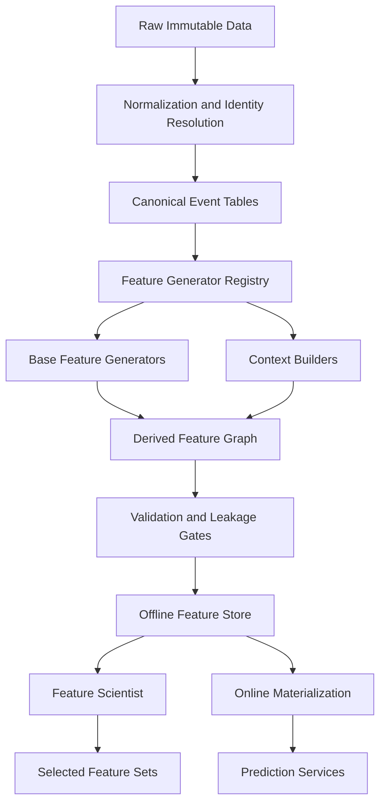
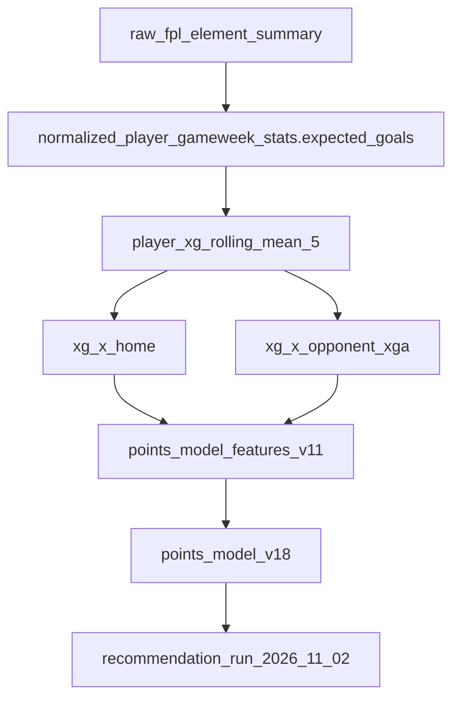

<!-- claims
package: packages/feature_factory
symbols: xg_alonso.features.catalogue:FeatureSpec, xg_alonso.features.catalogue:catalogue_specs, xg_alonso.features.catalogue:CATALOGUE_VERSION, xg_alonso.features.generators:rolling_as_of, xg_alonso.features.generators:shrunk_rate_as_of, xg_alonso.features.leakage:assert_no_leakage, xg_alonso.features.leakage:assert_detects_leakage, xg_alonso.features.career:CAREER_VERSION
commands: xg build-features, xg importance
-->

# Feature Factory Design Specification

| Field | Value |
|---|---|
| Project | XG Alonso |
| Document | Feature Factory |
| Version | 1.1 |
| Status | Build Specification — **mostly unbuilt as specified**; see the as-built map below |
| Owner | ML Platform |
| Dependencies | Data contracts and raw/normalized data layers ([Data Sources](../data/01_data_sources.md), [Database Schema](../data/04_database_schema.md)); canonical player identity (`elements[].code`); [Repository Structure](../architecture/01_repository_structure.md) |
| Consumed by | [Feature Scientist](03_feature_scientist.md), [Prediction Models](07_prediction_models.md), [Embeddings](06_embeddings.md), [Transfer Planner](../optimization/02_transfer_planner.md) |
| Last updated | 2026-08-04 |

---

## 0. As-built map — read this before anything below

This is the longest document in the repository and the one furthest from the code. Almost every
*principle* in it was honoured; almost every *interface* in it was not. Nothing here is a
description of running code unless this section says so.

**The principles that were built, and are enforced mechanically:**

| Principle | Where it lives |
|---|---|
| Every feature uses only information whose `available_time` precedes the prediction timestamp | `features/point_in_time.py`, proven by `features/leakage.py` — which rebuilds features with future records appended and fails if any value moved, and whose negative control proves the harness still has teeth |
| Features are declared, not hand-written; adding one is configuration plus an existing generator | `features/catalogue.py` |
| Generation is bounded rather than combinatorial (D12) | `features/catalogue.py` — nothing is crossed with anything; interactions are a separate, gated concern |
| Features are versioned | `CATALOGUE_VERSION`, `CAREER_VERSION`, and the feature-schema hash on every artifact manifest |
| Generators are reusable across features | `rolling_as_of`, `shrunk_rate_as_of` in `features/generators.py` |

**The named interfaces below, and what actually exists:**

| Specified here | Reality |
|---|---|
| `FeatureGenerator` (a generator class hierarchy) | Does not exist. Generators are two module-level functions taking and returning frames |
| `FeatureDefinition` | Does not exist. The unit is `FeatureSpec` — a frozen dataclass with eight fields, at `features/catalogue.py` |
| `GenerationContext` | Does not exist. Context is passed as function arguments |
| `FeatureMetadata` | Does not exist as a type. Metadata is the `family` field on a spec plus the module version constants |
| `FeatureStore` | Does not exist. Features materialize to parquet under `.data/gold/` through `ParquetTableStore` |
| `FeatureCard` | Does not exist, in any form |
| A `feature_registry` database table | Does not exist. See [Database Schema §4](../data/04_database_schema.md) |
| "approximately 300-700 quality candidate features" | 180 catalogue specs; 224 distinct columns including the career, opponent, recency and slice-1 families. D12 is a ceiling and the build is under it |

**One gap worth stating plainly**, because it undermines a guarantee this document makes. The
feature-schema hash covers declarative specs only. The opponent, career and recency families come
from hand-written functions, so only their names and a module version constant are hashable —
editing the arithmetic inside `build_career_features` without bumping `CAREER_VERSION` will not
change the digest. That is precisely why a catalogue-hash mismatch is a warning rather than a
refusal, and why those version constants exist at all. See
[Model Artifacts §8](model_artifacts.md).

The rest of this document is retained because its reasoning about point-in-time correctness,
leakage classes, and bounded generation is the reasoning the implementation actually followed. Read
it as design rationale, not as an interface contract.

---

## 1. Purpose

The Feature Factory is the central machine-learning infrastructure component in XG Alonso.

Its responsibility is to transform timestamped football, Fantasy Premier League, market, fixture, availability, tactical, and contextual data into a large, reproducible, versioned catalog of candidate features.

The Feature Factory does not decide which features are useful. It generates valid candidates with explicit lineage and hands them to the [Feature Scientist](03_feature_scientist.md) for evaluation, interaction discovery, selection, promotion, and retirement.

The system must support:

- deterministic feature generation;
- point-in-time correctness;
- reusable feature generators;
- feature metadata and lineage;
- batch and incremental execution;
- multiple prediction targets;
- approximately 300–700 quality candidate features (see §22; deliberately not thousands);
- safe interaction generation;
- feature versioning;
- feature quality validation;
- offline training and online inference parity.

The Feature Factory is designed around one rule:

**Every feature must represent only information available at the prediction timestamp.**

---

## 2. Product Role

The Feature Factory supplies inputs for the following products:

- Expected-minutes prediction
- Next-gameweek points prediction
- Multi-gameweek points prediction
- Goal, assist, clean-sheet, and bonus component models
- Price-rise and price-fall prediction (deferred; see the scope note below)
- Player fair-value estimation
- Player, team, manager, and fixture embeddings (Phase 2; see the scope note below)
- Transfer optimization
- Wildcard timing
- Recommendation explanation

Scope notes:

- The price model is deferred. There is no current-season price data at GW1, so price-rise and price-fall prediction is not part of the first slice. The feature families that feed it are still specified here so the contracts are stable when the model is built.
- Embedding-derived products are Phase 2. The product ships first; the research platform deepens afterwards.
- Chip logic is out of scope for the MVP. Chip and wildcard *state* is modelled as a feature (see §6.11); chip *decision logic* is not built.

The system must be target-aware without becoming target-specific. A feature can be globally reusable, model-specific, horizon-specific, or prohibited for particular targets.

Examples:

- `net_transfers_last_6h` is highly relevant to price-change prediction.
- The same feature may be excluded from intrinsic football-performance models to prevent market behavior from dominating performance estimates.

Decision on `official_ep_next`:

- `official_ep_next` is **banned from all points-model training**. This is a settled decision, not an open question. It is a vendor-derived forward projection whose construction and cutoff we do not control, and it cannot be reconstructed point-in-time.
- `official_ep_next` must be listed in the leakage register (§11) and enforced by the `prohibited_targets` field on its Feature Card (§9) so the registry blocks it at feature-set assembly time rather than at review time.

---

## 3. Core Concepts

### 3.1 Entity Grain

The canonical modeling grain is:

```text
player_id × prediction_timestamp × target_fixture_or_gameweek
```

- For most gameweek models, one row represents one player immediately before a gameweek deadline.
- For intraday price models, one row represents one player at a timestamped market snapshot.
- For fixture-level models, one row represents one player-fixture pair.

### 3.2 Feature Definition

A feature definition is the declarative specification of how a feature is constructed.

Example:

```yaml
name: player_xg_ewma_5
entity: player_fixture
source_column: xg
generator: exponentially_weighted_mean
lookback:
  type: appearances
  value: 5
parameters:
  alpha: 0.45
availability_delay: 0h
null_policy: position_median
tags:
  - player_performance
  - expected_goals
  - recency
```

### 3.3 Feature Value

A feature value is the output for a specific entity row and feature version.

The following is an illustrative example; the identifiers, timestamp, and value are placeholders, not a real stored record:

```text
player_id=123
prediction_timestamp=2026-09-11T17:30:00Z
feature_name=player_xg_ewma_5
feature_version=3
value=0.41
```

### 3.4 Feature Set

A feature set is a versioned collection of feature definitions approved for a model family.

Illustrative examples of feature-set names:

- `minutes_model_features_v4`
- `points_model_features_v11`
- `price_model_features_v7`
- `embedding_input_features_v3`

### 3.5 Point-in-Time Join

A point-in-time join selects only source records whose event time and publication time make them available before the prediction cutoff.

For every source record, the platform should distinguish:

- `event_time`: when the underlying event occurred;
- `observed_time`: when XG Alonso collected it;
- `available_time`: when the information became publicly usable;
- `processed_time`: when the pipeline transformed it.

Feature joins must filter on `available_time <= prediction_timestamp`.

---

## 4. High-Level Architecture



---

## 5. Subsystems

### 5.1 Source Adapters

Source adapters expose normalized tables to the Feature Factory.

Required adapters:

- Official FPL player snapshots (`bootstrap-static`)
- Official FPL fixture data
- Official FPL live-gameweek data
- Modelled price-pressure signals. FPL publishes **no** official price predictor, so any progress-toward-threshold signal is something XG Alonso must model itself from public transfer history. There is no "official predictor" adapter to build. This adapter is deferred with the price model.
- Historical FPL gameweek data, backfilled from 2022/23 (the earliest season with expected statistics in the API)
- Expected-statistics data from the official FPL endpoints: `expected_goals`, `expected_assists`, `expected_goal_involvements`, and `expected_goals_conceded` per player per gameweek, published from 2022/23 onward
- Team-level match data derived from official FPL fixtures and bootstrap payloads
- Injury and availability events from the official FPL player status fields
- Manager and coaching-tenure data (no official FPL source; deferred until an approved zero-budget source exists)
- Optional bookmaker probabilities (out of scope: paid provider, excluded by the zero-budget official-API-only sourcing rule)
- Optional weather and travel context (out of scope for the same reason; retained here as a future adapter slot, not an MVP dependency)
- User squad and transfer-state data, keyed by public FPL team ID only, with purchase and selling prices reconstructed from public transfer history

Sourcing constraint: the official FPL API only (D6). Understat and FBref are out of scope, so shot-level features stay unbuildable. Any adapter above with no permitted source is a future slot, not a build item.

Every adapter must publish:

- schema;
- primary key;
- event time;
- available time;
- freshness expectations;
- missingness expectations;
- known leakage risks;
- license or usage constraints.

#### 5.1.1 Scoring rules and squad constants

Scoring rules and squad constants are machine-readable in the FPL bootstrap payload (`game_config.scoring` and `game_config.rules`).

**These constants load from a pinned snapshot of the FPL payload with a recorded fetch timestamp and a drift check. They are never Python literals.** Any generator, validation rule, or component-to-points conversion that needs a scoring value or a squad constraint reads it from the pinned snapshot through the same accessor.

Scoring values as published (`game_config.scoring`):

| Event | GKP | DEF | MID | FWD |
|---|---|---|---|---|
| `goals_scored` | 10 | 6 | 5 | 4 |
| `assists` | 3 | 3 | 3 | 3 |
| `clean_sheets` | 4 | 4 | 1 | 0 |
| `defensive_contribution` | 0 | 2 | 2 | 2 |
| `saves` | 1 | — | — | — |
| `bonus` | 1 | 1 | 1 | 1 |
| `yellow_cards` | -1 | -1 | -1 | -1 |
| `red_cards` | -3 | -3 | -3 | -3 |
| `own_goals` | -2 | -2 | -2 | -2 |

Note that a goalkeeper goal is worth 10 points, not the widely assumed 6. This is exactly the class of assumption that must never be hardcoded.

Squad constants as published (`game_config.rules`):

| Constant | Value |
|---|---|
| Squad size | 15 |
| Starting XI | 11 |
| Max players per club | 3 |
| Budget | 1000 tenths of a million |
| `transfers_sell_on_fee` | 0.5 |
| `max_extra_free_transfers` | 4 (free transfers therefore cap at 5) |
| `transfers_cap` | 20 |

Positional quotas:

| Position | Squad | Minimum in XI | Maximum in XI |
|---|---|---|---|
| GKP | 2 | 1 | 1 |
| DEF | 5 | 3 | 5 |
| MID | 5 | 2 | 5 |
| FWD | 3 | 1 | 3 |

#### 5.1.2 Preseason hazards

Adapters must handle the following documented preseason states rather than treating them as valid data:

- `strength_attack_home`, `strength_attack_away`, `strength_defence_home`, and `strength_defence_away` are 0 for all 20 teams preseason.
- `strength` is null preseason.
- `strength_overall_home` and `strength_overall_away` use a 1–5 scale preseason versus roughly 1000–1400 in-season, so any feature built on them must be scale-aware or gated until in-season values appear.
- `entry/{id}/event/{gw}/picks/` returns 404 before the deadline. Absence of picks before a deadline is expected, not an error.

### 5.2 Feature Generator Registry

All generators are registered through a common interface.

```python
class FeatureGenerator(Protocol):
    name: str
    version: int
    supported_entities: set[str]
    required_columns: set[str]

    def validate_definition(self, definition: FeatureDefinition) -> None: ...

    def generate(
        self,
        frame: DataFrame,
        context: GenerationContext,
        definition: FeatureDefinition,
    ) -> DataFrame: ...

    def metadata(
        self,
        definition: FeatureDefinition,
    ) -> FeatureMetadata: ...
```

Generators must be:

- deterministic;
- stateless during execution;
- independently testable;
- idempotent;
- schema-validated;
- safe against future leakage.

### 5.3 Feature Definition Compiler

The compiler converts declarative feature definitions into an executable dependency graph.

It must:

- validate source columns;
- validate entity grain;
- resolve upstream dependencies;
- detect cyclic dependencies;
- calculate feature hashes;
- plan execution order;
- reuse shared intermediate computations;
- emit a reproducible execution manifest.

### 5.4 Context Builders

Context builders create reusable contextual tables.

Examples:

- opponent strength as of the prediction timestamp;
- current manager tenure;
- current set-piece hierarchy;
- player role;
- team rest schedule;
- fixture congestion;
- home and away split;
- current FPL ownership state;
- current user selling price;
- upcoming fixture horizon.

### 5.5 Validation Gates

No feature is materialized until it passes:

- schema validation;
- point-in-time validation;
- null-rate checks;
- range checks;
- cardinality checks;
- duplicate-key checks;
- invariant checks;
- deterministic rerun checks;
- known-leakage rules;
- distribution drift checks.

### 5.6 Feature Store

The MVP uses DuckDB for feature metadata plus Parquet for feature values, both behind a `FeatureStore` protocol so the storage provider stays swappable. There is no PostgreSQL dependency. A later version may substitute a dedicated feature store, but the abstraction must not depend on a vendor and no caller may reach past the protocol to touch DuckDB or Parquet directly.

The system requires:

- offline historical storage;
- latest-value materialization;
- point-in-time retrieval;
- feature-set versioning;
- training-serving consistency;
- feature lineage lookup.

---

## 6. Feature Taxonomy

The Feature Factory should generate features across the following families.

Source availability note: this taxonomy is the target design space. Any listed measure that has no column in the official FPL payload is a future candidate, not an MVP build item, and must not be sourced by scraping. Where an FPL-native proxy exists, the proxy is used and the substitution is recorded on the Feature Card.

### 6.1 Player Performance

#### Raw and transformed measures

- minutes;
- starts;
- goals;
- assists;
- expected goals;
- non-penalty expected goals;
- expected assists;
- shots;
- shots on target;
- big chances;
- touches in the box;
- key passes;
- progressive carries;
- progressive passes;
- bonus;
- defensive contributions;
- clean sheets;
- cards;
- own goals;
- saves;
- goals prevented;
- set-piece attempts.

Any of these measures that also functions as a scoring event (goals, assists, clean sheets, bonus, defensive contributions, saves, cards, own goals) is converted to points only through the versioned scoring rules loaded from the pinned FPL snapshot described in §5.1.1, never through inline constants.

#### Transformations

- rolling mean;
- rolling median;
- rolling sum;
- rolling maximum;
- rolling minimum;
- rolling standard deviation;
- coefficient of variation;
- exponentially weighted mean;
- exponentially weighted variance;
- trend slope;
- change from previous window;
- percentile within position;
- z-score within position;
- per-90 normalization;
- per-start normalization;
- share of team total;
- opponent-adjusted values;
- residual versus model expectation.

#### Windows

- last 1 appearance;
- last 3 appearances;
- last 5 appearances;
- last 8 appearances;
- last 10 appearances;
- season to date;
- previous season;
- same-manager tenure;
- last 30, 60, and 90 days.

### 6.2 Minutes and Role

- start rate;
- substitute rate;
- expected minutes;
- minutes when starting;
- median substitution minute;
- probability of 60+ minutes;
- probability of 75+ minutes;
- consecutive starts;
- matches since last start;
- team lineup stability;
- competition for position;
- teammate injury effects;
- formation-specific role;
- set-piece rank;
- penalty-taking probability;
- corner-taking probability;
- direct free-kick probability;
- tactical-position stability;
- manager-specific usage;
- European-match rotation tendency.

### 6.3 Team Attack and Defense

- team xG;
- team non-penalty xG;
- team xGA;
- goals for;
- goals against;
- shots for;
- shots allowed;
- big chances for;
- big chances allowed;
- possession;
- field tilt;
- pressing intensity;
- set-piece xG;
- counterattack rate;
- clean-sheet rate;
- scoring rate;
- home attack strength;
- away attack strength;
- home defensive strength;
- away defensive strength;
- strength versus opponent tiers;
- strength under current manager;
- form adjusted for opponent quality.

Features built on the FPL `strength_*` fields must respect the preseason hazards in §5.1.2: the attack and defence strength fields are 0 for all teams preseason and the overall strength fields change scale between preseason and in-season.

### 6.4 Opponent Matchup

- opponent xGA;
- opponent shots conceded;
- opponent chances conceded by zone;
- opponent goals conceded by position;
- opponent set-piece weakness;
- opponent aerial weakness;
- opponent transition defense;
- opponent pressing vulnerability;
- opponent clean-sheet probability;
- historical performance of comparable player archetypes;
- player historical output versus opponent;
- player underlying output versus opponent;
- team historical output versus opponent;
- opponent-adjusted player residual.

Historical opponent features must include sample-size metadata and shrinkage.

For a player with only three appearances against an opponent, use:

```text
shrunk_rate =
    weight × player_vs_opponent_rate
  + (1 - weight) × player_baseline_rate
```

where `weight` increases with relevant sample size.

### 6.5 Temporal and Calendar Context

- day of week;
- kickoff hour;
- local time;
- early kickoff indicator;
- late kickoff indicator;
- days since prior appearance;
- days until next match;
- number of matches in last 7, 14, and 21 days;
- number of matches in next 7 and 14 days;
- international-break return;
- holiday-period indicator;
- month;
- season phase;
- gameweek number;
- daylight and weather context where available.

Calendar features should be treated as candidate features, not trusted signals. The Feature Scientist must penalize low-sample and unstable effects.

Examples:

- `player_points_on_saturday_early_kickoff`
- `player_xg_weekday_residual`
- `team_performance_monday_matches`

These must include:

- sample count;
- empirical-Bayes shrinkage;
- confidence interval;
- out-of-sample stability.

### 6.6 Home and Away Context

- player home xG;
- player away xG;
- player home points;
- player away points;
- team home attack;
- team away attack;
- opponent home defense;
- opponent away defense;
- venue-specific performance;
- travel distance;
- rest-adjusted home advantage;
- manager-specific home advantage.

### 6.7 Manager Context

- manager tenure;
- matches under manager;
- manager attack strength;
- manager defense strength;
- average substitution minute;
- rotation rate;
- lineup consistency;
- youth usage;
- set-piece production;
- favored formations;
- player start rate under manager;
- player output under manager;
- team style embedding;
- manager-change indicator;
- new-manager bounce candidates;
- pre/post-manager-change residuals.

Manager context is Phase 2. The official FPL API publishes no manager or coaching-tenure feed, so this family has no permitted source in the first slice.

### 6.8 Fixture Congestion and Fatigue

- rest days;
- travel distance;
- European away travel;
- extra-time played;
- cup match minutes;
- international minutes;
- number of starts in prior 14 days;
- age-adjusted congestion;
- injury-history-adjusted congestion;
- manager rotation tendency × congestion;
- position × congestion;
- travel × kickoff-time interaction.

### 6.9 FPL Market

- current price;
- starting price;
- price change season to date;
- ownership;
- effective ownership estimate;
- transfers in;
- transfers out;
- net transfers;
- net transfers per hour;
- transfer velocity;
- transfer acceleration;
- ownership-normalized transfer rate;
- modelled price-pressure index (internal, since FPL publishes no official predictor);
- distance to modelled threshold;
- pressure velocity;
- pressure acceleration;
- hours until price update;
- prior rise or fall recency;
- market reaction after points haul;
- market reaction after injury;
- market-versus-model divergence.

Two constraints on this family:

- The price-pressure index, its threshold, and its derivatives are **our model output, not observed data**. They must be versioned as derived features with their own lineage and must never be described as an official signal.
- The price model itself is deferred: there is no current-season price data at GW1. Player prices and selling prices are reconstructed from public transfer history rather than read from a live price feed. Price-family features are specified now and materialized when the price model is built.

### 6.10 Intrinsic Value

- expected points per million;
- expected minutes per million;
- value over positional replacement;
- fair-price residual;
- projected six-gameweek points minus price-adjusted baseline;
- scarcity-adjusted value;
- captaincy-adjusted value;
- transfer flexibility contribution;
- expected resale value;
- ownership-adjusted upside.

Every per-million and resale calculation depends on the budget and sell-on-fee constants. Those load from the pinned FPL snapshot described in §5.1.1 with a recorded fetch timestamp and a drift check, never from Python literals.

### 6.11 User-Specific Squad Context

- purchase price;
- current selling price;
- locked-in value;
- money in bank;
- free transfers;
- hit cost;
- player role in current starting XI;
- bench dependency;
- club-slot pressure;
- captaincy coverage;
- replacement affordability;
- path-to-target-player cost;
- squad structural imbalance;
- future transfer flexibility;
- wildcard state;
- chip state.

Constraints on this family:

- Squad size, XI size, per-club limits, budget, sell-on fee, free-transfer caps, and the transfers cap all come from the pinned FPL snapshot described in §5.1.1 with a recorded fetch timestamp and a drift check. They are never Python literals.
- Selling price is reconstructed from public transfer history keyed by public FPL team ID. There is no authenticated access and no stored credentials.
- Chip state is modelled as a feature; chip decision logic is out of MVP scope.
- Wildcard availability is window-bounded: GW2–19 and GW20–38. The wildcard is unavailable in GW1, so any wildcard-state feature must evaluate to unavailable rather than null or true in GW1.
- `entry/{id}/event/{gw}/picks/` returns 404 before the deadline, so user-context features for the upcoming gameweek must be built from the last known picks plus pending transfers, not from an endpoint that does not yet exist.

### 6.12 Availability and Risk

- injury status;
- chance of playing;
- suspension status;
- yellow-card accumulation;
- return-from-injury period;
- prior injury burden;
- source agreement;
- availability confidence;
- press-conference recency;
- rotation risk;
- minutes uncertainty;
- model disagreement;
- missing-data risk.

### 6.13 Similarity and Embedding Features

- nearest-player similarity;
- player-cluster ID;
- team-cluster ID;
- manager-cluster ID;
- fixture-cluster ID;
- cosine similarity to opponent-vulnerable archetypes;
- similarity to high-performing historical fixtures;
- embedding distance to replacement candidates;
- cluster-relative form;
- cluster-relative price.

This entire family is **Phase 2**. The product ships first and the research platform is deepened afterwards, so no embedding or clustering feature is on the MVP critical path.

Until embeddings and clusters ship, every consumer of this family must be null-safe: the features resolve to null, downstream models must train and serve without them, and no pipeline stage may fail because an embedding table is absent. See [Embeddings](06_embeddings.md) and [Player Clustering](05_player_clustering.md).

---

## 7. Generator Types

### 7.1 Rolling Generator

Supported operators:

- mean;
- sum;
- median;
- min;
- max;
- standard deviation;
- quantile;
- count;
- start rate.

Supported windows:

- matches;
- starts;
- days;
- gameweeks;
- manager tenure.

### 7.2 Exponential Generator

Produces recency-weighted features.

Parameters:

- alpha;
- half-life;
- minimum observations;
- missing-value behavior.

### 7.3 Trend Generator

Produces:

- linear slope;
- robust Theil-Sen slope;
- acceleration;
- change-point indicator;
- recent-minus-long-term average.

### 7.4 Ratio Generator

Produces ratios with guarded denominators.

Examples:

- `goals / xG`;
- `points / price`;
- `shots on target / shots`;
- `player xG / team xG`;
- `net transfers / ownership`.

Every ratio must define:

- denominator floor;
- clipping bounds;
- null policy.

### 7.5 Residual Generator

Fits or consumes a baseline expectation and stores the residual.

Examples:

- goals minus expected goals;
- actual minutes minus expected minutes;
- FPL points minus underlying-points expectation;
- price progress minus market-model expectation.

### 7.6 Group-Normalization Generator

Produces:

- z-score;
- percentile;
- rank;
- deviation from group median.

Groups may include:

- position;
- team;
- price band;
- player cluster;
- fixture tier;
- gameweek.

### 7.7 Split Generator

Builds conditional histories:

- home only;
- away only;
- under current manager;
- versus top quartile defenses;
- versus bottom quartile defenses;
- early kickoff;
- weekend;
- weekday;
- European-congestion matches;
- starts only.

Every split feature must carry sample count and shrinkage.

### 7.8 Shrinkage Generator

Used for sparse contextual histories such as:

- versus a specific opponent;
- performance on a weekday;
- output in a particular kickoff window;
- performance under a manager;
- venue-specific performance.

Recommended empirical-Bayes estimate:

```text
posterior_mean =
    (n × observed_mean + prior_strength × prior_mean)
    /
    (n + prior_strength)
```

The generator should also emit:

- raw mean;
- shrunk mean;
- sample count;
- posterior uncertainty.

### 7.9 Interaction Generator

Interaction discovery is controlled, not unrestricted.

Supported interactions:

- numeric × numeric;
- numeric × binary;
- category-specific numeric residual;
- monotonic transformations;
- ratios;
- thresholds;
- embedding similarity interactions.

Candidate interactions are generated from:

- domain-compatible feature families;
- high-performing univariate features;
- residual error analysis;
- tree-model interaction scores;
- SHAP interaction values;
- repeated cross-validation stability.

Examples:

- expected minutes × opponent xGA;
- home × rolling xG;
- rest days × age;
- manager rotation rate × fixture congestion;
- price momentum × expected points;
- penalty-taker probability × opponent foul rate;
- player archetype similarity × opponent weakness.

The generator must block:

- direct target-derived interactions;
- duplicate algebraic equivalents;
- unstable sparse combinations;
- high-cardinality entity IDs;
- interactions lacking enough historical support.

### 7.10 Sequence Generator

Creates ordered pattern features:

- consecutive starts;
- consecutive blanks;
- consecutive returns;
- trend after return from injury;
- streak length;
- time since last haul;
- time since last goal;
- state transitions.

### 7.11 Embedding Join Generator

Joins learned vectors or derived similarity measures into tabular features.

Embeddings are versioned and must be generated only from information available before the prediction timestamp. This generator is Phase 2 and its outputs must be null-safe until embeddings ship (see §6.13).

---

## 8. Interaction Discovery Workflow

The Feature Factory generates interaction candidates (§7.9) and the [Feature Scientist](03_feature_scientist.md) evaluates them. The five-stage evaluation and promotion workflow — eligibility, candidate generation, cheap screening, full evaluation, and promotion — now lives in its own specification.

See [Interaction Discovery](04_interaction_discovery.md). That workflow is deferred post-MVP; automated interaction discovery must not begin before point-in-time correctness, metadata, and deterministic materialization are complete.

---

## 9. Feature Metadata

Every feature must have a Feature Card.

Required fields, shown here as an illustrative example. The identifiers, version numbers, and dates below (`points_model_features_v11`, `2026-08-01`, `2026-11-02`) are placeholders for documentation purposes and do not describe a registered feature or a real evaluation run:

```yaml
feature_id: uuid
name: player_xg_ewma_5
version: 3
display_name: Player xG EWMA, last 5 appearances
description: Recency-weighted expected goals across the player's previous five appearances.
entity: player_fixture
dtype: float
owner: ml-platform
generator: exponentially_weighted_mean
generator_version: 2
source_tables:
  - player_match_stats
source_columns:
  - xg
dependencies: []
lookback:
  type: appearances
  value: 5
parameters:
  alpha: 0.45
available_at: fixture_finalization
null_policy: position_median
valid_range:
  min: 0
  max: 3
tags:
  - performance
  - xg
  - recency
prohibited_targets: []
created_at: 2026-08-01
status: candidate
```

Evaluation metadata, also illustrative:

```yaml
coverage: 0.992
missing_rate: 0.008
training_importance_mean: 0.041
shap_rank_mean: 14
permutation_lift: 0.0038
stability_score: 0.87
redundancy_cluster: 22
selected_feature_sets:
  - points_model_features_v11
last_evaluated_at: 2026-11-02
```

---

## 10. Feature Lineage

The platform must answer:

- Which raw fields produced this feature?
- Which code version generated it?
- Which upstream features does it depend on?
- Which models use it?
- Which recommendations were influenced by it?
- When did it enter production?
- When was it retired?

Lineage graph. The node names below are an illustrative example built on an FPL-native source; `points_model_v18` and `recommendation_run_2026_11_02` are placeholder identifiers, not real artifacts:



---

## 11. Point-in-Time Correctness

The most serious implementation risk is leakage.

The system must provide a reusable point-in-time join utility.

```python
def point_in_time_join(
    entities: DataFrame,
    source: DataFrame,
    entity_keys: list[str],
    prediction_time_col: str,
    source_available_time_col: str,
) -> DataFrame: ...
```

Prohibited examples:

- using final bonus points to predict the same gameweek;
- using a price snapshot collected after midnight to predict that price change;
- using an injury update published after the deadline;
- using full-season aggregates when reconstructing an earlier gameweek;
- using current club identity for a player before a transfer;
- using revised historical expected statistics not available at the original time without marking them as retrospective-only;
- using `official_ep_next` in any points model, per the decision in §2.

The leakage register lists every prohibited feature-target pair, including `official_ep_next` against all points targets, and the registry enforces it at feature-set assembly time.

Every backtest must persist the exact `data_cutoff_timestamp`.

---

## 12. Data Quality Rules

Feature generation should fail loudly when critical assumptions break.

Required checks:

- one row per entity key;
- monotonic timestamps;
- valid player-team membership interval;
- no fixture dated before prior fixture ordering;
- no negative minutes;
- plausible price range;
- ownership between 0 and 100;
- modelled price-pressure index within accepted range or explicitly unbounded;
- no impossible future records;
- correct promoted-team mapping;
- consistent manager tenure interval;
- team strength fields are not silently trusted preseason, when the attack and defence strength fields are 0 for all teams and the overall strength fields use a different scale (§5.1.2).

Range checks that depend on game constants (price bounds, budget, squad limits) read those bounds from the pinned FPL snapshot with a recorded fetch timestamp and a drift check, never from Python literals. A drift-check failure is a loud failure: the constants changed and the affected rules must be re-approved.

Non-critical issues may quarantine affected rows rather than fail the entire pipeline.

---

## 13. Missing Data

Missingness may itself carry information.

For each feature, define one of:

- leave null;
- zero-fill;
- group median;
- historical prior;
- explicit missing indicator;
- model-native missing handling;
- prohibit row.

Do not use global mean imputation by default.

Examples:

- No xG history for a promoted player: use league- or source-adjusted prior plus a missing-history indicator.
- No manager history: use manager-archetype prior or league prior.
- No specific-opponent history: use shrunk player baseline.
- No modelled price-pressure snapshot: mark unavailable rather than imputing fake progress.
- No embedding or cluster assignment: resolve to null and proceed, per §6.13.

---

## 14. Cold-Start Strategy

Cold-start entities include:

- promoted players;
- transferred players;
- new managers;
- newly promoted teams;
- players returning from long absences;
- players with role changes.

Fallback hierarchy, in order:

1. current-entity history;
2. history from another league adjusted by competition strength;
3. player-cluster prior;
4. position and price-band prior;
5. league-wide prior.

Embeddings and player clustering should provide priors for sparse entities. Because both are Phase 2, the MVP cold-start path must remain correct when steps 2 and 3 are unavailable and falls through to position, price-band, and league-wide priors.

---

## 15. Execution Modes

### 15.1 Historical Backfill

Produces point-in-time features for prior seasons and gameweeks, backfilled from 2022/23, the earliest season with expected statistics in the FPL API.

Requirements:

- deterministic;
- resumable;
- partitioned by season and gameweek;
- capable of rebuilding one feature family;
- emits audit manifest.

### 15.2 Gameweek Materialization

Runs before each gameweek deadline.

Outputs:

- model-ready gameweek feature table;
- feature-quality report;
- latest entity features;
- prediction input snapshot.

### 15.3 Intraday Market Refresh

Runs during active price-change monitoring. This mode is Phase 2, alongside the deferred price model.

Only recomputes time-sensitive features such as:

- ownership;
- transfers;
- modelled price-pressure index;
- hours until price update;
- price velocity;
- availability updates.

### 15.4 Post-Gameweek Finalization

After official results lock:

- updates labels;
- materializes completed-game features;
- recalculates rolling histories;
- publishes training partitions;
- triggers Feature Scientist evaluation.

---

## 16. Performance Requirements

MVP targets:

- full current-season gameweek feature build: under 10 minutes;
- intraday price refresh: under 60 seconds;
- latest feature lookup per player: under 100 ms from cache;
- one historical season backfill: under 30 minutes on a developer machine;
- deterministic rerun equality: exact for integer and categorical outputs, tolerance-based for floating point.

Execution is local-only in the first slice: no Docker, no cloud, no hosted infrastructure. Use Polars for in-process transformation and DuckDB over Parquet for analytical execution and storage. Avoid premature distributed infrastructure.

---

## 17. Suggested Package Structure

```text
feature_factory/
├── __init__.py
├── contracts/
│   ├── definitions.py
│   ├── metadata.py
│   └── execution.py
├── registry/
│   ├── generator_registry.py
│   ├── feature_registry.py
│   └── feature_set_registry.py
├── compiler/
│   ├── parser.py
│   ├── validator.py
│   ├── dependency_graph.py
│   └── planner.py
├── generators/
│   ├── rolling.py
│   ├── exponential.py
│   ├── trend.py
│   ├── ratio.py
│   ├── residual.py
│   ├── normalization.py
│   ├── split.py
│   ├── shrinkage.py
│   ├── interaction.py
│   ├── sequence.py
│   └── embedding_join.py
├── contexts/
│   ├── player_context.py
│   ├── team_context.py
│   ├── opponent_context.py
│   ├── fixture_context.py
│   ├── manager_context.py
│   ├── market_context.py
│   └── user_squad_context.py
├── quality/
│   ├── leakage.py
│   ├── validation.py
│   ├── drift.py
│   └── reports.py
├── materialization/
│   ├── offline.py
│   ├── online.py
│   └── manifests.py
└── cli.py
```

---

## 18. Configuration

> **Not built.** There is no `configs/` directory. Feature definitions are version-controlled, but
> as frozen `FeatureSpec` values in `features/catalogue.py` rather than as YAML. The property this
> section was after — adding a feature is configuration plus an existing generator, not bespoke
> pipeline code — holds; the file format does not. Declaring specs in Python also buys type
> checking on every field, which a YAML tree would have had to re-implement.

Feature definitions should live in version-controlled YAML.

```text
configs/features/
├── base/
├── player_performance/
├── minutes/
├── team/
├── matchup/
├── temporal/
├── manager/
├── congestion/
├── market/
├── valuation/
├── user_context/
├── embeddings/
└── interactions/
```

Example:

```yaml
features:
  - name: player_points_rolling_mean_5
    generator: rolling
    entity: player_gameweek
    source_column: total_points
    window:
      unit: appearances
      size: 5
    aggregation: mean
    min_periods: 2

  - name: player_points_saturday_shrunk
    generator: shrinkage_split
    entity: player_gameweek
    source_column: total_points
    split:
      column: day_of_week
      value: saturday
    prior_feature: player_points_rolling_mean_10
    prior_strength: 8
```

Scoring rules and squad constants are not configured here. They are read from the pinned FPL payload snapshot described in §5.1.1, with a recorded fetch timestamp and a drift check.

---

## 19. Testing Strategy

### Unit Tests

Test each generator with small fixtures covering:

- normal behavior;
- missing values;
- insufficient history;
- duplicate records;
- boundary timestamps;
- categorical splits;
- numerical stability.

### Golden Tests

Persist small canonical input-output datasets. Any feature logic change must explicitly update the golden artifact.

### Leakage Tests

Construct future records and verify that they never affect earlier predictions.

### Property Tests

Examples:

- rolling count never exceeds window;
- ownership percentile stays in `[0, 1]`;
- shrinking with zero observations equals prior;
- increasing sample size moves posterior toward observed mean;
- historical rebuild is invariant to records added after the cutoff.

### Integration Tests

Test:

- raw adapter to feature table;
- one complete gameweek build;
- training-serving parity;
- registry and lineage creation;
- feature-set loading;
- constants drift check against the pinned FPL snapshot.

---

## 20. Observability

Every run should emit:

- run ID;
- feature definitions hash;
- source dataset versions;
- row count;
- execution duration;
- feature count;
- failed features;
- null-rate changes;
- distribution-shift warnings;
- leakage checks;
- materialized partitions;
- pinned FPL snapshot identifier and fetch timestamp.

A feature-quality dashboard should show:

- coverage;
- drift;
- importance;
- redundancy;
- stability;
- production usage.

---

## 21. Security and Compliance

- Do not store user FPL credentials. Public team ID access is sufficient and is the only supported mode.
- Respect source terms and rate limits.
- Keep source adapters replaceable.
- Store provenance and license notes.
- Avoid exposing licensed raw data through public APIs.
- Separate user-specific features from globally shared training data.

---

## 22. MVP Scope

Feature Factory v1 must include:

- Player, team, fixture, and market source adapters
- Point-in-time joins
- Rolling, exponential, ratio, trend, normalization, split, and shrinkage generators
- Feature registry and Feature Cards
- Offline Parquet materialization with DuckDB metadata behind the `FeatureStore` protocol
- Current-gameweek materialization
- Leakage checks
- Feature-quality report
- YAML feature definitions
- Integration with the first points model. The price model is deferred (no current-season price data at GW1), so price-family features are defined and validated but not wired to a trained price model in v1.

The MVP should generate approximately 300–700 candidate features, not thousands for the sake of scale.

Quality and correctness are more important than raw feature count.

---

## 23. Phase 2

Add:

- automated interaction candidates;
- residual-guided generation;
- embedding joins;
- player and team clusters;
- manager context;
- intraday price refresh;
- user-specific squad features;
- feature-set promotion workflows.

---

## 24. Phase 3

Add:

- automated feature proposal from residual analysis;
- semantic duplicate detection;
- interaction discovery using SHAP;
- cross-target feature transfer;
- feature retirement;
- feature-cost-aware selection;
- richer cold-start priors;
- multi-league support.

---

## 25. Acceptance Criteria

The Feature Factory is ready for production integration when:

- a historical gameweek can be rebuilt without future leakage;
- the same definitions produce identical features across reruns;
- every feature has complete metadata and lineage;
- model training loads feature sets only through the registry;
- price and points models can use separate approved feature sets;
- current-gameweek materialization finishes within the target runtime;
- failed or drifting features are visible in run reports;
- adding a feature requires configuration and a reusable generator rather than bespoke pipeline code;
- no scoring value or squad constant appears as a literal anywhere in the codebase; all resolve from the pinned FPL snapshot and pass the drift check.

---

## 26. Claude Code Implementation Order

Claude should implement in this order:

1. Data and feature contracts
2. Generator protocol
3. Registry
4. Rolling generator
5. Point-in-time join utility
6. YAML definition parser
7. Compiler and dependency graph
8. Validation framework
9. Offline materialization
10. Exponential, ratio, trend, normalization generators
11. Split and shrinkage generators
12. Feature Cards and lineage
13. CLI
14. Integration tests
15. Current-gameweek execution
16. Interaction generator only after the base system is stable

Do not begin automated interaction discovery before point-in-time correctness, metadata, and deterministic materialization are complete.

---

## Related documents

- [Feature Scientist](03_feature_scientist.md) — evaluates, selects, promotes, and retires the candidates produced here
- [Interaction Discovery](04_interaction_discovery.md) — the extracted five-stage interaction workflow (deferred post-MVP)
- [Player Clustering](05_player_clustering.md) — supplies cluster IDs and cluster-relative features (§6.13)
- [Embeddings](06_embeddings.md) — supplies learned vectors for the embedding join generator (§7.11)
- [Prediction Models](07_prediction_models.md) — the primary consumer of approved feature sets
- [Data Sources](../data/01_data_sources.md) — the source adapters and sourcing constraints in §5.1
- [Database Schema](../data/04_database_schema.md) — the normalized tables the Feature Factory reads
- [Repository Structure](../architecture/01_repository_structure.md) — where the package in §17 lives
- [Transfer Planner](../optimization/02_transfer_planner.md) — downstream consumer of predictions built on these features
- [Build Plan](../implementation/01_build_plan.md) — sequencing of the MVP scope in §22
