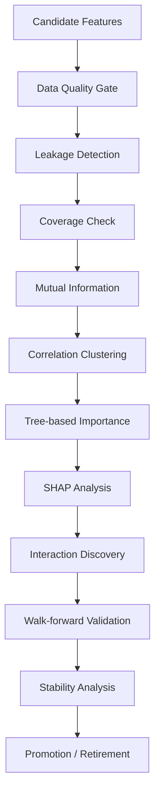
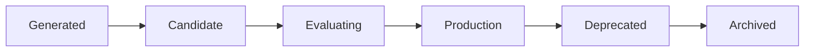

# Feature Scientist Design

| Field | Value |
|---|---|
| Project | XG Alonso |
| Document | Feature Scientist |
| Version | 1.0 |
| Status | Deferred (Post-MVP) |
| Owner | ML Platform |
| Dependencies | [Feature Factory](02_feature_factory.md), [Prediction Models](07_prediction_models.md), [Knowledge Lab](../research/01_knowledge_lab.md) |
| Last updated | 2026-07-27 |

---

## 1. Purpose

The Feature Scientist is an AutoML-inspired research layer that continuously evaluates, selects,
versions, and retires engineered features created by the Feature Factory.

Unlike the Feature Factory, which is deterministic, the Feature Scientist is adaptive. Its
objective is to improve downstream recommendation quality rather than simply improve prediction
metrics.

The candidate corpus it operates over is deliberately bounded: **300-700 quality candidate
features, not thousands** (D12). The Feature Scientist's job is to keep that corpus sharp, not to
grow it without limit.

---

## 2. Responsibilities

- Evaluate every candidate feature.
- Discover nonlinear feature interactions.
- Identify redundant features.
- Build target-specific feature sets.
- Produce Feature Cards and Feature Reports.
- Recommend feature promotion or retirement.
- Maintain a versioned Feature Registry.

---

## 3. Pipeline

The evaluation pipeline runs twelve stages in a fixed order. Every stage is deterministic given
its inputs and its recorded configuration.

---

## 4. Feature Lifecycle

Each feature stores:

- Version
- Source columns
- Generator
- Parameters
- Lineage
- Coverage
- Missing rate
- Importance
- Stability score
- SHAP rank
- Models using the feature
- Date introduced
- Date retired
- Retirement reason

---

## 5. Feature Registry

The registry is the source of truth.

It answers:

- Which models use this feature?
- Which generator created it?
- Which experiments promoted it?
- What replaced it?
- How has its importance changed over time?

The registry is stored relationally in DuckDB behind the repository interface (D2). There is no
separate metadata service and no graph database.

---

## 6. Automatic Interaction Discovery

Search interactions only between semantically compatible feature families.

Examples:

- Expected Minutes × Fixture Difficulty
- Home × Rolling xG
- Manager Rotation × Fixture Congestion
- Team xG × Opponent xGA
- Embedding Similarity × Opponent Cluster

Reject interactions with:

- Target leakage
- Sparse support
- High instability
- Duplicate information

---

## 7. Feature Reports

Every retraining produces:

- New candidate features
- Promoted features
- Retired features
- Largest gain
- Largest loss
- Top interactions
- Drift warnings

---

## 8. Acceptance Criteria

- Reproducible feature selection
- Walk-forward validated
- Feature metadata complete
- Automatic reports generated
- Feature sets versioned

---

## Related documents

- [Feature Factory](02_feature_factory.md) — deterministic generation of the candidate features this layer evaluates
- [Prediction Models](07_prediction_models.md) — the downstream consumers whose recommendation quality is the objective
- [Player Clustering](05_player_clustering.md) — supplies cluster-derived candidate features
- [Embeddings](06_embeddings.md) — supplies embedding-derived candidate features
- [Knowledge Lab](../research/01_knowledge_lab.md) — stores Feature Cards, experiments, and promotion decisions
- [Repository Structure](../architecture/01_repository_structure.md) — package boundaries and dependency rules
