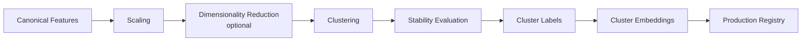

<!-- claims
package: packages/discovery
symbols: xg_alonso.discovery.clusters, xg_alonso.discovery.registry:DiscoveryRegistry
routes: GET /clusters, GET /players/{player_code}/cluster-history
-->

# Player Clustering Design

| Field | Value |
|---|---|
| Project | XG Alonso |
| Document | Player Clustering |
| Version | 1.1 |
| Status | Superseded — the capability shipped, this interface did not |
| Owner | ML Platform |
| Dependencies | [Feature Factory](02_feature_factory.md), [Embeddings](06_embeddings.md), [Prediction Models](07_prediction_models.md) |
| Last updated | 2026-08-04 |

> **Status correction, 2026-08-04.** This document carried `Deferred (Post-MVP)` after clustering had
> shipped. It runs in `packages/discovery/src/xg_alonso/discovery/clusters.py`, is seeded and
> deterministic, persists to the `discovery_cluster_models` and `discovery_cluster_assignments`
> tables, and is served at `GET /clusters` and
> `GET /players/{player_code}/cluster-history`.
>
> **It shipped as part of the discovery package, not as `packages/embeddings`,** and the clusters are
> **dynamic**: recomputed per fold and conditioned on the objective, rather than a single static
> archetype assignment. The pipeline diagram in section 3 is close to what runs; the production
> registry at the end of it is the discovery registry, not a separate store.
>
> One thing the shipped surface is careful about that this document does not say: a cluster is not
> an identity. The cluster-history route exists so a reader can see a player move between clusters
> rather than treating a label as a permanent attribute.
>
> See [Player Embeddings and Clusters](../player_embeddings_and_clusters.md) for what was built.

---

## 1. Purpose

Player clustering groups footballers by learned statistical profile rather than position labels.
Clusters provide richer priors for prediction, cold-start handling, recommendation diversity, and
similarity search.

---

## 2. Inputs

- Per-90 underlying stats
- Expected minutes
- Touch profile
- Shot profile
- Chance creation
- Defensive actions
- Set-piece role
- Team style embedding
- Age
- Position

All inputs derive from the official FPL API (D6). Where a profile above has no FPL-API
source, it is approximated from published per-gameweek element stats rather than imported from an
external provider.

---

## 3. Pipeline

Dimensionality reduction is optional and, when enabled, its configuration is recorded with the
cluster version.

---

## 4. Requirements

- Recomputed after every completed gameweek
- Versioned
- Stable across retraining
- Human-readable summaries

Players are keyed by `elements[].code`, the stable cross-season player identifier in the FPL
payload, so cluster history survives the annual reassignment of `element` ids.

---

## 5. Outputs

For every player:

- `cluster_id`
- `cluster_version`
- `nearest_neighbors`
- `distance_to_centroid`
- `confidence`
- `archetype_summary`

---

## 6. Product Uses

- Similar-player search
- Cold-start priors
- Recommendation alternatives
- Feature generation
- Transfer suggestions

---

## 7. Acceptance Criteria

- Stable clusters
- Versioned outputs
- Integrated into feature store

### 7.1 Null-safety note (clustering is post-MVP)

The third criterion above assumes feature-store integration, but **clustering does not ship in the
MVP**. Until it does, every cluster-derived feature must be null-safe:

- Consumers of `cluster_id`, `cluster_version`, `nearest_neighbors`, `distance_to_centroid`,
  `confidence`, and `archetype_summary` must tolerate a null value and fall back to a defined
  default (position-level priors) rather than erroring or silently imputing zero.
- Feature Factory generators that depend on cluster output must emit an explicit null and record
  the reason in feature metadata, not omit the column.
- Prediction models must train and score correctly with the entire cluster feature family absent.
- The acceptance criterion "integrated into feature store" is satisfied only once clustering
  actually ships; before that, the criterion under test is that the MVP behaves correctly with
  clusters missing.

---

## Related documents

- [Embeddings](06_embeddings.md) — the representation layer clusters are computed over and published back into
- [Feature Factory](02_feature_factory.md) — consumes cluster output as a feature family
- [Feature Scientist](03_feature_scientist.md) — evaluates whether cluster-derived features earn promotion
- [Prediction Models](07_prediction_models.md) — uses cluster priors for cold-start players
- [Transfer Planner](../optimization/02_transfer_planner.md) — uses archetypes for recommendation alternatives
