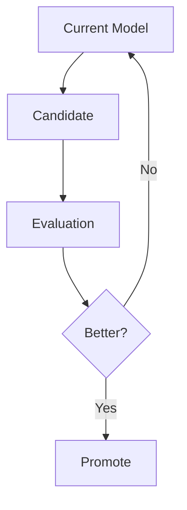

# Prediction Models

| Field | Value |
|---|---|
| Project | XG Alonso |
| Document | Prediction Models |
| Version | 1.0 |
| Status | Draft |
| Owner | ML Platform |
| Dependencies | [Feature Factory](02_feature_factory.md), [Feature Scientist](03_feature_scientist.md), [Embeddings](06_embeddings.md), [Database Schema](../data/04_database_schema.md), [Transfer Planner](../optimization/02_transfer_planner.md) |
| Last updated | 2026-07-27 |

---

## 1. Overview

Prediction models consume:

- Approved feature sets
- Embeddings
- User-independent football context

They never consume raw data directly.

Predictions are not the product. They exist to support transfer, captaincy, and squad
recommendations, and every modelling choice below is justified by what it does to those
decisions rather than by a leaderboard metric.

---

## 2. Modelling Strategy

### 2.1 Component-based points modelling (D8)

Points are **not** modelled as a single direct regression. The system predicts scoring components
separately and then converts them to FPL points through versioned scoring rules held in
`packages/domain`.

The components modelled separately are:

- Minutes
- Goals
- Assists
- Clean sheets
- Bonus
- Cards
- Defensive contributions
- Saves
- Goals conceded

### 2.2 Why components rather than direct points

FPL added defensive-contribution points in 2025/26. A direct points regression trained across
seasons therefore fits a scoring system that no longer exists — the label for a 2023/24
gameweek was produced by different rules than the label for a 2025/26 gameweek, and no amount of
feature engineering repairs a target whose definition changed underneath it.

Component labels do not have this problem:

- **Component labels are rule-version independent.** "Scored a goal", "kept a clean sheet",
  "made four saves" mean the same thing in every season.
- **The whole backfill stays usable.** The 2022/23-onward history (D7) contributes to every
  component model instead of being discounted or discarded because the points formula moved.
- **A rules change becomes a config edit, not a relabel.** When FPL changes a scoring value or
  adds a category, we bump the scoring-rules version and re-convert. We do not retrain on
  re-derived targets.
- **Explanations improve.** A recommendation can say *why* a player is projected highly — expected
  minutes, goal involvement, defensive contribution — which a single scalar regression cannot.

### 2.3 Direct points regression as a baseline

A direct next-GW points regression remains documented and implemented **as a comparison baseline
only**. It is used to sanity-check that the component path is not losing accuracy, and it is
reported alongside the component path in evaluation. It is not the primary path and does not feed
the optimizer.

---

## 3. Scoring Constants and the Pinned-Snapshot Rule

### 3.1 The rule

Scoring values and squad constraints **load from a pinned snapshot of the FPL payload with a
recorded fetch timestamp and a drift check. They are never Python literals.** Every conversion
from components to points records which snapshot version produced it.

The drift check re-reads `game_config` from `bootstrap-static` on each ingest, compares it to the
pinned snapshot, and fails loudly on any difference rather than silently adopting new values.
`game_config.scoring` exists in `bootstrap-static`, so scoring is machine-readable and there is no
excuse for transcription.

### 3.2 Why transcription is banned — a worked example

A goalkeeper goal is worth **10 points**, not the widely assumed 6. That value is in the payload
and has been for as long as anyone has bothered to read it, yet almost every hand-written FPL
scoring table in circulation gets it wrong. A single mistyped constant of that size silently
corrupts every downstream recommendation, and nothing in the test suite would notice, because the
tests would be written against the same wrong assumption.

### 3.3 Scoring values (verified from the payload, 2026-07-27)

Reproduced here for reader orientation only. **Code reads these from the snapshot, not from this
table.**

| Component | GKP | DEF | MID | FWD |
|---|---|---|---|---|
| `goals_scored` | 10 | 6 | 5 | 4 |
| `assists` | 3 | 3 | 3 | 3 |
| `clean_sheets` | 4 | 4 | 1 | 0 |
| `defensive_contribution` | 0 | 2 | 2 | 2 |

| Component | Value |
|---|---|
| `saves` | 1 |
| `bonus` | 1 |
| Yellow card | -1 |
| Red card | -3 |
| Own goal | -2 |

Any per-unit divisor or threshold attached to a component (for example the saves unit and the
defensive-contribution threshold) loads from the same snapshot as the value itself.

### 3.4 Squad constants from `game_config.rules`

These bound what the optimizer may do with a prediction, and load under the same rule.

| Constant | Value |
|---|---|
| Squad size | 15 |
| Starting XI | 11 |
| Max players per club | 3 |
| Budget | 1000 (tenths of a million) |
| `transfers_sell_on_fee` | 0.5 |
| `max_extra_free_transfers` | 4 (free transfers cap at 5) |
| `transfers_cap` | 20 |

Positional quotas:

| Position | Squad | Min in XI | Max in XI |
|---|---|---|---|
| GKP | 2 | 1 | 1 |
| DEF | 5 | 3 | 5 |
| MID | 5 | 2 | 5 |
| FWD | 3 | 1 | 3 |

---

## 4. Models

### 4.1 Expected Minutes

Target: minutes played next fixture.

Inputs:

- Injury status
- Starts
- Rotation
- Congestion
- Manager tendencies
- Team context
- Player embedding

Output:

- Expected minutes
- Start probability

Expected minutes is the load-bearing model. Every other component is conditioned on it, so its
errors propagate everywhere and it is evaluated first when the component path regresses.

#### 4.1.1 Minutes state — `Implemented, measured, not yet wired`

The two outputs above are fitted **independently**, so they can contradict each other: 80 expected
minutes beside a 0.2 start probability is a shape `MinutesPrediction` rejects. `inference.py::
_minutes_from` therefore reconciles them algebraically —

```
p_appearance = max(p_start, min(1, expected_minutes / 70))
p_60_plus    = min(p_appearance, p_start * 0.9 + max(0, (expected_minutes - 60) / 30) * 0.1)
```

— and those probabilities feed the *appearance* term of `assemble_points`, which is the largest
single term for most players. The reconciliation exists to satisfy a validator, not because it
estimates anything.

`MinutesState` replaces it with a three-class head over `{none, short, long}` — did not play,
played under the long-play threshold, reached it. The classes are mutually exclusive and
exhaustive by construction, so coherence is a property of the model rather than a repair applied
afterwards. Measured population shares across four seasons: **59.6% / 12.8% / 27.7%**.

Measured out of fold against the incumbent reconciliation on the real training frame (52,259 rows,
128 features, 15 walk-forward folds, production hyperparameters):

| metric | head | incumbent | gain |
|---|---|---|---|
| log loss | 0.470 | 0.774 | **−38.9%** |
| multiclass Brier | 0.262 | 0.291 | **−10.0%** |
| folds won | | | **15 / 15** |

The comparison is deliberately against the incumbent rather than a base-rate constant: the
question is whether estimating the states beats reconciling them, not whether either beats
nothing.

**Why this is the state everything else conditions on.** Minutes drive every component
simultaneously — goals, assists and clean sheets all rise together because the player stayed on
the pitch. Conditioning on the state makes that dependence vanish, so components can be composed
into a points distribution without estimating a covariance matrix. The `none` state also supplies
the zero atom that ~60% of player-gameweeks sit in, which no continuous distribution can represent.

Not yet wired into `_minutes_from`. Wiring is a separate change; this one measured whether it is
warranted.

### 4.2 Component Models

Each component below is a separate head, trained on rule-version-independent labels and
conditioned on expected minutes.

| Component | Target | Notes |
|---|---|---|
| Goals | Goals scored next fixture | Anchored on `expected_goals` from the FPL API |
| Assists | Assists next fixture | Anchored on `expected_assists` |
| Clean sheets | Team clean sheet, next fixture | Team-level, applied per player by position |
| Bonus | BPS-driven bonus points | Conditioned on minutes and involvement |
| Cards | Yellow / red | Low-frequency, heavily regularized |
| Defensive contributions | Defensive-contribution events | Introduced to FPL scoring in 2025/26; label exists earlier than the points do |
| Saves | Saves next fixture | Goalkeepers only |
| Goals conceded | Team goals conceded | Anchored on `expected_goals_conceded` |

The FPL API publishes `expected_goals`, `expected_assists`, `expected_goal_involvements`, and
`expected_goals_conceded` per player per gameweek from 2022/23 onward, which is exactly why the
backfill starts there (D7). These are the priors the component heads are built on. No external
provider is used (D6).

Model candidates for the component heads:

- XGBoost
- LightGBM
- CatBoost

Features:

- Selected Feature Scientist features
- Embeddings
- Expected minutes

Outputs, per component:

- Mean prediction
- Confidence
- Feature contributions

### 4.3 Expected FPL Points (conversion, not regression)

Targets: next-GW points and 3/6 GW aggregates.

Points are produced by applying the versioned scoring rules in `packages/domain` to the component
predictions. The conversion is a pure function of `(component predictions, scoring rules version,
player position)` and is deterministic and independently testable.

Outputs:

- Mean prediction
- Confidence
- Feature contributions, decomposed by component

Every stored points prediction records the scoring-rules version and the FPL payload snapshot
that produced it, so any historical prediction can be reproduced or re-converted under a
different rules version without retraining.

#### 4.3.1 Realised points — the inverse conversion

`assemble_points` maps *expected* counts to *expected* points and is linear, because expectation
is linear. That linearity is an approximation in exactly two places, and the function's own
docstring says so: goals conceded deducts a point per completed **pair**, and saves pay a point
per completed **triple**, so dividing a mean by two or three is exact only when the count happens
to divide evenly.

`domain/realisation.py` is the other half — realised points from realised counts, applying
`floor(conceded / 2)`, `floor(saves / 3)` and the defensive-contribution threshold test exactly.

It exists because nothing downstream can score a **distribution** over outcomes without a function
that prices one realisation. The composition engine convolves component PMFs through this map, the
calibration report scores forecasts against it, and the gap between its mean and
`assemble_points`' total is precisely the linearisation error — which becomes a measured quantity
rather than a caveat in a docstring.

**Verified against reality: 113,270 of 113,270 rows reconstruct `total_points` exactly, across all
four seasons.** That check simultaneously validates every `VERIFY`-marked field in
`ScoringThresholds` (§3). FPL publishes the point *values* but none of the divisors or thresholds,
so no drift check can catch a change to `saves_per_point` — a wrong value there would surface only
as a mismatch somewhere in 113,270 rows, and this is the only verification available for them.

One consequence worth recording: the 2026-27 pinned rules reconstruct **2022-23 as well**, so the
scoring values these components depend on have not moved across the archive.

`defensive_contribution` is modelled as `int | None`, where `None` means *the rule did not exist
for this row*. FPL introduced it in 2025/26, so the column is null for all 83,513 rows of the three
earlier seasons — the one case where contributing zero is semantically correct rather than a
coerced missing value. A test asserts the nulls are exactly season-aligned, so absence cannot
quietly become a per-row measurement.

### 4.4 Price Movement — `Deferred (D11)`

**Not built for the MVP.** There is no current-season price data at GW1, so the model has nothing
to train on at the moment it would first be needed. The contract is defined here so the rest of
the system can be built against it and so the deferral does not become a redesign later.

Targets:

- Rise
- Fall
- No change

Features:

- Transfer momentum
- Ownership
- Market velocity
- Availability
- Form

Correction to the earlier draft: **FPL publishes no official price predictor.** A previous version
of this document listed "official predictor" as an input feature. There is no such published
signal — price movement is something we would have to model ourselves from public transfer
history (D3), not something we can read off an official source.

Outputs:

- Probability rise
- Probability fall

### 4.5 Fair Value

Estimate intrinsic player value independent of current FPL price.

Outputs:

- Fair price
- Overvalued score
- Undervalued score

Fair value depends on the points path, not the price path, so it is not blocked by the D11
deferral.

---

## 5. Cold Start for GW1 of 2026/27

The system must be useful at GW1 (D9), which is the point of maximum missing data. Every cold-start
path is explicit, and every prediction records a `prior_source` field naming the fallback that
produced it, so explanations never imply evidence the model did not have.

### 5.1 Promoted teams

Promoted clubs have no Premier League history at all under D6 — the official API carries no
second-tier data and there is no budget to buy any.

- Back off to the pooled distribution of promoted-team cohorts from 2022/23 onward rather than
  fitting a team-specific model on zero rows.
- Widen predictive intervals for promoted-team players and mark them as low-confidence for the
  optimizer.
- Update to a team-specific fit once a defined minimum number of completed fixtures exists, and
  record the gameweek at which the switch happened.

### 5.2 New signings

- A player who has previous Premier League minutes is matched on `elements[].code`, the stable
  cross-season identifier, so his history carries across the transfer and across the annual
  reassignment of `element` ids.
- A player with no Premier League history falls back to a prior built from position, price tier,
  and team context. Player-embedding and cluster priors are used here once those systems ship;
  until then this path must work without them.

### 5.3 Players with no prior minutes

- Expected minutes backs off to a position and price-tier prior with deliberately wide
  uncertainty, never to a point estimate borrowed from a superficially similar player.
- Because every component head is conditioned on expected minutes, a wide minutes prior
  automatically widens every downstream component and the converted points figure.

### 5.4 Preseason data hazards

These are properties of the live payload before a season starts and must be handled as data
quality gates, not discovered as bugs:

- `strength_attack_*` and `strength_defence_*` are `0` for all 20 teams.
- `strength` is `null`.
- `strength_overall_*` uses a 1-5 scale preseason versus roughly 1000-1400 in-season. Any feature
  reading it must be scale-aware or it silently changes meaning at the season boundary.
- `entry/{id}/event/{gw}/picks/` returns `404` before the deadline. Squad-dependent code paths
  must treat this as an expected state, not an error.

---

## 6. Training

Walk-forward only.

Never randomly split data. A random split leaks future information into the past and produces
validation numbers that do not survive contact with a real gameweek.

Champion/challenger workflow:



Each component head runs its own champion/challenger loop. A challenger is promoted only if it
improves the component metric **and** does not degrade converted-points recommendation quality.

---

## 7. Metrics

### 7.1 Minutes

- MAE
- Start accuracy

### 7.2 Components

- Per-component MAE or log loss, whichever suits the component's distribution
- Calibration of the count and probability heads

### 7.3 Points (converted)

- MAE
- Rank correlation
- Top-k precision

The component path and the direct-regression baseline (§ 2.3) are reported side by side on these
three metrics.

### 7.4 Price — `Deferred (D11)`

Defined now, measured when the model is built:

- Accuracy
- Log loss
- Brier score
- Calibration

### 7.5 The metric that decides

Recommendations are the final business metric. A component model that scores marginally worse on
points MAE but produces better transfer decisions wins.

---

## Related documents

- [Feature Factory](02_feature_factory.md) — generates the candidate features these models consume
- [Feature Scientist](03_feature_scientist.md) — decides which features reach an approved feature set
- [Player Clustering](05_player_clustering.md) — supplies cold-start priors once it ships
- [Embeddings](06_embeddings.md) — supplies player, team, manager, and fixture representations
- [Database Schema](../data/04_database_schema.md) — where predictions, components, and snapshot versions are stored
- [Data Sources](../data/01_data_sources.md) — the official FPL API surface and its preseason hazards
- [Transfer Planner](../optimization/02_transfer_planner.md) — the consumer whose decision quality is the real metric
