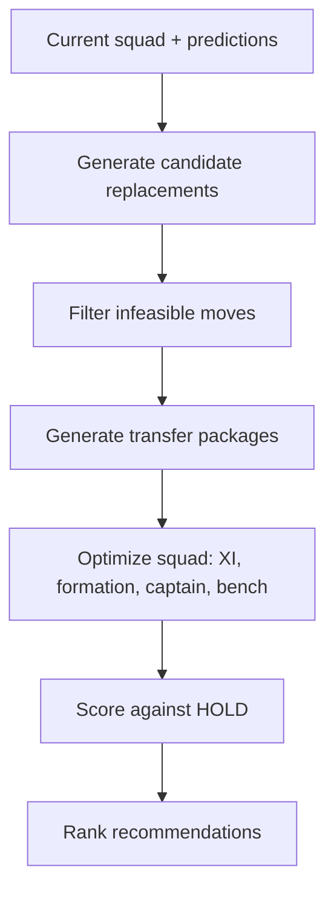

# Transfer Planner

| Field | Value |
|---|---|
| Project | XG Alonso |
| Document | Transfer Planner |
| Version | 1.0 |
| Status | Draft |
| Owner | Optimization |
| Dependencies | [Prediction Models](../ml/07_prediction_models.md), [Database Schema](../data/04_database_schema.md), [Public API](../api/01_public_api.md) |
| Last updated | 2026-07-27 |

---

## 1. Goal

Convert model predictions into optimal FPL decisions.

Predictions estimate reality; optimization chooses actions. The Transfer Planner is where XG Alonso
stops being a projection tool and becomes a decision system. A slightly worse points model that
produces better transfer decisions is the preferred model.

---

## 2. Inputs

| Input | Source | MVP status |
|---|---|---|
| Current squad | `entry/{entry_id}/event/{gw}/picks/`, or `--squad-file` before the GW1 deadline | Required |
| Budget | `bank` from entry history, or the squad file | Required |
| Selling prices | Reconstructed from `entry/{entry_id}/transfers/` purchase prices plus the sell-on fee (D3) | Required |
| Free transfers | Derived from transfer history and the free-transfer accumulation rule | Required |
| Prediction models | Expected minutes and component-based expected points | Required |
| Feature Scientist outputs | Approved, versioned feature sets | Deferred — slice 1 uses a fixed hand-curated set. See [Feature Scientist](../ml/03_feature_scientist.md) |
| Embeddings | Player, team and fixture vectors | Deferred — see [Embeddings](../ml/06_embeddings.md) |

The two deferred inputs are optional by construction. The planner reads a feature-set version and a
prediction table; it does not care whether the feature set was hand-curated or machine-selected.

---

## 3. Constraint constants

**These constants load from a pinned snapshot of the FPL payload with a recorded fetch timestamp and
a drift check on every ingest. They are never Python literals.** The values below are the verified
current values, recorded here for review only — code reads them from
`game_config_snapshots.rules` and `game_config_snapshots.element_types`.

### 3.1 Squad constraints

| Constant | Value | `game_config.rules` key |
|---|---|---|
| Squad size | 15 | `squad_squadsize` |
| Starting XI | 11 | `squad_squadplay` |
| Maximum players per Premier League club | 3 | `squad_team_limit` |
| Starting budget | 1000 tenths of a million (£100.0m) | `squad_total_spend` |
| Sell-on fee | 0.5 (half of any profit) | `transfers_sell_on_fee` |
| Maximum extra free transfers | 4, so free transfers cap at **5** | `transfers_max_extra_free` |
| Transfers cap in one gameweek | 20 | `transfers_cap` |
| Points cost per transfer beyond the free allowance | −4 | `transfers_cost` |

### 3.2 Positional quotas and formation bounds

| Position | Squad quota | Minimum in XI | Maximum in XI |
|---|---|---|---|
| GKP | 2 | 1 | 1 |
| DEF | 5 | 3 | 5 |
| MID | 5 | 2 | 5 |
| FWD | 3 | 1 | 3 |

Legal formations are **derived** from these bounds, never hardcoded. Under the current bounds there
are eight: `3-4-3`, `3-5-2`, `4-3-3`, `4-4-2`, `4-5-1`, `5-2-3`, `5-3-2`, `5-4-1`. If FPL changes a
bound, the derivation produces the new set without a code change; a hardcoded list would silently
plan illegal squads.

### 3.3 Selling price rule

```text
if now_cost <= purchase_price:
    selling_price = now_cost
else:
    profit          = now_cost - purchase_price          # tenths of a million
    retained_profit = floor(profit * transfers_sell_on_fee)
    selling_price   = purchase_price + retained_profit
```

All quantities are integers in tenths of a million. Floating-point money produces off-by-one budget
infeasibilities that are extremely hard to diagnose. See
[Database Schema §1.1](../data/04_database_schema.md).

### 3.4 Scoring constants

Points conversion uses the same pinned snapshot. Component-based modelling (D8) converts predicted
components to points through `game_config.scoring`, which is machine-readable — so nothing is
transcribed. Notably a **goalkeeper goal is worth 10 points, not the widely assumed 6**
(`goals_scored` = GKP 10, DEF 6, MID 5, FWD 4); `clean_sheets` = GKP 4, DEF 4, MID 1, FWD 0;
`defensive_contribution` = GKP 0, DEF 2, MID 2, FWD 2; assists 3; saves 1; bonus 1; yellow −1;
red −3; own goal −2. Transcribing these is how a wrong constant enters a codebase silently.

---

## 4. The HOLD baseline

HOLD is the headline metric. Every recommendation is reported as a delta against it, so it must be
defined without ambiguity.

**HOLD is defined as:**

1. Make **zero transfers** in the target gameweek.
2. Keep the 15-player squad **exactly** as it currently stands.
3. **Re-optimize everything that is free**: starting XI, formation, captain, vice-captain and bench
   order, under the same predictions, the same pinned constraints and the same horizon.
4. Carry the free transfer forward, subject to the cap of 5.
5. Score it as expected points summed over the full planning horizon.

**HOLD is not "do nothing".** A manager who makes no transfers still picks a captain and a starting
XI, and picks them as well as they can. Scoring HOLD with a stale or naive XI would inflate every
recommendation's apparent gain, which is precisely the failure mode that makes most FPL tools look
better than they are.

Consequences that follow directly from the definition:

- Every reported `expected_point_gain` is **net of hit cost** and **relative to HOLD**.
- A recommendation whose delta is not strictly positive is never surfaced as the top action.
- Rolling a transfer is a first-class recommendation. It is HOLD, ranked alongside the alternatives,
  and it wins whenever no transfer clears the action threshold.
- The action threshold is a configured value, not a magic constant, and it is deliberately above
  zero: acting on a +0.1 expected-point edge is noise-chasing.

### 4.1 Secondary baselines

Reported for context, never used as the recommendation target.

| Baseline | Definition | Purpose |
|---|---|---|
| **Hold** | As defined above | The decision benchmark |
| **Highest form** | Transfer in the highest `form` player affordable and legal | Detects whether the model beats naive momentum chasing |
| **Highest projected points** | Transfer in the highest single-gameweek projection affordable and legal | Isolates the value of horizon planning over greedy one-week picks |
| **Market template** | Move toward the highest-ownership legal squad | Measures edge against the crowd, which is the only edge that changes rank |

Beating "highest projected points" but losing to "market template" on rank is a meaningful and
reportable outcome. The evaluation harness reports all four.

---

## 5. Supported decisions

| Decision | Slice 1 | Notes |
|---|---|---|
| Roll transfer | Yes | This is HOLD; always evaluated |
| Single transfer | Yes | Exhaustive legal enumeration |
| Formation change | Yes | Derived from positional bounds |
| Captain selection | Yes | Doubles the captain's points |
| Vice-captain selection | Yes | Applies when the captain records no minutes |
| Bench ordering | Yes | Ordered by probability-weighted autosub value |
| Hit optimization | Yes | A −4 hit is offered only when the horizon gain exceeds it |
| Double transfer | No — next | Requires the package search of §6.3 |
| Triple transfer | No — next | Same |
| Wildcard comparison | **Deferred (D5)** | No chips in the MVP. See [Wildcard Planner](03_wildcard_planner.md) |

Double and triple transfers are designed for and not built in slice 1. They are the first extension
once single-transfer recommendations are trusted.

---

## 6. Optimization

### 6.1 Objective

```text
maximize   E[points over horizon]
         + w_value * E[squad value gain]
         - w_hit   * transfer hit cost
         - w_risk  * risk penalty
```

| Term | Meaning |
|---|---|
| `E[points over horizon]` | Sum of expected points across the planning horizon, with the captain's contribution doubled and expected autosubs included |
| `E[squad value gain]` | Expected change in squad value. **Weight is 0 in the MVP** — the price model is deferred (D11) and there is no current-season price data at GW1 |
| `transfer hit cost` | 4 points per transfer beyond the free allowance |
| `risk penalty` | Variance and availability exposure: rotation risk, injury doubt, fixture uncertainty |

Weights live in `configs/optimization/`, are versioned, and are recorded in the run provenance. A
recommendation cannot be reproduced without knowing the weights that produced it.

### 6.2 Constraints

Subject to:

- **Budget** — squad cost plus bank never exceeds the pinned budget, evaluated in integer tenths.
- **Position limits** — squad quotas GKP 2 / DEF 5 / MID 5 / FWD 3.
- **Club limits** — at most 3 players from any one Premier League club.
- **Valid formations** — XI satisfies GKP 1-1, DEF 3-5, MID 2-5, FWD 1-3.
- **Transfer accounting** — transfers used, free transfers available, hits incurred, cap of 20.

Every constraint is checked against the pinned snapshot. A constraint check that reads a Python
literal is a defect regardless of whether the literal happens to be correct today.

### 6.3 Search strategy



1. **Generate candidate replacements** — for each of the 15 held players, every player of the same
   position who could legally replace them.
2. **Filter infeasible moves** — drop anything violating budget, the club limit, or availability
   gates before any expensive scoring runs.
3. **Generate transfer packages** — slice 1 emits single transfers and the empty package (HOLD).
   Multi-transfer packages are the designed extension.
4. **Optimize squad** — for each surviving package, re-solve XI, formation, captain, vice-captain
   and bench order. This is the same routine that scores HOLD, which is what makes the comparison
   honest.
5. **Rank recommendations** — sort by net delta against HOLD, then by confidence.

### 6.4 Slice 1 uses exhaustive search, not MILP

**Slice 1 enumerates every legal single transfer exhaustively. There is no solver.**

The sizing makes this obvious. Fifteen held players, each replaceable by at most a few hundred
same-position candidates after budget and club filtering, gives on the order of 10⁴ packages. XI
re-optimization for a fixed 15 is itself trivial: eight legal formations, and within each the best XI
is a positional sort. The whole search runs in well under a second in plain Python.

A MILP formulation at this size would add a solver dependency, a modelling layer, and a class of
"infeasible model" failures, and would buy nothing. Exhaustive search is also **exactly optimal and
trivially explainable** — it enumerated everything, so "why not X?" is always answerable from stored
candidate scores.

MILP arrives when multi-transfer packages arrive. Two transfers is roughly 10⁸ naive combinations
and multi-gameweek transfer sequencing is genuinely combinatorial; that is the point where a solver
earns its complexity. Until then, adding one would be speculative abstraction.

The interface is designed for the swap: the planner exposes a `SearchStrategy` boundary so an
exhaustive strategy and a MILP strategy are interchangeable implementations scored by the identical
objective and validated against the identical constraint checks. Both must produce the same answer
on single-transfer problems — that equivalence is the MILP acceptance test.

---

## 7. Recommendation card

Each recommendation contains:

| Field | Description |
|---|---|
| Players out | Player, position, club, selling price, purchase price, sell-on fee applied |
| Players in | Player, position, club, current price |
| Cost | Net cash cost in tenths, and resulting bank |
| Expected point gain | Net of hit cost, relative to HOLD, over the stated horizon |
| Expected value gain | Expected squad value change. Zero-weighted in the MVP (D11) |
| Risk | Variance and availability exposure of the move |
| Confidence | Calibrated probability the move beats HOLD |
| Explanation | Deterministic reason codes plus rendered text |

Explanations are generated from structured evidence — reason codes derived from feature
contributions, fixture difficulty, expected minutes and ownership. An LLM may rewrite the phrasing.
**An LLM may never invent a reason.** Every sentence in the rendered text traces to a reason code
backed by a stored value. See [Repository Structure](../architecture/01_repository_structure.md) on
`packages/explanations`.

---

## 8. Multi-gameweek planning

Optimize over a horizon of:

- 1 gameweek
- 3 gameweeks
- 6 gameweeks

Include:

| Factor | MVP status |
|---|---|
| Future transfers | Modelled — free-transfer accumulation up to the cap of 5 makes rolling genuinely valuable |
| Fixture swings | Modelled — fixture difficulty over the horizon is the main driver of a roll-versus-act decision |
| Price movements | **Deferred (D11)** — no current-season price data exists at GW1, so the term is zero-weighted |

The horizon is the reason HOLD is a serious competitor. A transfer that wins GW3 and loses GW4–GW5
is correctly rejected, and a naive one-week optimizer would recommend it.

Longer horizons compound prediction error, so horizon uncertainty is propagated into `confidence`
rather than hidden. A 6-gameweek recommendation with the same point delta as a 1-gameweek
recommendation carries lower confidence, and the ranking reflects that.

---

## 9. Acceptance criteria

- **Deterministic optimizer** — identical inputs, weights and pinned config produce identical output,
  including tie-break ordering. Ties break on a stable key, never on dictionary iteration order.
- **Reproducible outputs** — a stored `run_id` replays the full recommendation set exactly.
- **Explainable decisions** — every recommendation carries reason codes traceable to stored values,
  and every rejected candidate has a stored score.
- **Supports package transfers** — the package abstraction and the `SearchStrategy` boundary exist in
  slice 1 even though only single-transfer packages are generated, so multi-transfer support is an
  added strategy rather than a rewrite.
- No constraint or scoring constant is a literal in code; all load from the pinned snapshot.
- The optimizer never proposes an illegal squad, verified by property-based tests over randomly
  generated legal squads.
- HOLD is scored with the same XI-optimization routine as every alternative.
- Recommendation quality is evaluated walk-forward against all four baselines of §4.1.

---

## Related documents

- [Prediction Models](../ml/07_prediction_models.md) — the expected-points inputs
- [Wildcard Planner](03_wildcard_planner.md) — deferred wildcard comparison
- [Chip Planner](04_chip_planner.md) — deferred chip logic
- [Database Schema](../data/04_database_schema.md) — pinned constants and squad tables
- [Feature Factory](../ml/02_feature_factory.md) — feature-set versions consumed here
- [Public API](../api/01_public_api.md) — `xg recommend` and the transfers endpoint
- [Build Plan](../implementation/01_build_plan.md) — phase 7 delivers this planner
- [Documentation Index](../README.md)
