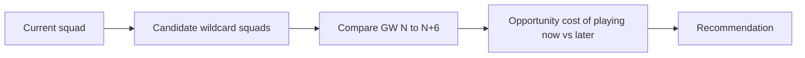

# Wildcard Planner

| Field | Value |
|---|---|
| Project | XG Alonso |
| Document | Wildcard Planner |
| Version | 1.0 |
| Status | Deferred (Post-MVP) |
| Owner | Optimization |
| Dependencies | [Transfer Planner](02_transfer_planner.md), [Chip Planner](04_chip_planner.md), [Prediction Models](../ml/07_prediction_models.md) |
| Last updated | 2026-07-27 |

---

## 1. Deferral notice

**Nothing in this document ships in the MVP.** Binding decision D5 excludes chips: chip **state** is
modelled, chip **logic** is not built. No wildcard endpoint exists in the
[Public API](../api/01_public_api.md), and the wildcard comparison listed in the
[Transfer Planner](02_transfer_planner.md) is deferred with it.

This document is retained because it constrains what the MVP must not make impossible. Two design
consequences already apply to code being written now, and both are cheap:

1. Chip state is represented in `packages/domain` from the start, so a squad object can carry
   "wildcard available", "wildcard played in GW11" and "free hit active this gameweek" without a
   later schema migration.
2. The squad optimizer is written so a 15-player squad can be built from scratch under budget, not
   only mutated one transfer at a time. A wildcard is a from-scratch build, and an optimizer that
   can only mutate would need rewriting rather than extending.

Neither point adds chip logic. They prevent the MVP from painting itself into a corner.

---

## 2. Objective

Determine the optimal wildcard **timing** and the optimal wildcard **squad**.

The two are one problem, not two. The best squad buildable in GW8 differs from the best squad
buildable in GW14, and the value of playing a wildcard is the gain over the horizon *minus* the
value of the best wildcard still available later. Solving for squad alone answers the wrong question.

---

## 3. Verified chip windows

| Window | Gameweeks | Chip availability |
|---|---|---|
| First half | GW2–GW19 | One wildcard |
| Second half | GW20–GW38 | A second wildcard |

Two wildcards exist per season, one per window, and an unused first-half wildcard does **not** carry
into the second half.

**A wildcard is unavailable in GW1.** The first window opens at GW2. Any planner, UI affordance or
recommendation that offers a GW1 wildcard is wrong. This matters more than it sounds: the MVP's
launch target is GW1 of 2026/27 (D9), which is exactly the gameweek where no wildcard can be played
— a further reason chip logic is not on the critical path.

Window boundaries are read from the pinned FPL payload alongside every other constant. **They load
from a pinned snapshot with a recorded fetch timestamp and a drift check; they are never Python
literals.** Chips already played by an entry are read from `chips` in `entry/{entry_id}/history/`,
and global usage from `chip_plays` on the `events` payload.

---

## 4. Pipeline

| Stage | Description |
|---|---|
| Current squad | The entry's squad, selling prices and bank at the decision point |
| Candidate wildcard squads | Optimal 15-player builds under budget for each candidate gameweek in the window |
| Compare GW N..N+6 | Expected points for each candidate over a rolling horizon, against the same HOLD-style baseline used by the Transfer Planner |
| Opportunity cost | Value of playing now minus the expected value of the best remaining wildcard week in the window |
| Recommendation | Best week, best squad, and the reasoning |

On a wildcard the whole squad is rebuilt at once, so the search is a genuine 15-player selection
under budget, position, club and formation constraints. This is the point where the exhaustive search
used for single transfers stops being adequate and MILP is warranted — see
[Transfer Planner §6.4](02_transfer_planner.md).

---

## 5. Outputs

| Output | Description |
|---|---|
| Best week | The recommended gameweek to play the wildcard, within the open window |
| Best squad | The optimal 15-player squad for that week, with XI, formation, captain and bench |
| Expected points gain | Horizon gain over not playing the wildcard, on the HOLD convention |
| Value gain | Expected squad value change. Blocked on the deferred price model (D11) |
| Explanation | Deterministic reason codes: fixture swing, injury cluster, squad structure, price drift |

---

## 6. Prerequisites before this is built

| Prerequisite | Why |
|---|---|
| Single-transfer recommendations trusted in production | A wildcard is 15 simultaneous transfers; being wrong is 15 times as expensive |
| Multi-gameweek planning validated | Wildcard value is entirely a horizon quantity |
| A from-scratch squad builder under full constraints | Wildcards are builds, not mutations |
| MILP or an equivalent solver | The from-scratch build is combinatorially real |
| Price model shipped (D11) | Value gain is otherwise unquantifiable |
| Chip state modelled in `packages/domain` | Already in scope for the MVP |

---

## Related documents

- [Transfer Planner](02_transfer_planner.md) — the shipping optimizer and the HOLD baseline
- [Chip Planner](04_chip_planner.md) — joint chip scheduling, also deferred
- [Prediction Models](../ml/07_prediction_models.md) — horizon projections this depends on
- [Public API](../api/01_public_api.md) — wildcard routes deliberately removed
- [Database Schema](../data/04_database_schema.md) — the deferred `wildcard_runs` table
- [Documentation Index](../README.md)
